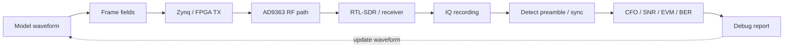

# Проектирование отладочного сигнала для SDR-стенда

Этот материал дополняет аппаратную отладку практическим приёмом: **отладочный сигнал должен быть спроектирован так, чтобы его было легко найти в эфире, измерить и разобрать offline**.

В реальном SDR-эксперименте недостаточно просто передать BPSK/QPSK/OFDM-поток. Если сигнал не найден, спектр выглядит странно или BER не сходится, нужен специальный диагностический формат. Он помогает ответить на вопросы:

- есть ли вообще передача;
- на какой частоте она появилась;
- не перепутаны ли I/Q;
- правильно ли работает NCO/mixer/FIR/интерполяция;
- где начинается пакет;
- какая символьная скорость и timing;
- есть ли clipping, перегруз или неверный gain;
- совпадает ли принятый payload с ожидаемым.

## Главная идея

```text
Сигнал для отладки должен быть не только полезной нагрузкой,
но и диагностическим инструментом.
```

Поэтому в курсе полезно иметь отдельный **debug waveform format** — учебный кадр, который можно передавать через Zynq/AD9363 и наблюдать через RTL-SDR/HDSDR или другую независимую приёмную цепочку.

## Рекомендуемый формат отладочного кадра

```text
silence
lead-in tone
preamble
sync word
header
training sequence
payload / PRBS
CRC
silence
```

| Поле | Назначение |
|---|---|
| `silence` | разделяет пакеты на waterfall и позволяет измерить noise floor |
| `lead-in tone` | помогает быстро найти передачу по спектру |
| `preamble` | используется для корреляционного поиска начала пакета |
| `sync word` | фиксирует точное начало кадра и снижает ложные срабатывания |
| `header` | задаёт режим, длину, номер кадра и параметры теста |
| `training sequence` | помогает оценить CFO, фазу, timing, SNR/EVM |
| `payload / PRBS` | проверяет битовый тракт и BER |
| `CRC` | отделяет обнаружение пакета от правильного приёма |

## Диагностический маршрут



## Преамбула

Преамбула — известная последовательность перед полезной частью кадра. Она нужна для поиска сигнала и грубой синхронизации.

| Тип преамбулы | Где полезна | Что проверяет |
|---|---|---|
| Чистый тон | первые RF-опыты | частоту, уровень, наличие передачи |
| `101010...` | BPSK/FSK/простые пакеты | символьную скорость и timing |
| Barker code | короткие учебные пакеты | корреляционный пик при малой длине |
| PN/m-sequence | шумоподобный поиск | устойчивый корреляционный поиск |
| Zadoff-Chu | синхронизация и оценка сдвигов | хороший корреляционный профиль |
| Chirp/sweep | визуальный поиск на waterfall | полосу и частотное направление |

Для первых лабораторий достаточно начать с простого варианта:

```text
preamble_bits = 10101010101010101010101010101010
```

Позже можно перейти к PN-последовательности или Barker/Zadoff-Chu.

## Sync word

После преамбулы полезно передавать уникальное слово синхронизации:

```text
sync_word = 0xA5A55A5A
```

Оно помогает:

- отличить настоящий пакет от случайного корреляционного пика;
- найти точное начало header/payload;
- выявить перепутанный порядок битов;
- выявить перепутанный порядок байтов;
- проверить инверсию битового потока.

Для учебного курса удобно использовать несколько вариантов и показать, как они выглядят при ошибках bit order/endian.

## Header отладочного кадра

Минимальный header:

```text
magic        uint32  0xA5A55A5A
version      uint8
mode_id      uint8
frame_id     uint32
payload_len  uint16
pattern_id   uint8
flags        uint8
```

| Поле | Зачем нужно |
|---|---|
| `version` | позволяет менять формат кадра без путаницы |
| `mode_id` | показывает, какой тест был включён |
| `frame_id` | помогает находить потери и дубли кадров |
| `payload_len` | даёт парсеру длину данных |
| `pattern_id` | описывает payload: zeros, PRBS, counter, ASCII |
| `flags` | режимы: inversion, loopback, pilot enabled и т.д. |

## Известная полезная нагрузка

Для отладки payload должен быть предсказуемым.

| Payload | Что диагностирует |
|---|---|
| `0x00 0x00 ...` | DC offset, reset, паразитные составляющие |
| `0xFF 0xFF ...` | насыщение, инверсию логики |
| `0xAA 0xAA ...` | тайминг и чередование битов |
| `0xCC 0xCC ...` | группировку битов и символов |
| счётчик `0,1,2,3...` | потерю слов, кадров, байтовый порядок |
| ASCII `ZYNQ-SDR-TEST` | быстрый визуальный контроль декодирования |
| PRBS с seed | BER и воспроизводимый шумоподобный поток |

Хороший минимальный payload для курса:

```text
frame_id
counter_0
counter_1
counter_2
...
crc16
```

## PRBS и seed

Для BER-тестов полезна PRBS-последовательность. Но seed должен быть явно сохранён:

```text
prbs_seed = 0x12345678
```

Это позволяет:

- восстановить ожидаемый payload offline;
- посчитать BER;
- повторить эксперимент;
- сравнить MATLAB/fixed-point/RTL/hardware результат.

## Pilot tone

Пилотный тон можно добавлять как отдельный диагностический элемент.

```text
pilot_offset = +50 kHz
pilot_level  = -20 dBc относительно полезного сигнала
```

Он помогает:

- быстро найти передачу на спектре;
- оценить CFO и дрейф;
- проверить знак частотного сдвига;
- контролировать gain staging;
- увидеть перегруз по появлению гармоник и побочных составляющих.

Важно: пилот не должен мешать полезному сигналу. В учебном режиме его можно включать отдельно через `mode_id` или `flags`.

## Training sequence

Training sequence — известные символы перед payload. Она полезна для оценки канала и синхронизации.

Для BPSK:

```text
+1, +1, -1, +1, -1, -1, +1, ...
```

Для QPSK можно использовать известный комплексный паттерн:

```text
(+1 + j), (-1 + j), (-1 - j), (+1 - j), ...
```

Что можно оценить:

- CFO;
- фазовый сдвиг;
- timing offset;
- SNR;
- EVM;
- IQ imbalance;
- частотную характеристику канала;
- ошибку масштаба fixed-point/RTL.

## Пакетная передача с паузами

Для первых RF-лабораторий не стоит передавать сигнал непрерывно. Лучше использовать пачки:

```text
100 ms silence
packet
100 ms silence
packet
100 ms silence
packet
```

Это даёт:

- видимые пакеты на waterfall;
- измерение шума до и после пакета;
- удобный поиск начала кадра;
- проверку AGC-поведения;
- простое сопоставление TX-log и RX IQ-записи.

## Амплитудная лестница

Амплитудная лестница помогает подобрать уровни и найти перегруз:

```text
packet at -30 dBFS
packet at -24 dBFS
packet at -18 dBFS
packet at -12 dBFS
packet at  -6 dBFS
```

Что искать:

- clipping;
- появление гармоник;
- рост noise floor;
- изменение BER/EVM от уровня;
- границу нормальной работы ADC/RF frontend;
- влияние внешнего аттенюатора.

Этот режим особенно полезен для стенда с управляемым цифровым аттенюатором.

## Частотная лестница

Частотная лестница проверяет частотный план и знаки переносов:

```text
-200 kHz
-100 kHz
   0 kHz
+100 kHz
+200 kHz
```

Она помогает обнаружить:

- неверный знак NCO;
- перепутанные I/Q;
- зеркальный спектр;
- ошибку частотной оси;
- неверную интерпретацию sample rate;
- неправильные DUC/DDC настройки.

## I/Q diagnostic modes

Эти режимы нужно заложить обязательно, потому что ошибки I/Q очень часты в SDR.

| Режим | Что диагностирует |
|---|---|
| `I = tone, Q = 0` | канал I, зеркала, неправильный complex path |
| `I = 0, Q = tone` | канал Q, знак квадратуры |
| `I = Q` | поворот/зеркалирование созвездия |
| `Q = -I` | инверсию знака одного канала |
| `exp(+jωt)` | положительное комплексное смещение |
| `exp(-jωt)` | отрицательное комплексное смещение |
| swap I/Q flag | проверку защиты от перепутанного порядка |

Если студент видит сигнал «не с той стороны» спектра, первый подозреваемый — знак комплексного тона или порядок I/Q.

## Two-tone test

Двухтональный тест:

```text
f1 = -100 kHz
f2 = +100 kHz
```

Полезен для проверки:

- линейности;
- интермодуляции;
- clipping;
- симметрии спектра;
- влияния gain;
- паразитных составляющих.

При перегрузе могут появляться дополнительные пики:

```text
2f1 - f2
2f2 - f1
f1 + f2
```

## Multitone / comb signal

Гребёнка тонов:

```text
-300 kHz, -200 kHz, -100 kHz, 0, +100 kHz, +200 kHz, +300 kHz
```

Используется для:

- проверки полосы;
- оценки АЧХ;
- поиска завала на краях;
- проверки FIR/CIC/интерполяции;
- проверки RF bandwidth AD9363;
- сравнения модели и реальной IQ-записи.

## Режимы передатчика

В PS/FPGA желательно иметь управляемый `tx_mode`:

```text
tx_mode = 0: off
tx_mode = 1: pure tone
tx_mode = 2: two-tone
tx_mode = 3: multitone / comb
tx_mode = 4: preamble only
tx_mode = 5: repeated sync word
tx_mode = 6: PRBS packet
tx_mode = 7: amplitude sweep
tx_mode = 8: frequency sweep
tx_mode = 9: full debug packet
```

Это позволяет переключать отладку без пересборки bitstream.

## Минимальная карта регистров

| Регистр | Назначение |
|---|---|
| `tx_mode` | выбор отладочного режима |
| `frame_period_ms` | пауза между пакетами |
| `tone_offset_hz` | смещение одиночного тона |
| `pilot_enable` | включение пилота |
| `pilot_offset_hz` | смещение пилота |
| `amplitude_step_db` | шаг амплитудной лестницы |
| `frequency_step_hz` | шаг частотной лестницы |
| `prbs_seed` | seed для BER-теста |
| `frame_id_reset` | сброс счётчика кадров |
| `status_frames_sent` | число отправленных кадров |

## Что должен сохранять эксперимент

Для воспроизводимости каждая IQ-запись должна сопровождаться metadata:

```yaml
debug_waveform:
  mode_id: 9
  frame_format_version: 1
  preamble: alternating_1010
  sync_word: 0xA5A55A5A
  payload_pattern: prbs
  prbs_seed: 0x12345678
  frame_period_ms: 100
  pilot_enabled: true
  pilot_offset_hz: 50000
  tx_gain_db: -20
  external_attenuation_db: 40
  sample_rate_sps: 2400000
  rf_center_frequency_hz: 915000000
```

## Минимальные критерии успеха

Эксперимент с отладочным сигналом считается успешным, если:

1. сигнал виден на waterfall в ожидаемой полосе;
2. lead-in tone или packet burst обнаруживаются автоматически;
3. корреляция по преамбуле даёт устойчивый пик;
4. sync word найден в правильной позиции;
5. `frame_id` растёт без необъяснимых пропусков;
6. CRC проходит для достаточной доли кадров;
7. измеренные CFO/SNR/EVM/BER сохранены в отчёте;
8. результат можно повторить по metadata и seed.

## Связь с лабораториями курса

Этот материал полезен сразу в нескольких блоках:

- Block 5: заранее заложить `tx_mode`, debug mux и testbench для режимов;
- Block 6: найти сигнал в RF и проверить уровни;
- Block 7: проверить TX/RX chain;
- Block 8: использовать преамбулу и training sequence для синхронизации;
- Block 9: записать IQ и выполнить offline replay;
- Block 11: собрать всё в полноценный end-to-end SDR-проект.

## Вывод

Преамбула — только первый шаг. Хороший SDR-стенд должен иметь целый набор отладочных сигналов: tone, preamble, sync word, PRBS, pilot, two-tone, multitone, amplitude sweep, frequency sweep и I/Q diagnostic modes.

Именно эти режимы превращают эксперимент из угадывания в инженерную процедуру:

```text
видим сигнал → находим пакет → проверяем sync → измеряем ошибки → доказываем работу тракта
```
