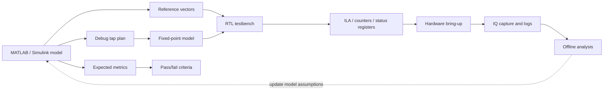

# Отладка железа как часть модели

Этот материал добавляет в курс важный инженерный принцип: **отладка железа должна проектироваться заранее**, а не появляться после первой неудачной прошивки.

В SDR/FPGA-проекте ошибка редко выглядит как одна понятная строка в логе. Чаще студент видит только общий симптом: нет сигнала, спектр смещён, созвездие развалилось, BER не сходится, поток AXI-Stream завис или RTL-SDR показывает «что-то похожее, но не то». Поэтому уже на этапе MATLAB/Simulink/fixed-point/RTL-модели нужно заранее решить, **как именно мы будем доказывать, что каждый участок тракта работает правильно**.

## Главная идея

```text
Модель должна проектировать не только алгоритм, но и будущую наблюдаемость железа.
```

Иными словами, рядом с математической моделью должны появляться:

- контрольные точки сигнала;
- ожидаемые спектры и уровни;
- допустимые ошибки fixed-point/RTL;
- latency budget;
- карта регистров управления и статуса;
- план ILA/VIO или другого встроенного debug;
- тестовые режимы, которые можно включить без переписывания RTL;
- правила записи IQ и сопоставления с offline-анализом.

## Debug-by-design в маршруте курса



## Что нужно заложить уже в модели

| Объект | Что определить в модели | Как это помогает на плате |
|---|---|---|
| Точки наблюдения | вход, выход каждого DSP-блока, выход NCO, выход mixer, выход FIR, выход rate-change | понятно, где сигнал перестал соответствовать ожиданию |
| Формат данных | Q-формат, signed/unsigned, порядок I/Q, масштабирование | проще искать переполнение, инверсию знака и перепутанные I/Q |
| Latency | задержка каждого блока и суммарная задержка тракта | можно проверять выравнивание `valid`, кадров и меток времени |
| Амплитудный бюджет | ожидаемые уровни до/после фильтров, микшера, интерполяции | быстрее выявляются saturation, clipping, неверный gain |
| Спектральный образ | центральная частота, полоса, зеркала, подавление образов | RTL-SDR/анализатор показывают не просто «картинку», а проверяемую гипотезу |
| Допуск ошибки | max abs error, RMS error, EVM, BER, SNR degradation | тесты становятся количественными, а не визуальными |
| Режимы возбуждения | tone, impulse, PRBS, packet, loopback | каждый режим проверяет отдельный класс ошибок |

## Минимальный набор debug-tap точек

Для SDR-тракта курса полезно заранее описывать такие точки:

1. `tap_input_iq` — входной поток после источника/DMA/генератора.
2. `tap_nco_iq` — синус/косинус NCO до микширования.
3. `tap_mixer_out_iq` — результат complex multiply.
4. `tap_fir_out_iq` — выход формирующего или согласованного фильтра.
5. `tap_rate_out_iq` — поток после интерполяции/децимации/CIC.
6. `tap_frame_sync` — обнаружение преамбулы/кадра.
7. `tap_metric` — корреляционная метрика, power estimate, RSSI-like estimate.
8. `tap_output_iq` — последний цифровой поток перед RF frontend или после RX DSP.

Не обязательно физически выводить все точки одновременно. Важно, чтобы в спецификации было понятно, **какие точки могут быть подключены к ILA, DMA snapshot или debug-mux**.

## Debug-mux вместо перепрошивки

Хорошая практика — добавить небольшой mux наблюдения:

```text
register debug_select
0: final output
1: input stream
2: NCO output
3: mixer output
4: FIR output
5: rate-change output
6: detector metric
```

Тогда один и тот же путь захвата может смотреть разные внутренние сигналы. Это особенно полезно на Zynq: PS может переключать `debug_select` через AXI-Lite, а PL выдаёт выбранный поток в ILA, DMA или тестовый RF/DAC путь.

## Регистры, которые стоит планировать заранее

| Регистр | Назначение |
|---|---|
| `control.enable` | включение/остановка блока без перепрошивки |
| `control.reset_counters` | сброс счётчиков ошибок и событий |
| `debug_select` | выбор внутренней точки наблюдения |
| `status.locked` | признак синхронизации/захвата |
| `status.overflow` | переполнение арифметики, FIFO или DMA |
| `status.underflow` | нехватка данных в потоке |
| `status.frame_count` | число обработанных кадров |
| `status.error_count` | ошибки CRC/BER/проверки пакета |
| `status.max_abs_iq` | максимальная амплитуда для поиска clipping |
| `status.last_event` | код последнего диагностического события |

Даже если первая лаборатория не реализует все регистры, модель и HDL specification должны показывать, какие признаки будут нужны на стенде.

## Какие тестовые режимы нужны

| Режим | Что проверяет |
|---|---|
| Zero input | нет ли DC-смещения, паразитных тонов, неверного reset |
| Constant tone | частотный план, NCO, mixer, знак частоты, спектральные зеркала |
| Impulse | FIR/CIC response, задержка, симметрия коэффициентов |
| PRBS bits | битовый тракт, BER, packet framing |
| Internal loopback | DSP без RF-канала и без внешних приборов |
| RF loopback через аттенюатор | совместную работу PL, AD9363, аналогового тракта и измерений |
| External RTL-SDR observation | независимую проверку того, что реально излучается/принимается |

## Как это отражать в MATLAB/Simulink

В модели должны быть не только конечные графики, но и сохранённые reference artifacts:

```text
artifacts/
  vectors/
    block_input_ci16.csv
    mixer_output_ci16.csv
    fir_output_ci16.csv
  plots/
    expected_spectrum.png
    expected_constellation.png
  reports/
    latency_budget.md
    debug_tap_plan.md
```

Для каждого tap point желательно сохранять:

- sample rate;
- Q-format;
- complex convention: `I + jQ`;
- valid/ready assumptions;
- expected latency from previous tap;
- expected frequency shift;
- acceptable numerical error.

## Как это отражать в RTL

RTL-блок должен иметь не только datapath, но и диагностическую оболочку:

```text
DSP core
  ├── data path
  ├── valid/ready alignment
  ├── saturation/overflow flags
  ├── counters
  ├── debug mux
  └── AXI-Lite control/status registers
```

Минимальные HDL-проверки:

- testbench сравнивает tap outputs с reference vectors;
- latency проверяется численно, а не «на глаз» по waveform;
- overflow/saturation cases проверяются отдельно;
- debug mux имеет тест выбора каждого канала;
- reset не оставляет старые значения в status-регистрах;
- valid/ready не теряет и не дублирует samples.

## План ILA/VIO перед синтезом

Перед запуском Vivado synthesis полезно заполнить таблицу:

| Сигнал | Ширина | Частота домена | Trigger | Зачем нужен |
|---|---:|---|---|---|
| `in_valid` | 1 | sample clk | rising edge | проверка прихода данных |
| `out_valid` | 1 | sample clk | rising edge | проверка задержки |
| `debug_iq_i` | 16 | sample clk | trigger on overflow | анализ внутреннего потока |
| `debug_iq_q` | 16 | sample clk | trigger on overflow | анализ внутреннего потока |
| `status_overflow` | 1 | AXI/control clk | high | поиск saturation/FIFO overflow |
| `frame_sync` | 1 | sample clk | rising edge | проверка packet detector |
| `metric` | 16/32 | sample clk | threshold crossing | проверка коррелятора/детектора |

Главное ограничение: ILA потребляет BRAM и усложняет timing. Поэтому в курсе важно объяснять студенту, что debug-сигналы тоже являются частью архитектуры, а не бесплатным дополнением.

## Связь с RF-измерениями

Аппаратная отладка SDR не заканчивается на ILA. Нужно заранее сопоставить внутренние цифровые точки с внешними наблюдениями:

| Внутри FPGA | Снаружи платы |
|---|---|
| NCO/mixer frequency word | частота тона на RTL-SDR или анализаторе спектра |
| FIR output level | уровень сигнала после RF gain/attenuator |
| packet/frame marker | появление пакета в IQ-записи |
| overflow flag | clipping/spurs/развал созвездия |
| CFO estimate | смещение пика спектра в записанном IQ |
| BER/error counter | offline BER по replay-файлу |

## Типовые ошибки, которые debug-by-design ловит рано

- перепутаны I и Q;
- неверный знак частотного сдвига;
- потерян один sample на границе valid/reset;
- неверно учтена latency фильтра;
- коэффициенты FIR загружены в другом масштабе;
- saturation скрывается до RF-измерения;
- testbench проходит, но hardware не имеет наблюдаемых внутренних точек;
- RTL-SDR показывает сигнал, но нельзя доказать, какой блок его сформировал.

## Минимальный критерий готовности к железу

Перед прошивкой студент должен ответить:

1. Какие внутренние точки можно наблюдать?
2. Какие reference vectors соответствуют этим точкам?
3. Какой ожидаемый latency между tap points?
4. Какие регистры покажут состояние блока?
5. Как включить test tone, loopback или PRBS без перепрошивки?
6. Какие признаки будут видны на RTL-SDR/HDSDR?
7. Какой результат считается pass/fail?

Если на эти вопросы нет ответа, переход к плате превращается в угадывание.

## Вывод

Debug-by-design связывает моделирование, RTL и стенд. Он учит студента думать не только о том, **как сделать DSP-блок**, но и о том, **как доказать, что этот блок работает в реальном Zynq/SDR-тракте**.

Для курса это особенно важно: каждая лаборатория должна постепенно приучать к мысли, что хороший инженерный результат — это не просто сигнал на экране, а воспроизводимая цепочка:

```text
model expectation → RTL evidence → hardware observation → offline measurement → engineering decision
```
