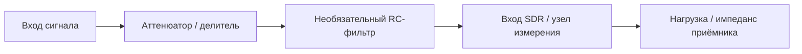

# Лабораторная 10.4 — KiCad schematic mini-project

## Цель

Подготовить мини-проект схемы для SDR-стенда: аттенюатор/фильтр, BOM, ограничения и safety checklist.

## Что выполняется

В работе студент:

1. выбирает назначение вспомогательной схемы;
2. рассчитывает attenuation/filter параметры;
3. оформляет schematic concept;
4. составляет BOM;
5. фиксирует ограничения и safety notes.

## Результат

После выполнения работы должны быть получены:

- schematic concept;
- BOM table;
- расчёт параметров;
- safety checklist;
- вывод о пригодности схемы для SDR bench.

## Подробная техническая часть
### Инженерный вопрос

> Сможет ли другой инженер воспроизвести вспомогательную схему фронтенда и понять её ограничения до подключения к железу SDR?

### Концепция мини-проекта



### Необходимые блоки схемы

| Блок | Назначение |
|---|---|
| Входной разъём | определяет точку входа сигнала |
| Аттенюатор | уменьшает уровень перед приёмником |
| Необязательный RC-фильтр | ограничивает низко- или высокочастотные составляющие |
| Выходной разъём | подключение к SDR или измерительному входу |
| Опорная земля | избегает неоднозначного обратного пути |
| Примечания | документируют импеданс и пределы безопасности |

### Шаблон BOM

| Обозн. | Номинал | Корпус | Назначение | Примечания |
|---|---:|---|---|---|
| R1 | 9 кОм | THT/SMD | верхний резистор делителя | учебный пример |
| R2 | 1 кОм | THT/SMD | нижний резистор делителя | около −20 дБ без нагрузки |
| C1 | 100 нФ | THT/SMD | необязательный конденсатор RC | выбирается по целевой частоте среза |
| J1 | разъём | SMA/BNC/штыри | вход | зависит от стенда |
| J2 | разъём | SMA/BNC/штыри | выход | зависит от приёмника |

### Результаты KiCad

Полный мини-проект должен включать:

```text
kicad/
  sdr_frontend_helper.kicad_pro
  sdr_frontend_helper.kicad_sch
  bom.csv
  README.md
```

Если KiCad недоступен, сначала задокументируйте схему в Markdown, а затем преобразуйте её в KiCad.

### Чек-лист безопасности

- [ ] Указан максимальный входной уровень.
- [ ] Рассчитано ожидаемое ослабление.
- [ ] Записано допущение об импедансе нагрузки.
- [ ] Задокументирована связь по постоянному/переменному току.
- [ ] Учтена защита входа SDR.
- [ ] Схема сначала проверена на малом уровне.
- [ ] Метаданные измерений упоминают интерфейсную цепь.

### Чек-лист отчёта (расширенный)

- [ ] Приложена схема или понятная диаграмма.
- [ ] Приложен BOM.
- [ ] Приложен расчёт ослабления.
- [ ] Приложен расчёт частоты среза RC, если используется фильтр.
- [ ] Объяснены ограничения схемы.
- [ ] Указано, безопасна ли она для намеченного эксперимента SDR.

### Шаблон инженерного вывода

```text
Мини-проект KiCad реализует ______ с ожидаемым ослаблением ____ дБ и необязательной частотой среза ____ Гц.
Он подходит / не подходит для стенда SDR, потому что ______. Главное ограничение — ______.
```
