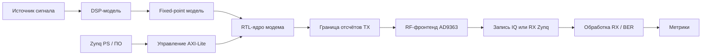

# Лабораторная 11.1 — Требования проекта и системная архитектура

## Цель

Определить требования итогового SDR-проекта и превратить их в понятную системную архитектуру.

## Инженерный вопрос

> Что именно должен делать интегрированный SDR-проект и какие блоки нужны, чтобы доказать, что он работает?

## Зачем это нужно

Большинство неудачных интеграционных проектов терпят неудачу ещё до написания кода: цель была расплывчатой («сделать модем»), критерии успеха отсутствовали, или никто не записал, на какой частоте работает FPGA и на какой частоте захватывает RF-микросхема. Если сначала записать требования, придётся сделать выбор, который потом трудно менять (тип сигнала, план частот дискретизации, плоскость управления), а вопрос «работает ли?» превращается в числовой вопрос «прошёл/не прошёл». Это также фиксирует *порядок рисков*: первый аппаратный эксперимент должен быть самым маленьким из тех, что могут завершиться информативной неудачей.

## Необходимые решения

| Решение | Описание |
|---|---|
| Тип сигнала | тон, QPSK, пакет, пользовательская форма сигнала |
| План частот дискретизации | частота модели, частота FPGA, частота RF-захвата |
| Частотный план | LO TX, LO RX, цифровые смещения |
| Объём реализации | Python/MATLAB, fixed-point, RTL, RF |
| Плоскость управления | карта регистров AXI-Lite, путь DMA или статическое управление воспроизведением |
| Метрики | пик FFT, SNR, EVM, BER |
| Первый аппаратный шаг | разведочный пакет, кондуктивный loopback или полный прогон BER |
| Критерии успеха | числовые пороги «прошёл/не прошёл» |

## Эталонная архитектура



## Текущий рекомендуемый первый аппаратный шаг

Первым экспериментом с AD9363 не должна быть полная измерительная кампания. Это должен быть короткий разведочный пакет:

1. запрограммировать параметры детерминированного кадра через AXI-Lite;
2. запустить один короткий пакет при минимальном усилении TX;
3. держать усиление RX низким и ручным;
4. на первое наблюдение отключить AGC;
5. проверить только видимость пакета, признаки перегрузки и детерминированное восстановление.

Lab 11.7 даёт минимальную последовательность регистров со стороны PS для этого шага.

Так снижается риск перед попытками более длинных прогонов, развёрток BER или экспериментов с маршрутизированным loopback.

## Чек-лист отчёта

- [ ] Сформулирована цель проекта.
- [ ] Определены критерии успеха.
- [ ] Нарисована системная архитектура.
- [ ] Определён план частот дискретизации.
- [ ] Определён частотный план.
- [ ] Определены форматы данных.
- [ ] Определён путь плоскости управления.
- [ ] Определены метрики и пороги.
- [ ] Определён первый аппаратный шаг.
- [ ] Указаны риски проекта.

## Шаблон инженерного вывода

```text
Интегрированный SDR-проект нацелен на ______. Основная сигнальная цепочка — ______.
Проект считается успешным, если ______. Наибольший технический риск — ______, потому что ______.
```
