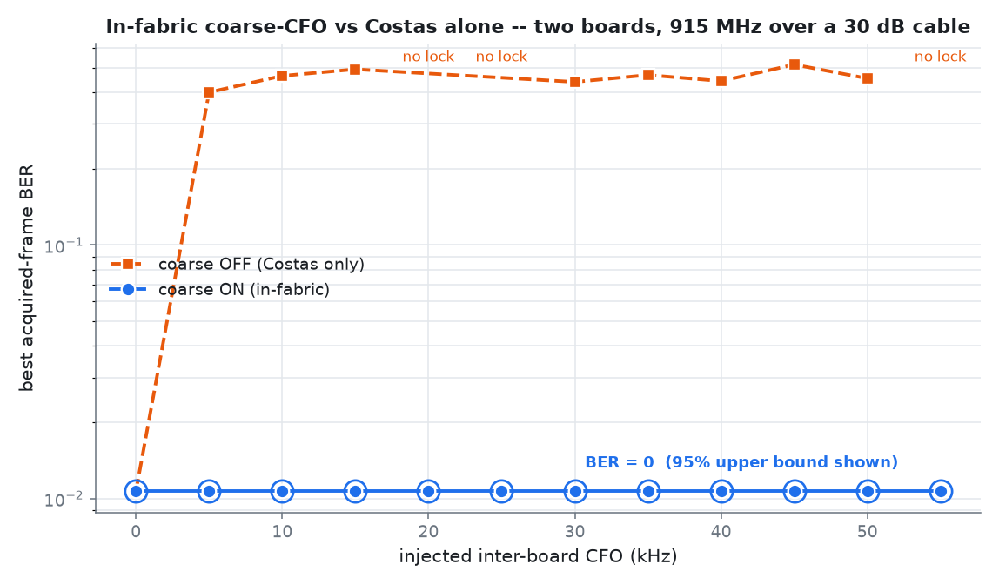

# Lab 11.32 — Двухплатный захват coarse-CFO внутри FPGA

## Цель

Проверить, что блок `qpsk_coarse_cfo.v` в опубликованном PL-битстриме захватывает живой QPSK-кадр
при управляемом межплатном CFO от 0 до 55 кГц. RF-тракт, кадр, число попыток и перебор восьми фаз
одинаковы; между сериями меняется только `gp_ctrl[13]`: coarse-CFO включён или работает одна петля
Костаса.

Это эксперимент по **полосе захвата**, а не заявление о долговременном BER. Нулевой BER хотя бы у
одного кадра доказывает возможность захвата данной CFO. Устойчивость отдельно показывают доля
чистых попыток, доля захватов и агрегированный BER полностью принятых кадров.

## Стенд и параметры

```text
плата A: vendor image, циклический DMA TX на 915 МГц + Δ
    TX1 ── аттенюатор 30 дБ ── SMA-кабель ── RX1
плата B: course bitstream, fabric RX + coarse-CFO + Costas + BER counter
```

| Параметр | Значение |
|---|---:|
| Несущая | 915 МГц |
| Символьная частота / Fs | 480 ксимв/с / 3,84 Мвыб/с |
| Кадр | 140 QPSK-символов, 280 проверяемых бит |
| TX / RX gain | −30 дБ / 50 дБ |
| Start offsets | 0…7 |
| Попытки | 3 на каждую фазу и режим, 24 на CFO-точку |
| CFO sweep | 0…55 кГц, шаг 5 кГц |

Обе платы переводятся в −89,75 дБ до настройки и в блоке `finally`, включая аварийное завершение.

## Контракт метрик

| Метрика | Смысл |
|---|---|
| `reached_zero` / `best_ber` | Найден хотя бы один полный кадр 280/280 без ошибок: факт захвата. |
| `clean_attempt_rate` | Чистые кадры / все попытки, включая отсутствие захвата. |
| `lock_rate` | Попытки с полными 140 символами / все попытки. |
| `aggregate_ber` | BER только по полным кадрам; отсутствие захвата не считается нулём. |
| Wilson interval | 95%-й интервал для долей захвата и чистых попыток. |

JSON сохраняет каждую попытку, поэтому итог пересчитывается без ручного выбора удачных строк.

## Результат 2026-07-20

Coarse-CFO достиг BER=0 во всех **12/12 CFO-точках** и дал **75/288 чистых попыток (26,0%)**.
Costas-only дал **0/216 чистых попыток** в девяти различающих точках от 15 до 55 кГц.



| CFO, кГц | Coarse: чистые | Coarse: lock | Coarse: aggregate BER | Costas: лучший BER | Costas: чистые | Costas: lock |
|---:|---:|---:|---:|---:|---:|---:|
| 0 | 7/24 | 50,0% | 0,175 | 0 | 8/24 | 66,7% |
| 5 | 6/24 | 70,8% | 0,267 | 0,400 | 0/24 | 70,8% |
| 10 | 6/24 | 79,2% | 0,302 | 0,464 | 0/24 | 83,3% |
| 15 | 5/24 | 66,7% | 0,245 | 0,493 | 0/24 | 25,0% |
| 20 | 9/24 | 79,2% | 0,203 | нет захвата | 0/24 | 0% |
| 25 | 7/24 | 83,3% | 0,227 | нет захвата | 0/24 | 0% |
| 30 | 7/24 | 70,8% | 0,232 | 0,439 | 0/24 | 12,5% |
| 35 | 8/24 | 87,5% | 0,276 | 0,468 | 0/24 | 25,0% |
| 40 | 2/24 | 58,3% | 0,395 | 0,443 | 0/24 | 16,7% |
| 45 | 3/24 | 58,3% | 0,361 | 0,514 | 0/24 | 4,2% |
| 50 | 10/24 | 70,8% | 0,136 | 0,454 | 0/24 | 4,2% |
| 55 | 5/24 | 66,7% | 0,171 | нет захвата | 0/24 | 0% |

Эксперимент подтверждает **полосу захвата CFO**: coarse-блок находит чистый кадр в каждой точке,
а одна петля Костаса не справляется на 15–55 кГц. Но это ещё не устойчивая непрерывная связь:
26% чистых попыток и высокий условный BER показывают оставшуюся проблему sample-clock/timing phase.
Следующий инженерный шаг — непрерывное timing recovery либо формализованный burst-phase search.

## Воспроизведение

```bash
python blocks/block_11_integrated_sdr_project/python/lab_11_32_two_board_fabric_coarse_cfo.py --self-test

python blocks/block_11_integrated_sdr_project/python/lab_11_32_two_board_fabric_coarse_cfo.py \
  --host-a 192.168.40.1 --host-b 192.168.20.1 \
  --cfo-start 0 --cfo-stop 55000 --cfo-step 5000 \
  --retries-per-offset 3
```

Канонический результат: [`lab1132_two_board_fabric_coarse_cfo.json`](../../assets/lab1132_two_board_fabric_coarse_cfo.json).
Команда возвращает ненулевой код, если coarse не захватил хотя бы одну CFO-точку или Costas-only
получил чистый кадр при `|CFO| ≥ 15 кГц`.

## RF-безопасность

Использовать только замкнутый кабельный тракт с аттенюатором 30 дБ. Не подключать антенны с этими
настройками и не повышать мощность TX для «улучшения картинки». После прерывания проверить, что обе
платы возвращены в −89,75 дБ.
