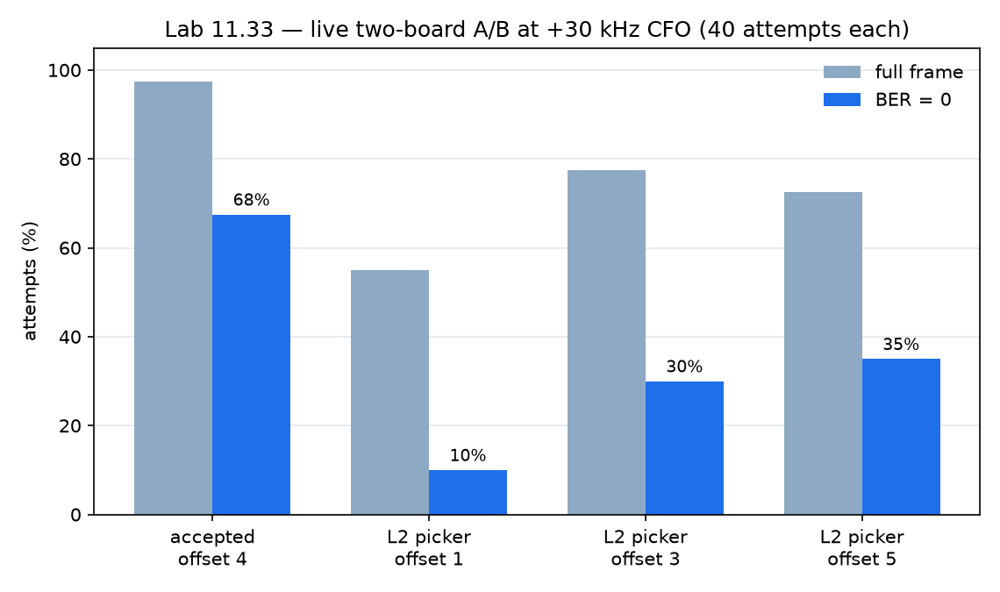

# Лабораторная 11.33 — остаточный CFO и отвергнутая timing-гипотеза

## Цель

Превратить низкую долю чистых попыток из Lab 11.32 в проверяемый диагноз. Используются точные
samples из bridge BRAM, RTL-replay, timing-closed Vivado-сборки и равные серии на двух платах.
Изменение принимается только тогда, когда улучшает физический линк, а не один replay.

## Что показали захваты

Период циклического кадра на живом участке равен 1120 ADC samples; заметного ухода sample clock
внутри короткого 140-символьного кадра нет. Первый реальный дефект оказался в carrier loop:
сохранённый 30-кГц захват даёт **124/280 ошибок** со старой настройкой Costas и **0/280** при
`KI_LOG=4`, 64 acquisition symbols и tracking `KP_LOG=7`.

Эта настройка принята. На кабельном тракте при +30 кГц и offset 4 она дала **27/40 чистых** и
**39/40 полных кадров**.

## Отвергнутый вариант

Кандидат ждал восемь символов после запуска 65-tap matched filter и ранжировал фазы по
`I²+Q²`. Он прошёл replay и RTL-тесты. Непайплайненная версия провалила timing
(`WNS=-2.779 ns`, 3113 endpoints); после pipeline и post-route physopt кандидат честно закрыл
timing: **WNS=+0.010 ns, TNS=0**, 75 689 полностью разведённых nets, routing errors 0.

Но живой A/B оказался хуже:

| Приёмник | Offset | Полные кадры | BER=0 | Доля чистых |
|---|---:|---:|---:|---:|
| принятый L1 picker + настроенный Costas | 4 | 39/40 | 27/40 | **67.5%** |
| кандидат `I²+Q²` | 1 | 22/40 | 4/40 | 10.0% |
| кандидат `I²+Q²` | 3 | 31/40 | 12/40 | 30.0% |
| кандидат `I²+Q²` | 5 | 29/40 | 14/40 | 35.0% |

Кандидат удалён из RTL и с SD-карты. Плата B холодно загружена обратно в принятый образ;
проверены FPGA `operating`, core ID `0x4250534B`, IIO и безопасный TX `-89.75 dB`.

Канонический результат: [`lab1133_residual_cfo_timing_hypothesis.json`](../../assets/lab1133_residual_cfo_timing_hypothesis.json).

## Решение

Оставляем настройку Costas, отвергаем усложнённый feedforward picker. Следующий эксперимент —
настоящий непрерывный QPSK timing-recovery loop с раздельными acquisition/tracking режимами,
а затем длинная двухплатная BER-серия. Главный урок: simulation pass и timing closure обязательны,
но право вето остаётся у физического A/B.
