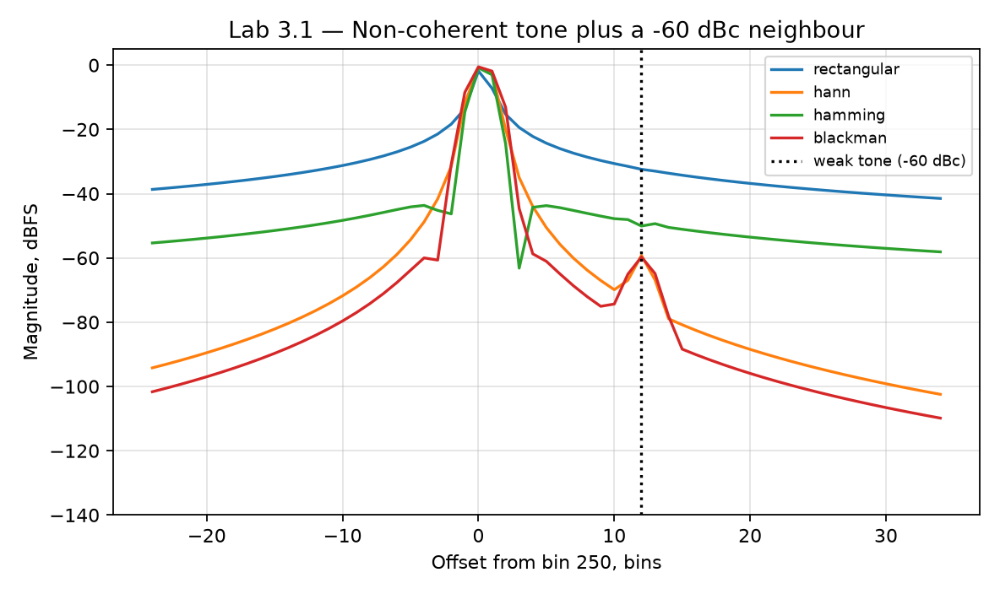

# Лабораторная 3.1 — Оконные функции БПФ и спектральная утечка

## Цель

Понять, почему конечная длительность записи и выбор оконной функции влияют на вид спектра, уровень боковых лепестков и точность оценки частоты.

## Что выполняется

В работе студент:

1. формирует тестовый синусоидальный или IQ-сигнал;
2. рассчитывает БПФ без окна и с оконными функциями;
3. сравнивает ширину главного лепестка и уровень боковых лепестков;
4. оценивает ошибку определения частоты;
5. оформляет графики в инженерном стиле.

## Результат

После выполнения работы должны быть получены:

- графики спектра для разных окон;
- таблица сравнения оконных функций;
- вывод о компромиссе между разрешением и подавлением боковых лепестков.

## Что приложить к отчёту

- параметры сигнала и частоту дискретизации;
- длину БПФ;
- используемые окна;
- спектры до/после применения окон;
- краткий инженерный вывод.

## Подробная техническая часть
### Связь с измерениями SDR

Работа напрямую связана с измерениями в SDR: если окно FFT и частотная ось выбраны неверно, измеренный спектр может выглядеть убедительно, но приводить к неверным инженерным выводам.

### Теория

FFT конечной длины наблюдает лишь ограниченное временное окно сигнала. Если частота сигнала не попадает точно в бин FFT, спектр «растекается» по соседним бинам. Это спектральная утечка.

Важные понятия:

- частота дискретизации `Fs`;
- длина FFT `N`;
- шаг бинов `df = Fs / N`;
- когерентная и некогерентная частота тона;
- прямоугольное окно, окна Ханна, Хэмминга и Блэкмана;
- ширина главного лепестка;
- подавление боковых лепестков;
- коррекция амплитуды.

### Эксперимент

Сгенерируйте два комплексных тона:

1. когерентный тон точно в бине FFT;
2. некогерентный тон между бинами FFT.

Для каждого тона вычислите спектры с окнами:

- прямоугольное;
- Ханна;
- Хэмминга;
- Блэкмана.

Сравните:

- бин пика;
- уровень утечки;
- кажущуюся амплитуду;
- ошибку оценки частоты;
- возможность увидеть слабый соседний тон.

### Запуск эталонного скрипта

```bash
python blocks/block_03_dsp_basics/python/lab_3_1_fft_windows.py
```

Скрипт детерминирован и записывает:

```text
docs/assets/lab31_fft_windows_leakage.png
docs/assets/lab31_fft_windows_metrics.json
```

Сначала запустите его и сверьте числа с разделом *Чего ожидать* ниже. Затем напишите собственную версию по минимальной структуре ниже; эталонный скрипт — ваш ключ для проверки.

### Реализация на Python

Минимальная структура собственной реализации:

```python
import numpy as np
import matplotlib.pyplot as plt

fs = 2.4e6
n = 4096
t = np.arange(n) / fs

f_bin = 250 * fs / n
f_off = (250.35) * fs / n

x = np.exp(1j * 2 * np.pi * f_off * t)

windows = {
    "rectangular": np.ones(n),
    "hann": np.hanning(n),
    "hamming": np.hamming(n),
    "blackman": np.blackman(n),
}

freq = np.fft.fftshift(np.fft.fftfreq(n, d=1/fs))

for name, w in windows.items():
    xw = x * w
    spec = np.fft.fftshift(np.fft.fft(xw))
    mag_db = 20 * np.log10(np.maximum(np.abs(spec) / np.sum(w), 1e-12))
    plt.plot(freq / 1e3, mag_db, label=name)

plt.grid(True)
plt.xlabel("Frequency, kHz")
plt.ylabel("Magnitude, dBFS")
plt.legend()
plt.show()
```

### Реализация на MATLAB

Минимальная структура собственной реализации:

```matlab
fs = 2.4e6;
N = 4096;
t = (0:N-1).' / fs;

f_bin = 250 * fs / N;
f_off = 250.35 * fs / N;

x = exp(1j * 2*pi*f_off*t);

windows = {
    'rectangular', ones(N, 1);
    'hann', hann(N);
    'hamming', hamming(N);
    'blackman', blackman(N)
};

freq = fftshift((-floor(N/2):ceil(N/2)-1).' * fs / N);

figure; hold on;
for k = 1:size(windows, 1)
    name = windows{k, 1};
    w = windows{k, 2};
    spec = fftshift(fft(x .* w));
    magDb = 20*log10(max(abs(spec) / sum(w), 1e-12));
    plot(freq/1e3, magDb, 'DisplayName', name);
end

grid on;
xlabel('Frequency, kHz');
ylabel('Magnitude, dBFS');
legend('Location', 'best');
```

### Мост к C++ / FPGA

Работа не только про построение графиков. Та же дисциплина FFT/окон встречается в FPGA и встраиваемой диагностике.

Инженерный мост:

| Понятие | Взгляд в ПО | Взгляд FPGA / железа |
|---|---|---|
| Коэффициенты окна | вектор с плавающей точкой | ROM или память коэффициентов |
| Умножение на окно | векторное умножение | DSP-блоки или fixed-point умножитель |
| Длина FFT | размер массива | задержка, память и стоимость ресурсов |
| Утечка | артефакт графика | реальное ограничение измерения |
| Коррекция амплитуды | деление на сумму окна | фиксированная компенсация усиления |

### Ожидаемые графики

Постройте как минимум:

1. спектр когерентного тона с несколькими окнами;
2. спектр некогерентного тона с несколькими окнами;
3. увеличенный вид вокруг тона;
4. необязательный случай обнаружения слабого тона.

### Чего ожидать

Запуск по умолчанию (`Fs = 2,4 МС/с`, `N = 4096`, шаг бина 585,94 Гц; тон полной шкалы в 0,35 бина от бина 250 и второй тон на −60 дБн ровно на 12 бинов выше бина 250):

```text
window         ENBW  scallop  leak@20  weak vis
rectangular    1.00    1.83dB   -35.0dB    -27.7dB
hann           1.50    0.69dB   -87.8dB     14.8dB
hamming        1.36    0.85dB   -52.7dB    -10.8dB
blackman       1.73    0.54dB   -95.4dB     22.5dB
```

- **ENBW** (эквивалентная шумовая полоса в бинах) — цена окна: 1,0 для прямоугольного, ровно 1,5 для Ханна, 1,73 для Блэкмана. Чем шире ENBW, тем больше шума попадает в каждый бин, поэтому показание шумовой полки в дБ/бин растёт на `10*log10(ENBW)`: +1,8 дБ для Ханна, +2,4 дБ для Блэкмана.
- **Потеря «гребёнки» (scalloping)** — насколько занижено показание тона не в бине. С прямоугольным окном тон в 0,35 бина от сетки занижен на 1,83 дБ; Блэкман теряет только 0,54 дБ. Если вы читаете амплитуду тона по FFT, это ошибка амплитуды, а не изменение сигнала.
- **Утечка на 20 бинов** — место, где окна действительно различаются: −35 дБн у прямоугольного против −88…−95 дБн у Ханна и Блэкмана.
- **Видимость слабого тона** сводит всё вместе. С прямоугольным окном сосед на −60 дБн лежит **на 27,7 дБ ниже «юбки» утечки** сильного тона и невидим. Хэмминга (−10,8 дБ) тоже недостаточно: его дальние боковые лепестки спадают медленно. Ханн показывает его на 14,8 дБ выше юбки, Блэкман — на 22,5 дБ. Один и тот же слабый сигнал либо «отсутствует», либо явно виден — в зависимости только от выбора обработки.



### Упражнения

1. Замените `NONCOHERENT_BIN` с 250,35 на 250,5 (худший случай, ровно между двумя бинами). Насколько вырастет потеря гребёнки прямоугольного окна? Учебное значение — 3,92 дБ.
2. Отодвиньте слабый тон с 12 на 40 бинов (`WEAK_OFFSET_BINS`). Покажет ли его теперь Хэмминг? Почему для Хэмминга ответ зависит от расстояния, а для Блэкмана почти нет?
3. Удвойте `N` до 8192 при том же `Fs`. Что произойдёт с шагом бина и с утечкой *в герцах* при фиксированном частотном отступе?
4. Нужно указать шумовую полку захвата в дБм/Гц. Какую поправку вы вносите для окна Блэкмана и на сколько дБ?

### Чек-лист отчёта (расширенный)

- [ ] Указаны `Fs`, `N`, `df` и частота тона.
- [ ] Объяснено, когерентен ли тон бинам FFT.
- [ ] Сравнена ширина главного лепестка для каждого окна.
- [ ] Сравнено подавление боковых лепестков.
- [ ] Объяснено, какое окно лучше всего для измерения амплитуды.
- [ ] Объяснено, какое окно лучше для обнаружения слабого соседнего тона.
- [ ] Добавлено короткое замечание о стоимости применения окна в FPGA.

### Шаблон инженерного вывода

```text
Для этого сигнала и длины FFT окно ______ даёт лучшее подавление утечки,
но увеличивает ширину главного лепестка. Для измерений в SDR это значит, что выбор
окна необходимо документировать вместе с Fs, длиной FFT и нормировкой амплитуды.
```
