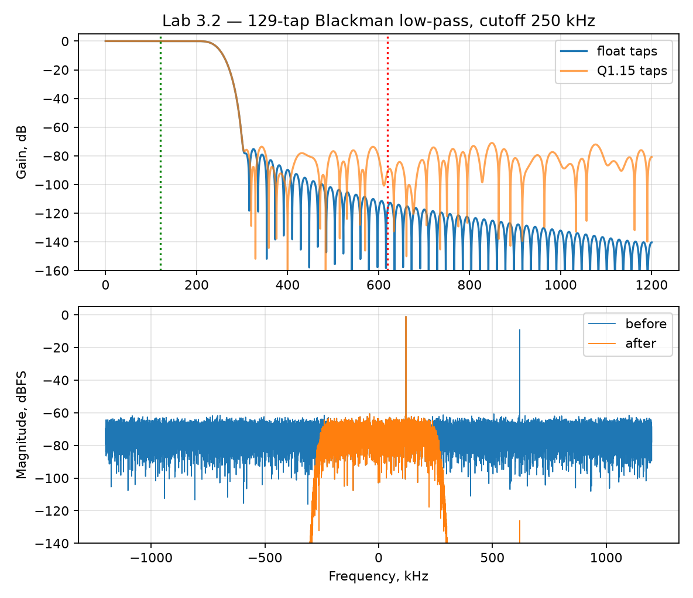

# Лабораторная 3.2 — FIR-фильтр нижних частот для IQ-данных

## Цель

Научиться проектировать и применять FIR-фильтр нижних частот к комплексному IQ-сигналу, а также оценивать влияние фильтра на спектр и временную форму.

## Что выполняется

В работе студент:

1. задаёт частоту дискретизации и полосу полезного сигнала;
2. проектирует FIR-фильтр;
3. применяет фильтр к IQ-сигналу;
4. сравнивает спектр до и после фильтрации;
5. оценивает подавление внеполосных составляющих.

## Результат

После выполнения работы должны быть получены:

- коэффициенты FIR-фильтра;
- график АЧХ фильтра;
- спектры IQ-сигнала до и после фильтрации;
- краткая оценка качества фильтрации.

## Что приложить к отчёту

- параметры фильтра;
- порядок фильтра;
- частоту среза;
- график АЧХ;
- спектры до/после;
- инженерный вывод о пригодности фильтра для SDR-тракта.

## Подробная техническая часть
### Связь с практикой SDR

Работа связывает теорию фильтрации с практической обработкой SDR и готовит студента к будущему потоковому блоку FIR на Verilog.

### Теория

Низкочастотный FIR-фильтр обычно применяют, чтобы выделить сигнал основной полосы, подавить соседние каналы, сузить шумовую полосу или подготовить сигнал к децимации.

Важные понятия:

- полоса пропускания;
- полоса подавления;
- ширина переходной полосы;
- порядок фильтра / число коэффициентов;
- групповая задержка;
- проектирование методом окна с sinc;
- свёртка;
- фильтрация комплексных IQ;
- квантование коэффициентов в fixed-point.

### Эксперимент

Сгенерируйте или загрузите комплексные IQ-данные с:

- желаемой низкочастотной компонентой;
- нежелательной высокочастотной компонентой;
- необязательным аддитивным шумом.

Затем:

1. спроектируйте низкочастотный FIR-фильтр;
2. постройте импульсную характеристику фильтра;
3. постройте частотную характеристику фильтра;
4. отфильтруйте IQ-данные;
5. сравните спектры до и после фильтрации;
6. измерьте базовое улучшение качества сигнала.

### Запуск эталонного скрипта

```bash
python blocks/block_03_dsp_basics/python/lab_3_2_fir_low_pass.py
```

Скрипт детерминирован и записывает:

```text
docs/assets/lab32_fir_low_pass.png
docs/assets/lab32_fir_low_pass_metrics.json
```

Сначала запустите его и сверьте числа с разделом *Чего ожидать* ниже. Затем напишите собственную версию по минимальной структуре ниже; эталонный скрипт — ваш ключ для проверки.

### Реализация на Python

Минимальная структура собственной реализации:

```python
import numpy as np
import matplotlib.pyplot as plt

fs = 2.4e6
n = 32768
t = np.arange(n) / fs

wanted = np.exp(1j * 2*np.pi*120e3*t)
interferer = 0.35 * np.exp(1j * 2*np.pi*620e3*t)
noise = 0.03 * (np.random.randn(n) + 1j*np.random.randn(n))
x = wanted + interferer + noise

num_taps = 129
cutoff = 250e3
m = np.arange(num_taps) - (num_taps - 1) / 2
h = 2 * cutoff / fs * np.sinc(2 * cutoff / fs * m)
h *= np.blackman(num_taps)
h /= np.sum(h)

y = np.convolve(x, h, mode="same")

freq = np.fft.fftshift(np.fft.fftfreq(n, d=1/fs))
X = np.fft.fftshift(np.fft.fft(x))
Y = np.fft.fftshift(np.fft.fft(y))

plt.figure()
plt.plot(freq/1e3, 20*np.log10(np.maximum(np.abs(X), 1e-12)), label="before")
plt.plot(freq/1e3, 20*np.log10(np.maximum(np.abs(Y), 1e-12)), label="after")
plt.grid(True)
plt.xlabel("Frequency, kHz")
plt.ylabel("Magnitude, dB")
plt.legend()
plt.show()
```

### Реализация на MATLAB

Минимальная структура собственной реализации:

```matlab
fs = 2.4e6;
N = 32768;
t = (0:N-1).' / fs;

wanted = exp(1j*2*pi*120e3*t);
interferer = 0.35 * exp(1j*2*pi*620e3*t);
noise = 0.03 * (randn(N,1) + 1j*randn(N,1));
x = wanted + interferer + noise;

numTaps = 129;
cutoff = 250e3;
m = (0:numTaps-1).' - (numTaps-1)/2;
h = 2*cutoff/fs * sinc(2*cutoff/fs * m);
h = h .* blackman(numTaps);
h = h ./ sum(h);

y = conv(x, h, 'same');

freq = fftshift((-floor(N/2):ceil(N/2)-1).' * fs / N);
X = fftshift(fft(x));
Y = fftshift(fft(y));

figure; hold on;
plot(freq/1e3, 20*log10(max(abs(X), 1e-12)), 'DisplayName', 'before');
plot(freq/1e3, 20*log10(max(abs(Y), 1e-12)), 'DisplayName', 'after');
grid on;
xlabel('Frequency, kHz');
ylabel('Magnitude, dB');
legend('Location', 'best');
```

### Мост к C++

Ту же операцию FIR позже следует реализовать как детерминированный примитив на C++:

```cpp
std::vector<std::complex<float>> fir_filter(
    const std::vector<std::complex<float>>& x,
    const std::vector<float>& taps);
```

Минимальная проверка C++:

- тест импульсной характеристики;
- тест ослабления синусоиды/тона;
- сравнение векторов с MATLAB/Python;
- проверка нормировки коэффициентов;
- проверка групповой задержки.

### Мост к FPGA / Verilog

Фильтр FIR естественно отображается на потоковый RTL-блок:

```text
clk, rst
in_valid,  in_i,  in_q
out_valid, out_i, out_q
```

Вопросы к железу:

- Сколько коэффициентов нужно?
- Сколько умножителей доступно?
- FIR полностью параллельный или мультиплексированный по времени?
- Какова разрядность коэффициентов?
- Какова ширина аккумулятора?
- Какая задержка допустима?

### Ожидаемые графики

Постройте как минимум:

1. импульсную характеристику FIR;
2. АЧХ FIR;
3. спектр до фильтрации;
4. спектр после фильтрации;
5. необязательное сравнение во временной области.

### Чего ожидать

Запуск по умолчанию (129-коэффициентный оконный sinc с окном Блэкмана, срез 250 кГц, `Fs = 2,4 МС/с`; полезный тон 120 кГц, помеха 0,35 на 620 кГц, шум 0,03 rms, seed 32):

```text
Gain at 120 kHz / 620 kHz: -0.000 / -116.9 dB
-3 dB edge: 240.3 kHz, first -60 dB point: 296.9 kHz
Transition width (-3 to -60 dB): 56.6 kHz
Stopband peak above 400 kHz: float -89.7 dB, Q1.15 -71.0 dB
Group delay: 64 samples (26.67 us)
Interferer: -9.1 -> -126.1 dBFS (suppression 116.9 dB), wanted change -0.000 dB
```

- **Граница −3 дБ — 240 кГц, а не 250 кГц «среза».** В оконном sinc параметр среза — это точка −6 дБ; переходная полоса симметрично расположена вокруг неё.
- **Ширина переходной полосы 56,6 кГц** задаётся числом коэффициентов и окном, а не частотой среза. Полезное правило для Блэкмана: `переход ≈ 5,5 * Fs / N_taps`, здесь около 100 кГц на весь участок от 0 до полосы подавления; от −3 до −60 дБ измерено 57 кГц.
- **Помеха падает на 116,9 дБ — ровно на усиление фильтра на 620 кГц**, а полезный тон не затронут (0,000 дБ): в линейном фильтре измеренное подавление *и есть* частотная характеристика.
- **Групповая задержка — 64 отсчёта, (N−1)/2**, на любой частоте, потому что коэффициенты симметричны (линейная фаза). В железе это задержка, которую нужно заложить в бюджет.
- **Квантование коэффициентов в Q1.15 поднимает полосу подавления с −89,7 до −71,0 дБ.** Малые крайние коэффициенты длинного фильтра занимают лишь несколько LSB в 16 битах; их ошибка округления — шумовая полка на характеристике. Поэтому разрядность коэффициентов — проектное решение, а не формальность.



### Упражнения

1. Вызовите `design_lowpass(num_taps=...)` с 33, 65, 129 и 257 коэффициентами и прочитайте усиление на 620 кГц (ожидается около −79, −96, −117 и −153 дБ). Куда смещается первая точка −60 дБ? Чего стоит удвоение числа коэффициентов в FPGA?
2. Квантуйте коэффициенты в 12 бит вместо 16. Где окажется полка полосы подавления? Сколько бит коэффициентов нужно для подавления 100 дБ?
3. Замените `np.blackman` на `np.hanning`. Сравните ширину переходной полосы и пик в полосе подавления.
4. Переместите помеху на 280 кГц, в переходную полосу. Какое подавление вы получите и что это говорит о защитных полосах между каналами?

### Чек-лист отчёта (расширенный)

- [ ] Указаны `Fs`, частота среза и число коэффициентов.
- [ ] Построена и объяснена АЧХ FIR.
- [ ] Оценена ширина переходной полосы.
- [ ] Объяснена групповая задержка.
- [ ] Сравнены спектры до/после фильтрации.
- [ ] Оценено подавление помехи.
- [ ] Объяснено, что меняется в fixed-point реализации.
- [ ] Описано, как этот FIR отображался бы в Verilog.

### Шаблон инженерного вывода

```text
Низкочастотный FIR-фильтр подавляет нежелательную компоненту примерно на ____ дБ.
Цена — ____ отсчётов групповой задержки и ____ коэффициентов, что напрямую влияет на
число умножителей FPGA, ширину аккумулятора и задержку.
```
