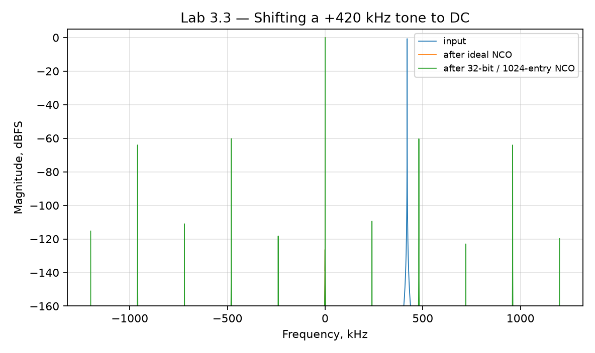

# Лабораторная 3.3 — Цифровое смешение и перенос частоты

## Цель

Понять, как комплексное умножение на цифровой гетеродин переносит IQ-сигнал по частоте и почему знак частотного сдвига критичен для DUC/DDC-трактов.

## Что выполняется

В работе студент:

1. формирует комплексный IQ-сигнал;
2. создаёт цифровой NCO/гетеродин;
3. выполняет комплексное смешение;
4. строит спектры до и после переноса;
5. анализирует ошибки знака и зеркального отображения спектра.

## Результат

После выполнения работы должны быть получены:

- спектр исходного сигнала;
- спектр после цифрового переноса;
- таблица с ожидаемым и измеренным частотным положением;
- объяснение связи с RF и Verilog-реализацией.

## Что приложить к отчёту

- частоту дискретизации;
- частоту цифрового гетеродина;
- знак переноса;
- спектры до/после;
- вывод о корректности частотного плана.

## Подробная техническая часть
### Связь с FPGA

Работа — прямой мост между программной обработкой SDR и блоками FPGA: DDS/NCO, комплексный умножитель, преобразователь частоты и цифровой понижающий преобразователь.

### Теория

Цифровое смешивание умножает входной комплексный сигнал на комплексную экспоненту:

```text
y[n] = x[n] * exp(j * 2*pi*f_shift*n/Fs)
```

Для комплексного сигнала основной полосы это сдвигает спектр на `f_shift`.

Важные понятия:

- комплексная синусоида;
- NCO / DDS;
- аккумулятор фазы;
- разрешение по частоте;
- комплексное умножение;
- положительные и отрицательные сдвиги частоты;
- спектральные образы и заворот;
- представление фазы и синуса/косинуса в fixed-point.

### Эксперимент

Сгенерируйте или загрузите IQ-сигнал с тоном или модулированной формой сигнала вдали от DC.

Затем:

1. оцените или задайте смещение входной частоты;
2. сгенерируйте NCO;
3. умножьте сигнал на NCO;
4. сравните спектры до и после сдвига частоты;
5. убедитесь, что целевой сигнал переместился на ожидаемую частоту;
6. обсудите разрешение NCO по частоте и ширину fixed-point аккумулятора фазы.

### Запуск эталонного скрипта

```bash
python blocks/block_03_dsp_basics/python/lab_3_3_digital_mixing.py
```

Скрипт детерминирован и записывает:

```text
docs/assets/lab33_digital_mixing.png
docs/assets/lab33_digital_mixing_metrics.json
```

Сначала запустите его и сверьте числа с разделом *Чего ожидать* ниже. Затем напишите собственную версию по минимальной структуре ниже; эталонный скрипт — ваш ключ для проверки.

### Реализация на Python

Минимальная структура собственной реализации:

```python
import numpy as np
import matplotlib.pyplot as plt

fs = 2.4e6
n = 32768
t = np.arange(n) / fs

f0 = 420e3
x = np.exp(1j * 2*np.pi*f0*t)

f_shift = -420e3
nco = np.exp(1j * 2*np.pi*f_shift*t)
y = x * nco

freq = np.fft.fftshift(np.fft.fftfreq(n, d=1/fs))
X = np.fft.fftshift(np.fft.fft(x * np.hanning(n)))
Y = np.fft.fftshift(np.fft.fft(y * np.hanning(n)))

plt.figure()
plt.plot(freq/1e3, 20*np.log10(np.maximum(np.abs(X), 1e-12)), label="before")
plt.plot(freq/1e3, 20*np.log10(np.maximum(np.abs(Y), 1e-12)), label="after")
plt.grid(True)
plt.xlabel("Frequency, kHz")
plt.ylabel("Magnitude, dB")
plt.legend()
plt.show()
```

### Реализация на MATLAB

Минимальная структура собственной реализации:

```matlab
fs = 2.4e6;
N = 32768;
t = (0:N-1).' / fs;

f0 = 420e3;
x = exp(1j*2*pi*f0*t);

fShift = -420e3;
nco = exp(1j*2*pi*fShift*t);
y = x .* nco;

freq = fftshift((-floor(N/2):ceil(N/2)-1).' * fs / N);
X = fftshift(fft(x .* hann(N)));
Y = fftshift(fft(y .* hann(N)));

figure; hold on;
plot(freq/1e3, 20*log10(max(abs(X), 1e-12)), 'DisplayName', 'before');
plot(freq/1e3, 20*log10(max(abs(Y), 1e-12)), 'DisplayName', 'after');
grid on;
xlabel('Frequency, kHz');
ylabel('Magnitude, dB');
legend('Location', 'best');
```

### Мост к C++

Будущий примитив на C++ должен разделять генерацию NCO и комплексное умножение:

```cpp
struct NcoState {
    uint64_t phase;
    uint64_t phase_step;
};

std::complex<float> next_nco_sample(NcoState& nco);
std::complex<float> mix_sample(std::complex<float> x, std::complex<float> osc);
```

Проверочные тесты:

- сгенерированная частота совпадает с целевым сдвигом;
- сохраняется непрерывность фазы;
- положительные и отрицательные сдвиги корректны;
- смешанный тон попадает в ожидаемый бин FFT;
- fixed-point ошибка NCO ограничена.

### Мост к FPGA / Verilog

Отображение на железо:

| Функция | Блок RTL |
|---|---|
| накопление фазы | аккумулятор фазы NCO |
| генерация синуса/косинуса | LUT, CORDIC или DDS вендора |
| комплексное умножение | четыре умножителя или оптимизированная форма с тремя умножителями |
| масштабирование выхода | fixed-point округление и насыщение |

Целевой потоковый интерфейс:

```text
clk, rst
in_valid,  in_i,  in_q
out_valid, out_i, out_q
```

### Разрешение NCO по частоте

Для аккумулятора шириной `A` бит:

```text
df = Fs / 2^A
```

| Ширина аккумулятора | Разрешение по частоте |
|---:|---|
| 24 бита | `Fs / 16 777 216` |
| 32 бита | `Fs / 4 294 967 296` |
| 48 бит | `Fs / 281 474 976 710 656` |

### Ожидаемые графики

Постройте как минимум:

1. спектр до смешивания;
2. спектр после смешивания;
3. увеличенный вид вокруг целевой частоты;
4. необязательный график аккумулятора фазы;
5. необязательный график ошибки квантования NCO.

### Чего ожидать

Запуск по умолчанию (`Fs = 2,4 МС/с`, `N = 32768`, тон на +420 кГц, сдвиг −420 кГц; «аппаратный» NCO использует 32-битный аккумулятор фазы, адресующий таблицу синуса/косинуса на 1024 элемента по 16 бит):

```text
Input peak: 419970.7 Hz
After ideal NCO (-420 kHz): 0.0 Hz
After wrong-sign NCO (+420 kHz): 840014.6 Hz
32-bit phase increment: 3543348019 -> realized shift -420000.000112 Hz (error -0.000112 Hz, resolution 0.000559 Hz)
After hardware NCO: 0.0 Hz, worst NCO spur -58.9 dBc
```

- **Показания пика квантованы по бинам.** Вход показывает 419 970,7 Гц, а не 420 000, потому что шаг бина 73,2 Гц; не принимайте это за частотную ошибку.
- **Ошибка знака не заявляет о себе громко.** С противоположным знаком тон уходит *прочь*, на 840 кГц, а выход всё ещё выглядит как чистый тон. Всегда проверяйте, куда попал пик.
- **Отрицательный сдвиг — это большое беззнаковое приращение.** `−420 кГц` становится приращением 3 543 348 019 (это 2^32 − 751 619 277); аккумулятор переполняется по кругу, а сдвиг реализуется с точностью 0,1 мГц — внутри разрешения 0,56 мГц 32-битного аккумулятора.
- **Чистоту ограничивает размер таблицы, а не аккумулятор.** Усечение фазы до 10 адресных бит даёт худшую побочную составляющую −58,9 дБн. Каждый дополнительный адресный бит даёт около 6 дБ (8 бит: −46,8 дБн, 12 бит: −70,8 дБн); 16-битная амплитуда начинает сказываться лишь ниже примерно 8 бит.



### Упражнения

1. Вызовите `hardware_nco(SHIFT_HZ, lut_addr_bits=a)` для `a` = 6, 8, 10, 12 и постройте худшую побочную составляющую от `a`. Проведите прямую. Какой размер таблицы нужен для NCO без побочных составляющих выше −90 дБн?
2. Повторите с `amp_bits` = 8, 12, 16 при 10 адресных битах. Почему разрядность амплитуды здесь почти не важна?
3. Выберите сдвиг, равный точной двоичной доле `Fs` (например `Fs / 16`). Что происходит с побочными составляющими и почему?
4. Замените комплексное умножение вещественным (`np.real(x) * np.cos(...)`). Где появляется лишняя спектральная линия и почему вещественному смесителю нужен фильтр зеркального канала?

### Чек-лист отчёта (расширенный)

- [ ] Указаны `Fs`, частота входного тона и целевой сдвиг.
- [ ] Показано уравнение комплексного NCO.
- [ ] Построен спектр до и после смешивания.
- [ ] Проверено итоговое положение частоты.
- [ ] Объяснены положительные и отрицательные сдвиги частоты.
- [ ] Рассчитано разрешение NCO минимум для 32-битного аккумулятора фазы.
- [ ] Объяснено, как микшер отображается в FPGA.
- [ ] Обсуждены fixed-point масштабирование и насыщение.

### Шаблон инженерного вывода

```text
Цифровое смешивание сдвигает сигнал с ____ кГц на ____ кГц. В FPGA та же операция
превращается в NCO плюс комплексный умножитель. Основные аппаратные компромиссы —
ширина аккумулятора фазы, способ генерации синуса/косинуса, число умножителей и
масштабирование выхода.
```
