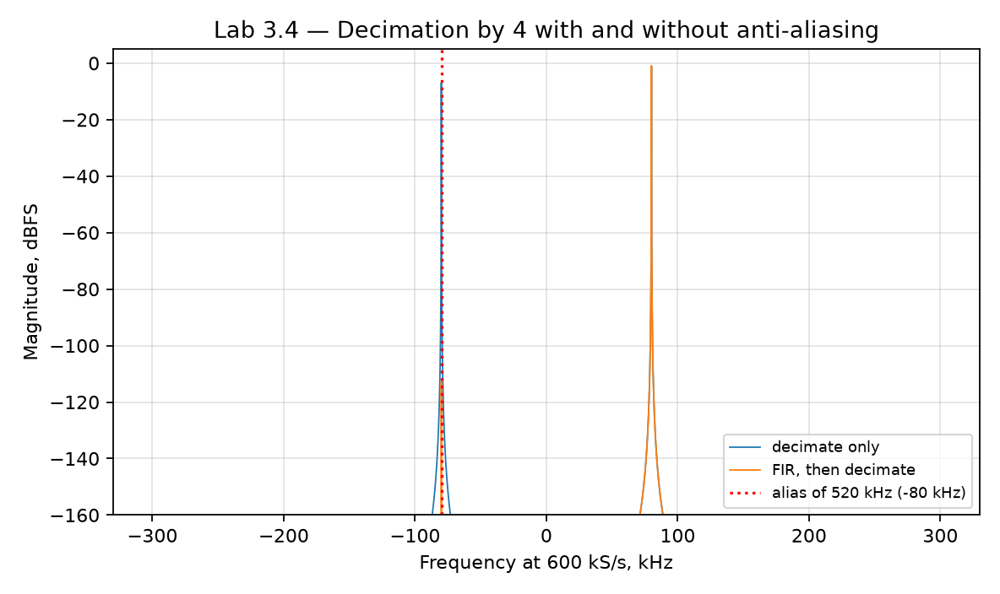

# Лабораторная 3.4 — Децимация с антиалиасинговым фильтром

## Цель

Понять, почему перед уменьшением частоты дискретизации необходимо подавить компоненты, которые после децимации попадут в полезную полосу как алиасинг.

## Что выполняется

В работе студент:

1. формирует тестовый IQ-сигнал с полезной и внеполосной составляющей;
2. проектирует антиалиасинговый FIR-фильтр;
3. выполняет фильтрацию;
4. уменьшает частоту дискретизации;
5. сравнивает спектры до и после децимации.

## Результат

После выполнения работы должны быть получены:

- график АЧХ антиалиасингового фильтра;
- спектр до децимации;
- спектр после децимации;
- оценка подавления алиасинга.

## Что приложить к отчёту

- исходную и конечную частоты дискретизации;
- коэффициент децимации;
- параметры фильтра;
- спектры до/после;
- вывод о корректности decimation chain.

## Подробная техническая часть
### Связь с приёмником SDR

Работа связывает теорию многоскоростной обработки с реализацией приёмника SDR и будущими блоками смены частоты в FPGA.

### Теория

Децимация в `M` раз оставляет каждый `M`-й отсчёт:

```text
y[k] = x[kM]
```

Однако прямое прореживание вызывает наложение спектров, если сигнал предварительно не отфильтрован низкочастотным антиалиасинговым фильтром.

Важные понятия:

- коэффициент децимации;
- новая частота дискретизации `Fs_out = Fs_in / M`;
- антиалиасинговый фильтр;
- переходная полоса;
- защитная полоса;
- полифазная реализация FIR;
- компромисс FPGA между ресурсами и задержкой.

### Эксперимент

Сгенерируйте или загрузите комплексные IQ-данные с:

- полезным сигналом вблизи DC;
- нежелательным сигналом вне будущей полосы Найквиста;
- необязательным шумом.

Затем сравните:

1. прямое прореживание без антиалиасинга;
2. низкочастотную фильтрацию FIR с последующим прореживанием;
3. спектры до и после децимации;
4. положение и подавление алиаса.

### Запуск эталонного скрипта

```bash
python blocks/block_03_dsp_basics/python/lab_3_4_decimation.py
```

Скрипт детерминирован и записывает:

```text
docs/assets/lab34_decimation.png
docs/assets/lab34_decimation_metrics.json
```

Сначала запустите его и сверьте числа с разделом *Чего ожидать* ниже. Затем напишите собственную версию по минимальной структуре ниже; эталонный скрипт — ваш ключ для проверки.

### Реализация на Python

Минимальная структура собственной реализации:

```python
import numpy as np
import matplotlib.pyplot as plt

fs = 2.4e6
M = 4
fs_out = fs / M
n = 65536
t = np.arange(n) / fs

wanted = np.exp(1j * 2*np.pi*80e3*t)
interferer = 0.5 * np.exp(1j * 2*np.pi*520e3*t)
x = wanted + interferer

# Bad path: no anti-aliasing
y_bad = x[::M]

# Good path: FIR anti-aliasing before decimation
num_taps = 129
cutoff = 0.40 * fs_out
m = np.arange(num_taps) - (num_taps - 1) / 2
h = 2 * cutoff / fs * np.sinc(2 * cutoff / fs * m)
h *= np.blackman(num_taps)
h /= np.sum(h)

x_filt = np.convolve(x, h, mode="same")
y_good = x_filt[::M]

freq_in = np.fft.fftshift(np.fft.fftfreq(n, d=1/fs))
freq_out = np.fft.fftshift(np.fft.fftfreq(len(y_good), d=1/fs_out))

X = np.fft.fftshift(np.fft.fft(x * np.hanning(n)))
Y_bad = np.fft.fftshift(np.fft.fft(y_bad * np.hanning(len(y_bad))))
Y_good = np.fft.fftshift(np.fft.fft(y_good * np.hanning(len(y_good))))

plt.figure()
plt.plot(freq_out/1e3, 20*np.log10(np.maximum(np.abs(Y_bad), 1e-12)), label="bad: no anti-alias")
plt.plot(freq_out/1e3, 20*np.log10(np.maximum(np.abs(Y_good), 1e-12)), label="good: FIR + decimate")
plt.grid(True)
plt.xlabel("Frequency, kHz")
plt.ylabel("Magnitude, dB")
plt.legend()
plt.show()
```

### Реализация на MATLAB

Минимальная структура собственной реализации:

```matlab
fs = 2.4e6;
M = 4;
fsOut = fs / M;
N = 65536;
t = (0:N-1).' / fs;

wanted = exp(1j*2*pi*80e3*t);
interferer = 0.5 * exp(1j*2*pi*520e3*t);
x = wanted + interferer;

% Bad path: no anti-aliasing
yBad = x(1:M:end);

% Good path: FIR anti-aliasing before decimation
numTaps = 129;
cutoff = 0.40 * fsOut;
m = (0:numTaps-1).' - (numTaps-1)/2;
h = 2*cutoff/fs * sinc(2*cutoff/fs * m);
h = h .* blackman(numTaps);
h = h ./ sum(h);

xFilt = conv(x, h, 'same');
yGood = xFilt(1:M:end);

freqOut = fftshift((-floor(numel(yGood)/2):ceil(numel(yGood)/2)-1).' * fsOut / numel(yGood));
YBad = fftshift(fft(yBad .* hann(numel(yBad))));
YGood = fftshift(fft(yGood .* hann(numel(yGood))));

figure; hold on;
plot(freqOut/1e3, 20*log10(max(abs(YBad), 1e-12)), 'DisplayName', 'bad: no anti-alias');
plot(freqOut/1e3, 20*log10(max(abs(YGood), 1e-12)), 'DisplayName', 'good: FIR + decimate');
grid on;
xlabel('Frequency, kHz');
ylabel('Magnitude, dB');
legend('Location', 'best');
```

### Мост к C++

Будущий дециматор на C++ должен делать антиалиасинговый фильтр явным:

```cpp
std::vector<std::complex<float>> decimate_fir(
    const std::vector<std::complex<float>>& x,
    const std::vector<float>& taps,
    int factor);
```

Проверочные тесты:

- выходная частота дискретизации верна;
- выходная длина верна;
- тон в полосе пропускания сохраняется;
- тон вне полосы подавляется до прореживания;
- воспроизводим случай отказа прямого прореживания.

### Мост к FPGA / Verilog

Аппаратный дециматор можно реализовать как:

```text
входной поток -> антиалиасинговый FIR -> разрешение прореживания в M раз -> выходной поток
```

Более эффективная реализация:

```text
полифазный FIR-дециматор
```

Вопросы к железу:

- Каков коэффициент децимации?
- Какое подавление в полосе заграждения требуется?
- Может ли FIR работать на входной частоте дискретизации?
- Нужно ли полифазное разложение?
- Каков шаблон выходного valid?
- Какова задержка?

### Ожидаемые графики

Постройте как минимум:

1. входной спектр;
2. выходной спектр без антиалиасинга;
3. выходной спектр с антиалиасинговым FIR;
4. необязательное увеличение вокруг наложенной компоненты;
5. необязательная АЧХ FIR.

### Чего ожидать

Запуск по умолчанию (`Fs_in = 2,4 МС/с`, `M = 4`, `Fs_out = 600 кС/с`; полезный тон +80 кГц, помеха 0,5 на +520 кГц; 129-коэффициентный фильтр нижних частот Блэкмана со срезом `0,4 * Fs_out = 240 кГц`):

```text
Fs in/out: 2.4 / 600 kS/s, new Nyquist band +/-300 kHz
520 kHz interferer is predicted to alias to -80 kHz
Alias relative to wanted tone: no filter -6.0 dBc, with FIR -111.8 dBc
Alias suppression by the anti-aliasing filter: 105.8 dB
```

- **Предскажите до измерения.** Комплексный тон попадает на `((f + Fs_out/2) mod Fs_out) − Fs_out/2`: 520 кГц сворачивается в 520 − 600 = **−80 кГц**, зеркало полезных +80 кГц. Функция `alias_hz()` скрипта делает ровно эту арифметику.
- **Без фильтра алиас на −6 дБн**, то есть вся амплитуда помехи 0,5 теперь сидит внутри полосы, как будто это реальный сигнал на −80 кГц. Ничто в децимированных данных не говорит, что он пришёл с 520 кГц. Наложение необратимо.
- **Фильтрация до прореживания его убирает: −111,8 дБн, подавление 105,8 дБ.** Фильтр должен работать на *входной* частоте, до отбрасывания отсчётов; поэтому дециматоры дороги и поэтому полифазная структура (вычислять только сохраняемые отсчёты) экономит множитель `M` в умножителях.



### Упражнения

1. С помощью `alias_hz()` предскажите, куда попадут 250, 310, 350 и 700 кГц при 600 кС/с (ожидается 250, −290, −250 и +100 кГц). Какие из них опасны для канала на +80 кГц?
2. Уменьшите фильтр до 17, 33 и 65 коэффициентов (ожидаемый алиас около −40, −86 и −106 дБн). Какой самый короткий фильтр держит алиас на 60 дБ ниже полезного тона?
3. Переместите помеху на 290 кГц — внутри новой полосы Найквиста, но за полосой пропускания фильтра. Она не накладывается. Доходит ли она всё же до выхода и насколько сильно?
4. Посчитайте число умножений на выходной отсчёт для прямого фильтра и для полифазной версии с теми же 129 коэффициентами.

### Чек-лист отчёта (расширенный)

- [ ] Указаны `Fs_in`, коэффициент децимации и `Fs_out`.
- [ ] Определена новая полоса Найквиста.
- [ ] Показано, почему прямое прореживание не работает.
- [ ] Спроектирован антиалиасинговый фильтр.
- [ ] Сравнены спектры до/после децимации.
- [ ] Оценено подавление алиаса.
- [ ] Объяснено преимущество полифазного дециматора.
- [ ] Описано поведение valid-частоты в FPGA.

### Шаблон инженерного вывода

```text
Прямое прореживание накладывает компоненту ____ кГц в выходную полосу.
Антиалиасинговый FIR подавляет её примерно на ____ дБ до понижения частоты.
В FPGA этот блок следует реализовать как FIR-дециматор или полифазный дециматор,
в зависимости от ограничений по ресурсам и частоте дискретизации.
```
