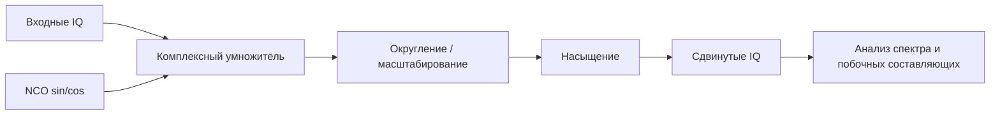

# Лабораторная 4.2 — Цифровой смеситель в fixed-point арифметике

## Цель

Реализовать цифровое смешение IQ-сигнала в fixed-point арифметике и оценить ошибки, возникающие из-за квантования NCO, sin/cos таблицы и комплексного умножения.

## Что выполняется

В работе студент:

1. задаёт частоту цифрового гетеродина;
2. выбирает fixed-point формат для IQ и sin/cos;
3. выполняет комплексное умножение в fixed-point;
4. сравнивает результат с floating-point эталоном;
5. оценивает ошибку амплитуды, фазы и спектральные побочные составляющие.

## Результат

После выполнения работы должны быть получены:

- таблица форматов данных;
- спектры до/после смешения;
- сравнение float и fixed реализаций;
- оценка пригодности формата для Verilog/NCO реализации.

## Что приложить к отчёту

- частоту дискретизации;
- частоту NCO;
- разрядность phase accumulator и LUT;
- ошибку fixed-point реализации;
- вывод о рисках при переносе в RTL.

## Подробная техническая часть
### Практический вопрос

> Сколько бит нужно в NCO и комплексном умножителе, чтобы сдвинуть IQ-сигнал без недопустимых побочных составляющих или ухудшения EVM?

### Исполняемые файлы

| Среда | Файл | Результат |
|---|---|---|
| Python | `blocks/block_04_simulink_and_fixed_point/python/lab_4_2_fixed_point_digital_mixer.py` | метрики + PNG-графики в `docs/assets` |
| MATLAB | `blocks/block_04_simulink_and_fixed_point/matlab/lab_4_2_fixed_point_digital_mixer.m` | метрики + PNG-графики в `docs/assets` |

Запуск из корня репозитория:

```bash
python blocks/block_04_simulink_and_fixed_point/python/lab_4_2_fixed_point_digital_mixer.py
```

MATLAB:

```bash
matlab -batch "run('blocks/block_04_simulink_and_fixed_point/matlab/lab_4_2_fixed_point_digital_mixer.m')"
```

Сгенерированные Python-графики:

```text
docs/assets/lab42_fixed_point_mixer_spectrum.png
docs/assets/lab42_fixed_point_mixer_error.png
docs/assets/lab42_nco_frequency_resolution.png
```

Сгенерированные MATLAB-графики:

```text
docs/assets/lab42_fixed_point_mixer_spectrum_matlab.png
docs/assets/lab42_fixed_point_mixer_error_matlab.png
docs/assets/lab42_nco_frequency_resolution_matlab.png
```

### Инженерный контекст

Цифровой микшер сдвигает комплексный сигнал основной полосы, умножая его на комплексный генератор:

```text
y[n] = x[n] * exp(j * 2*pi*f_shift*n/Fs)
```

В железе это превращается в:

```text
NCO / DDS -> LUT sin/cos или CORDIC -> комплексный умножитель -> округление/насыщение
```

### Цепочка обработки



### Рекомендуемые начальные форматы

| Сигнал | Начальный формат | Примечания |
|---|---|---|
| Входные IQ | Q1.15 | нормированный комплексный вход |
| NCO sin/cos | Q1.15 | простой формат, совместимый с LUT |
| Члены произведения | Q2.30 | результат каждого вещественного умножения |
| Сумма/разность | Q3.30 | накопление комплексного умножения |
| Выходные IQ | Q1.15 | после округления и насыщения |
| Аккумулятор фазы | 24–32 бита | зависит от разрешения по частоте и целевого уровня побочных составляющих |

### Комплексное умножение

Для:

```text
x = I + jQ
w = cos(phi) + j sin(phi)
```

Выход микшера:

```text
y_i = I*cos(phi) - Q*sin(phi)
y_q = I*sin(phi) + Q*cos(phi)
```

### Эталонные реализации

Исполняемые скрипты на Python и MATLAB реализуют один и тот же эксперимент:

1. генерируют комплексный IQ-тон с аддитивным шумом;
2. генерируют генератор NCO/DDS с аккумулятором фазы;
3. запускают микшер с плавающей точкой;
4. запускают учебный комплексный умножитель Q1.15 в фиксированной точке;
5. сравнивают спектры с плавающей и фиксированной точкой;
6. считают ошибку частотного сдвига, RMS-ошибку, EVM, оценку побочных составляющих и число насыщений;
7. сохраняют графики сравнения.

### Обсуждение NCO / DDS

В HDL генератор обычно строится как NCO:

```text
phase[n+1] = phase[n] + phase_increment
phase_increment = round(f_shift / Fs * 2^P)
```

где `P` — ширина аккумулятора фазы.

Разрешение по частоте:

```text
delta_f = Fs / 2^P
```

| Ширина фазы | Разрешение по частоте при Fs = 2,4 МС/с | Практическое замечание |
|---:|---:|---|
| 16 бит | 36,6 Гц | достаточно для простых демонстраций |
| 24 бита | 0,143 Гц | хорошо для большинства работ |
| 32 бита | 0,00056 Гц | распространённый надёжный выбор |

### Обязательные графики

Постройте как минимум:

1. входной спектр;
2. спектр выхода микшера с плавающей точкой;
3. спектр выхода микшера в фиксированной точке;
4. модуль ошибки float против fixed;
5. необязательное увеличение побочных составляющих около несущей;
6. необязательное созвездие до/после для модулированных сигналов.

### Метрики

| Метрика | Как считать | Инженерный смысл |
|---|---|---|
| Ошибка частотного сдвига | измеренный пик минус ожидаемый пик | точность приращения фазы NCO |
| RMS-ошибка | `rms(y_float - y_fixed)` | средняя ошибка реализации |
| EVM | RMS-ошибка, нормированная на RMS сигнала | влияние на качество модуляции |
| Уровень побочных составляющих | крупнейшая нежелательная спектральная компонента | артефакты NCO и квантования |
| Число насыщений | обрезанные выходные отсчёты | качество масштабирования |

### Отображение на HDL

Предлагаемый потоковый интерфейс:

```text
input  wire              clk
input  wire              rst
input  wire              in_valid
input  wire signed [15:0] in_i
input  wire signed [15:0] in_q
output wire              out_valid
output wire signed [15:0] out_i
output wire signed [15:0] out_q
```

Внутренние блоки:


### Чек-лист отчёта (расширенный)

- [ ] Указаны частота дискретизации, частота входного тона и частота сдвига.
- [ ] Указаны форматы входа, NCO, произведения и выхода.
- [ ] Вычислены приращение фазы и разрешение по частоте.
- [ ] Сравнены спектры float и fixed.
- [ ] Оценена ошибка частотного сдвига.
- [ ] Вычислены RMS-ошибка и EVM.
- [ ] Оценён уровень побочных составляющих.
- [ ] Подсчитаны события насыщения.
- [ ] Объяснено, что предпочтительнее: LUT, CORDIC или прямой DDS.

### Шаблон инженерного вывода

```text
Выбранный формат микшера ______ даёт EVM = ____ % и число насыщений = ____.
Ширина аккумулятора фазы ____ даёт разрешение по частоте ____ Гц при Fs = ____ Гц.
Крупнейшая наблюдаемая побочная составляющая — примерно ____ дБн.
Эта конфигурация готова / не готова к HDL, потому что ______.
```
