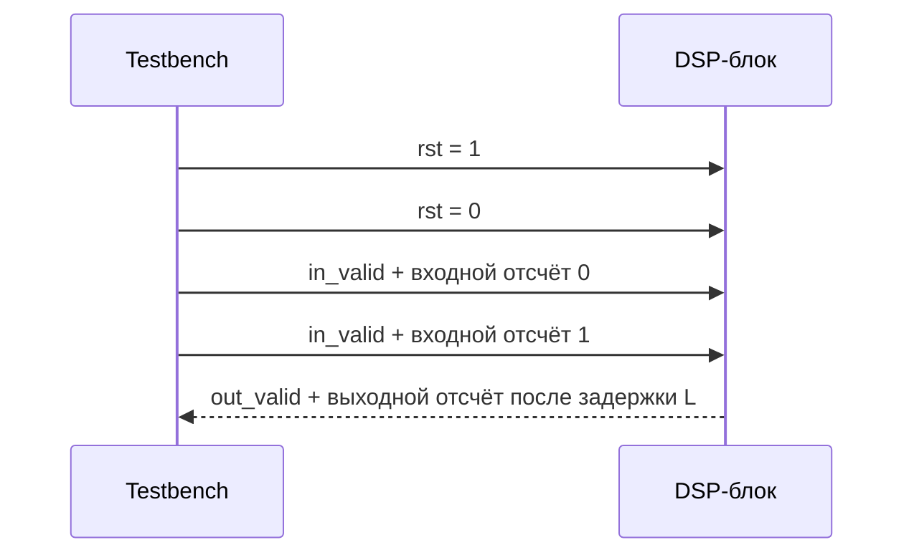

# Лабораторная 5.1 — Потоковый интерфейс и тестбенч

## Цель

Освоить минимальный потоковый интерфейс для DSP-блока на FPGA и научиться проверять его с помощью самопроверяющегося Verilog testbench.

## Что выполняется

В работе студент:

1. изучает valid-only интерфейс для IQ-отсчётов;
2. запускает RTL-блок `iq_passthrough`;
3. анализирует задержку в один такт;
4. проверяет соответствие входных и выходных IQ-отсчётов;
5. получает PASS/FAIL результат симуляции.

## Результат

После выполнения работы должны быть получены:

- RTL-модуль потоковой передачи IQ;
- самопроверяющийся testbench;
- VCD waveform;
- вывод симуляции с результатом `PASS`.

## Что приложить к отчёту

- схему интерфейса;
- таблицу сигналов;
- описание reset и latency;
- фрагмент лога симуляции;
- скриншот waveform или описание временной диаграммы.

## Подробная техническая часть
### Исполняемый HDL-пакет

| Файл | Назначение |
|---|---|
| `blocks/block_05_fpga_hdl_flow/rtl/iq_passthrough.v` | потоковый сквозной RTL-блок IQ только с valid |
| `blocks/block_05_fpga_hdl_flow/tb/tb_iq_passthrough.v` | самопроверяющийся Verilog-testbench |
| `blocks/block_05_fpga_hdl_flow/tb/iq_passthrough_vectors.txt` | описанный формат входных векторов |
| `blocks/block_05_fpga_hdl_flow/README_lab_5_1_hdl_sim.md` | инструкции по локальной симуляции |

Запуск из корня репозитория:

```bash
iverilog -g2012 \
  -o blocks/block_05_fpga_hdl_flow/tb/tb_iq_passthrough.out \
  blocks/block_05_fpga_hdl_flow/rtl/iq_passthrough.v \
  blocks/block_05_fpga_hdl_flow/tb/tb_iq_passthrough.v

vvp blocks/block_05_fpga_hdl_flow/tb/tb_iq_passthrough.out
```

Ожидаемый результат:

```text
PASS: iq_passthrough test completed without errors
```

Workflow GitHub Actions `.github/workflows/block5_hdl.yml` автоматически запускает эту симуляцию при изменении HDL-файлов Блока 5.

### Инженерный вопрос

> Как обернуть fixed-point DSP-алгоритм в детерминированный тактируемый аппаратный блок, который можно проверять отсчёт за отсчётом?

### Минимальный интерфейс только с valid

Для первых HDL-работ используйте простой потоковый интерфейс только с valid:

```verilog
module dsp_block #(
    parameter integer W = 16
)(
    input  wire                 clk,
    input  wire                 rst,

    input  wire                 in_valid,
    input  wire signed [W-1:0]  in_i,
    input  wire signed [W-1:0]  in_q,

    output reg                  out_valid,
    output reg  signed [W-1:0]  out_i,
    output reg  signed [W-1:0]  out_q
);
```

Это ещё не полноценный AXI-Stream, но он учит важнейшим идеям:

- отсчёты принимаются по фронтам тактов;
- `in_valid` отмечает значимые входные отсчёты;
- задержку на выходе необходимо документировать;
- `out_valid` должен быть выровнен с выходными отсчётами;
- поведение при сбросе должно быть детерминированным.

### Модель тайминга



### Пример сквозного блока

Исполняемая реализация находится в `rtl/iq_passthrough.v`.

```verilog
module iq_passthrough #(
    parameter integer W = 16
)(
    input  wire                 clk,
    input  wire                 rst,
    input  wire                 in_valid,
    input  wire signed [W-1:0]  in_i,
    input  wire signed [W-1:0]  in_q,
    output reg                  out_valid,
    output reg  signed [W-1:0]  out_i,
    output reg  signed [W-1:0]  out_q
);

always @(posedge clk) begin
    if (rst) begin
        out_valid <= 1'b0;
        out_i <= '0;
        out_q <= '0;
    end else begin
        out_valid <= in_valid;
        if (in_valid) begin
            out_i <= in_i;
            out_q <= in_q;
        end
    end
end

endmodule
```

### Чек-лист testbench

Testbench должен проверять:

| Проверка | Ожидаемое поведение |
|---|---|
| Сброс | valid на выходе равен нулю, выходы определены |
| Распространение valid | valid на выходе появляется после ожидаемой задержки |
| Выравнивание данных | выходной отсчёт соответствует верному входному |
| Холостые такты | блок не порождает ложных valid-отсчётов |
| Знаковые значения | отрицательные I/Q сохраняются корректно |
| Случаи насыщения | поведение ограничения детерминировано, когда применимо |

### Подход с эталонными векторами

Используйте текстовые файлы для детерминированных тестовых векторов:

```text
input_vectors.txt
expected_vectors.txt
```

Предлагаемый формат:

```text
valid i q
1 32767 0
1 0 32767
1 -32768 0
0 0 0
1 1234 -5678
```

### Структура testbench


### Минимальный отчёт

Отчёт по работе должен содержать:

- таблицу интерфейса;
- описание сброса;
- определение задержки;
- временную диаграмму;
- формат тестовых векторов;
- критерии «прошёл/не прошёл»;
- замечания о том, как интерфейс будет развиваться в AXI-Stream.

### Шаблон инженерного вывода

```text
Выбранный интерфейс использует ____-битные знаковые отсчёты I/Q и протокол только с valid.
Измеренная задержка — ____ тактов. Testbench проверяет сброс, выравнивание valid
и распространение знаковых отсчётов. Следующий шаг — заменить сквозной тракт
логикой FIR или микшера.
```
