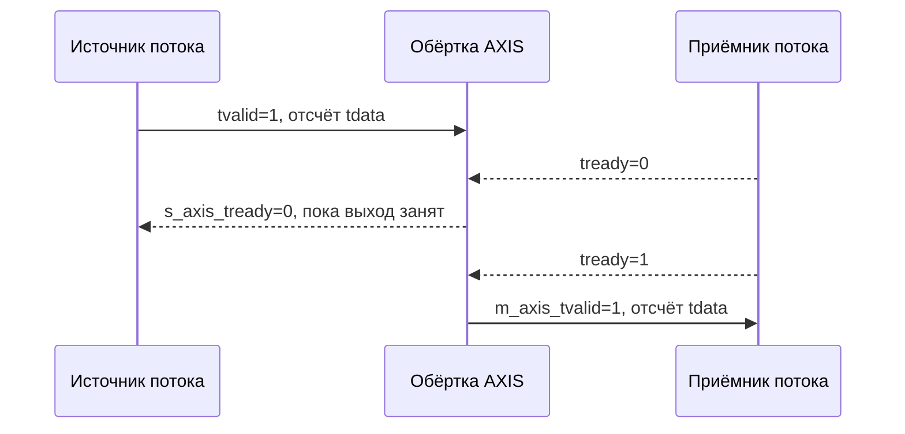

# Лабораторная 5.4 — Обёртка AXI-Stream для IQ-потока

## Цель

Перейти от учебного valid-only интерфейса к интерфейсу AXI-Stream, который ближе к реальному Vivado/Zynq потоку данных.

## Что выполняется

В работе студент:

1. изучает сигналы `tvalid`, `tready`, `tdata`, `tlast`;
2. разбирает упаковку IQ-отсчётов в 32-битное слово;
3. запускает RTL wrapper `axis_iq_passthrough`;
4. проверяет работу backpressure;
5. анализирует сохранение `tdata` и `tlast`.

## Результат

После выполнения работы должны быть получены:

- AXI-Stream style wrapper;
- self-checking testbench;
- VCD waveform;
- PASS/FAIL лог симуляции;
- понимание handshaking-правила `tvalid && tready`.

## Что приложить к отчёту

- таблицу AXI-Stream сигналов;
- формат упаковки IQ в `tdata`;
- пример backpressure;
- лог успешной симуляции;
- вывод о применимости wrapper для FIR/mixer блоков.

## Подробная техническая часть

### Исполняемый HDL-пакет

| Файл | Назначение |
|---|---|
| `blocks/block_05_fpga_hdl_flow/rtl/axis_iq_passthrough.v` | сквозная обёртка IQ в стиле AXI-Stream |
| `blocks/block_05_fpga_hdl_flow/tb/tb_axis_iq_passthrough.v` | самопроверяющийся testbench AXI-Stream |

Запуск из корня репозитория:

```bash
iverilog -g2012 \
  -o blocks/block_05_fpga_hdl_flow/tb/tb_axis_iq_passthrough.out \
  blocks/block_05_fpga_hdl_flow/rtl/axis_iq_passthrough.v \
  blocks/block_05_fpga_hdl_flow/tb/tb_axis_iq_passthrough.v

vvp blocks/block_05_fpga_hdl_flow/tb/tb_axis_iq_passthrough.out
```

Ожидаемый результат:

```text
PASS: axis_iq_passthrough test completed without errors
```

Workflow GitHub Actions `.github/workflows/block5_hdl.yml` запускает эту симуляцию автоматически.

### Инженерный вопрос

> Как подключить потоковый IQ DSP-блок к тракту данных в стиле Vivado/Zynq, поддерживающему backpressure?

### Подмножество сигналов AXI-Stream

Работа использует важнейшие сигналы в стиле AXI-Stream:

| Сигнал | Направление | Смысл |
|---|---|---|
| `s_axis_tvalid` | вход | входной отсчёт действителен |
| `s_axis_tready` | выход | блок может принять входной отсчёт |
| `s_axis_tdata` | вход | упакованный входной отсчёт I/Q |
| `s_axis_tlast` | вход | маркер конца кадра/пакета |
| `m_axis_tvalid` | выход | выходной отсчёт действителен |
| `m_axis_tready` | вход | нижестоящий блок может принять отсчёт |
| `m_axis_tdata` | выход | упакованный выходной отсчёт I/Q |
| `m_axis_tlast` | выход | маркер конца кадра/пакета на выходе |

### Упаковка IQ

Учебная обёртка упаковывает комплексные отсчёты в 32-битный `tdata`:

```text
tdata[15:0]   = отсчёт I, знаковый Q1.15
tdata[31:16]  = отсчёт Q, знаковый Q1.15
```

### Правило handshake

Передача происходит только когда:

```text
tvalid == 1 и tready == 1
```

Если `m_axis_tready` низкий, блок обязан удерживать выходной отсчёт и не терять данные.

### Модель backpressure



### Поведение RTL

Исполняемая обёртка — однотактный регистровый сквозной канал:

```text
входной отсчёт AXIS -> выходной регистр -> нижестоящий AXIS
```

Он демонстрирует:

- handshake `tvalid/tready`;
- удержание выходного регистра при backpressure;
- сохранение `tlast`;
- 32-битный упакованный тракт данных I/Q;
- сброс `aresetn` с активным низким уровнем.

### Стратегия testbench

Testbench проверяет:

1. сброс обнуляет `m_axis_tvalid`;
2. все отсчёты передаются ровно один раз;
3. `tdata` сохраняется;
4. `tlast` сохраняется;
5. детерминированный backpressure не приводит к потере отсчётов;
6. симуляция автоматически падает при расхождении.

### Масштабирование к настоящему проекту Vivado

| Учебная работа | Расширение в реальном проекте |
|---|---|
| 32-битный `tdata` с I/Q | более широкая шина, несколько отсчётов за такт передачи |
| сквозной тракт данных | FIR, mixer, DDC или обработчик пакетов |
| простой детерминированный backpressure | backpressure от DMA, FIFO или RF-фронтенда |
| нет метаданных по боковому каналу | `tuser`, `tkeep`, счётчики кадров, метки времени |
| учебная симуляция | AXI VIP, cocotb или верификация на SystemVerilog |

### Чек-лист отчёта (расширенный)

- [ ] Объяснён handshake `tvalid/tready`.
- [ ] Определена упаковка IQ в `tdata`.
- [ ] Объяснена роль `tlast`.
- [ ] Показано, как проверяется backpressure.
- [ ] Запущена симуляция и записан вывод PASS.
- [ ] Объяснено, как обёртку можно использовать вокруг блоков FIR или mixer.

### Шаблон инженерного вывода

```text
Обёртка AXI-Stream передаёт 32-битные упакованные IQ-отсчёты и сохраняет tlast.
Testbench применяет детерминированный backpressure через m_axis_tready и подтверждает,
что ни один отсчёт не потерян и не продублирован. Эта обёртка — первый шаг к подключению
блоков FIR, mixer и дециматора к потоковому тракту данных Vivado/Zynq.
```
