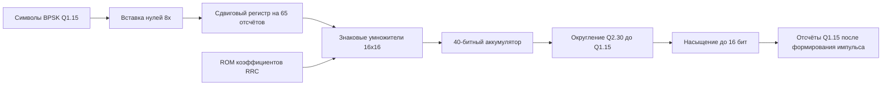

# Лабораторная 5.6 — RTL FIR формирующего RRC-фильтра BPSK TX

## Цель

Продвинуть исполняемый HDL-маршрут BPSK за пределы маппера символов и реализовать настоящий 65-коэффициентный FIR формирования импульса в Q1.15, используемый общим эталонным пакетом Блока 11.

Эта работа — первый настоящий мост от fixed-point модели Simulink к переиспользуемому RTL-блоку модема:

```text
handoff BPSK Блока 11 -> маппер символов -> RRC TX FIR -> будущие TX gain / ЦАП / интеграция Zynq
```

## Исполняемый HDL-пакет

| Файл | Назначение |
|---|---|
| `blocks/block_05_fpga_hdl_flow/rtl/bpsk_rrc_tx_fir.v` | 65-коэффициентный FIR формирования импульса Q1.15 для потоков I/Q |
| `blocks/block_05_fpga_hdl_flow/rtl/bpsk_rrc_tx_fir_taps.mem` | сгенерированный образ ROM коэффициентов из `rrc_taps_q15.txt` |
| `blocks/block_05_fpga_hdl_flow/python/generate_bpsk_rrc_tx_fir_vectors.py` | пересоздаёт память коэффициентов и детерминированные тестовые векторы |
| `blocks/block_05_fpga_hdl_flow/tb/tb_bpsk_rrc_tx_fir.v` | самопроверяющийся Verilog-testbench |
| `blocks/block_05_fpga_hdl_flow/tb/bpsk_rrc_tx_fir_input_vectors.txt` | сгенерированный выход маппера в Q1.15 после повышения частоты |
| `blocks/block_05_fpga_hdl_flow/tb/bpsk_rrc_tx_fir_expected_vectors.txt` | сгенерированный эталонный выход FIR в Q1.15 |

Запуск из корня репозитория:

```bash
python blocks/block_05_fpga_hdl_flow/python/generate_bpsk_rrc_tx_fir_vectors.py

iverilog -g2012 \
  -o blocks/block_05_fpga_hdl_flow/tb/tb_bpsk_rrc_tx_fir.out \
  blocks/block_05_fpga_hdl_flow/rtl/bpsk_rrc_tx_fir.v \
  blocks/block_05_fpga_hdl_flow/tb/tb_bpsk_rrc_tx_fir.v

vvp blocks/block_05_fpga_hdl_flow/tb/tb_bpsk_rrc_tx_fir.out
```

Ожидаемый результат:

```text
PASS: bpsk_rrc_tx_fir test completed without errors
```

## Общие входные данные

Работа намеренно использует тот же общий пакет, что и Блок 4.4:

| Общий файл | Роль на этом шаге RTL |
|---|---|
| `tx_symbols_q15.txt` | детерминированный поток символов после BPSK-маппинга |
| `rrc_taps_q15.txt` | точные 65 коэффициентов формирующего фильтра |
| `config.json` | задаёт `samples_per_symbol = 8` для вставки нулей |

Python-генератор повышает частоту символов, добавляет хвост для очистки фильтра, вычисляет fixed-point отклик FIR и записывает и тестовые векторы, и файл памяти ROM.

## Тракт данных



## Контракт fixed-point

| Параметр | Значение |
|---|---:|
| Формат входного отсчёта | знаковый Q1.15 |
| Формат коэффициентов | знаковый Q1.15 |
| Формат произведения | знаковый Q2.30 |
| Число коэффициентов | 65 |
| Минимум защитных бит | `ceil(log2(65)) = 7` |
| Ширина аккумулятора в RTL | 40 бит |
| Формат выхода | знаковый Q1.15 с насыщением |

## Связь с Simulink

Блок 4.4 уже проверяет тот же тракт формирования импульса в Simulink с общими коэффициентами `rrc_taps_q15`.

Эта работа использует те же коэффициенты и тот же поток символов, поэтому на следующем шаге интеграции можно сравнить:

1. выход MATLAB/Simulink;
2. выход RTL-симуляции;
3. итоговый захват отсчётов TX на Zynq.

## Чек-лист отчёта

- [ ] Показано, что один и тот же `rrc_taps_q15.txt` питает и Simulink, и RTL.
- [ ] Указаны ширина аккумулятора и правило округления.
- [ ] Объяснено, почему `NTAPS = 65` требует больше, чем учебная 4-коэффициентная архитектура.
- [ ] Приложен лог `PASS` самопроверяющегося testbench.
- [ ] Указано, какой блок следующий: TX gain / кадрирование или согласованный фильтр RX.

## Шаблон инженерного вывода

```text
RTL BPSK TX FIR принимает общие символы Q1.15 Блока 11 и 65 коэффициентов RRC.
Проект использует 40-битный аккумулятор и округляет обратно в Q1.15 с насыщением.
Теперь этот блок — опорная точка формирования импульса между маппером символов и будущим передающим трактом Zynq.
```
