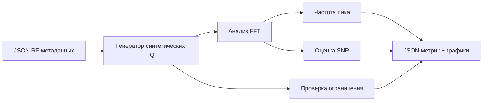

# Лабораторная 6.4 — Анализ синтетической RF IQ-записи

## Цель

Отладить pipeline анализа RF-захвата на синтетических IQ-данных до перехода к реальным записям с AD9363, RTL-SDR или HDSDR.

## Что выполняется

В работе студент:

1. читает metadata JSON;
2. генерирует синтетический IQ-сигнал;
3. строит FFT и временной график;
4. оценивает peak frequency, frequency error и SNR;
5. формирует metrics JSON и графики для отчёта.

## Результат

После выполнения работы должны быть получены:

- синтетический RF capture workflow;
- FFT-график;
- time-domain preview;
- metrics JSON;
- вывод о готовности анализа к реальным IQ-файлам.

## Что приложить к отчёту

- metadata JSON;
- FFT-график;
- measured peak и expected offset;
- оценку SNR;
- clipping/overload flag;
- инженерный вывод.

## Подробная техническая часть
### Практический вопрос

> Можно ли взять файл RF-метаданных, сгенерировать или загрузить IQ-захват, оценить частоту пика, частотную ошибку, SNR и признаки перегрузки и получить воспроизводимый артефакт отчёта?

### Исполняемые файлы

| Файл | Назначение |
|---|---|
| `blocks/block_06_rf_frontend_and_ad9363/python/lab_6_4_synthetic_rf_capture_analysis.py` | генерация и анализ синтетических IQ |
| `blocks/block_06_rf_frontend_and_ad9363/assets/example_first_rf_capture_metadata.json` | пример метаданных RF-захвата |

Запуск из корня репозитория:

```bash
python blocks/block_06_rf_frontend_and_ad9363/python/lab_6_4_synthetic_rf_capture_analysis.py
```

Необязательно: дополнительно записать синтетический IQ-файл CI16:

```bash
python blocks/block_06_rf_frontend_and_ad9363/python/lab_6_4_synthetic_rf_capture_analysis.py --write-iq
```

### Сгенерированные результаты

Скрипт записывает артефакты анализа в `docs/assets`:

```text
docs/assets/lab64_synthetic_rf_capture_fft.png
docs/assets/lab64_synthetic_rf_capture_time.png
docs/assets/lab64_synthetic_rf_capture_metrics.json
```

С `--write-iq` он также записывает:

```text
blocks/block_06_rf_frontend_and_ad9363/assets/synthetic_first_rf_capture.ci16
```

### Цепочка обработки



### Метрики

| Метрика | Смысл |
|---|---|
| `expected_offset_hz` | ожидаемое положение в основной полосе по частотному плану |
| `measured_peak_hz` | сильнейшая наблюдаемая компонента FFT |
| `frequency_error_hz` | измеренный пик минус ожидаемое смещение |
| `peak_dbfs` | оценённый уровень тона |
| `noise_floor_dbfs` | медианная полка спектра вне исключённых бинов |
| `snr_db` | уровень пика минус оценка шумовой полки |
| `clipping_count` | число обрезанных отсчётов I/Q после квантования CI16 |
| `overload_flag` | быстрое предупреждение по ограничению, уровню пика или плохому SNR |

### Зачем сначала синтетика?

Анализ синтетического захвата полезен тем, что позволяет студенту отладить процесс обработки до встречи с реальной RF-неопределённостью:

- неверное соглашение о знаке частоты;
- ошибки нормировки FFT;
- ошибки разбора метаданных;
- отсутствие информации о частоте дискретизации;
- неверный порядок I/Q в CI16;
- проблемы с построением графиков;
- проблемы автоматизации отчёта.

### Переход к реальным IQ-данным

После того как работа заработает, замените синтетический генератор настоящим читателем IQ:

```text
JSON метаданных + реальный capture.ci16 -> FFT -> метрики -> отчёт
```

Те же поля метаданных должны оставаться действительными:

- частота дискретизации;
- формат IQ;
- центральные частоты;
- ожидаемое смещение;
- RF-полоса;
- настройки усиления;
- внешнее ослабление;
- заметки о перегрузке.

### Чек-лист отчёта (расширенный)

- [ ] Приложен JSON метаданных или ссылка на него.
- [ ] Указано ожидаемое смещение в основной полосе.
- [ ] Записан измеренный пик FFT.
- [ ] Вычислена частотная ошибка.
- [ ] Оценён SNR.
- [ ] Проверен флаг ограничения/перегрузки.
- [ ] Приложен график FFT.
- [ ] Приложено превью во временной области.
- [ ] Объяснено, готов ли анализ к реальным IQ-данным.

### Шаблон инженерного вывода

```text
Синтетический RF-захват использовал файл метаданных ______ и ожидал тон на ____ Гц.
Измеренный пик — ____ Гц, частотная ошибка — ____ Гц.
Оценённый SNR — ____ дБ, число ограничений — ____.
Процесс анализа готов / не готов к реальным RF IQ-записям, потому что ______.
```
