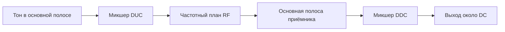

# Лабораторная 7.2 — Частотный перенос DUC/DDC

## Цель

Промоделировать цифровое повышение и понижение частоты в TX/RX-тракте и проверить, что сигнал оказывается в ожидаемой точке спектра на каждом этапе.

## Что выполняется

В работе студент:

1. формирует baseband-сигнал;
2. выполняет DUC-перенос;
3. рассчитывает RF/RX frequency plan;
4. применяет DDC-сдвиг;
5. строит спектры до и после DDC;
6. оценивает остаточную частотную ошибку.

## Результат

После выполнения работы должны быть получены:

- графики спектров TX/RX;
- график контрольных частотных точек;
- metrics JSON;
- вывод о корректности знаков DUC/DDC.

## Что приложить к отчёту

- TX LO и RX LO;
- TX digital offset;
- DDC shift;
- FFT-графики;
- measured peak и residual frequency error;
- инженерный вывод.

## Подробная техническая часть
### Практический вопрос

> Как цифровое смещение TX, частоты RF LO и сдвиг DDC на RX определяют, где сигнал окажется в итоговой основной полосе?

### Исполняемые файлы

| Среда | Файл | Результат |
|---|---|---|
| Python | `blocks/block_07_tx_rx_chains/python/lab_7_2_duc_ddc_frequency_translation.py` | графики FFT + JSON с метриками в `docs/assets` |

Запуск из корня репозитория:

```bash
python blocks/block_07_tx_rx_chains/python/lab_7_2_duc_ddc_frequency_translation.py
```

Сгенерированные артефакты:

```text
docs/assets/lab72_duc_ddc_tx_spectrum.png
docs/assets/lab72_duc_ddc_rx_spectrum.png
docs/assets/lab72_duc_ddc_frequency_plan.png
docs/assets/lab72_duc_ddc_metrics.json
```

### Цепочка обработки



### Частотные уравнения

RF-тон TX:

```text
f_rf = f_tx_lo + f_tx_offset
```

Наблюдаемое смещение в основной полосе приёмника:

```text
f_rx_obs = f_rf - f_rx_lo
```

После DDC:

```text
f_out = f_rx_obs + f_ddc_shift
```

Правильный выбор DDC:

```text
f_ddc_shift = -f_rx_obs
```

### Пример

| Параметр | Значение |
|---|---:|
| LO TX | 915 МГц |
| Цифровое смещение TX | +100 кГц |
| LO RX | 915 МГц |
| Наблюдаемое смещение RX | +100 кГц |
| Сдвиг DDC | −100 кГц |
| Итоговое смещение на выходе | 0 Гц |

### Практическая процедура

1. Сгенерируйте комплексный тон в основной полосе.
2. Примените сдвиг DUC.
3. Интерпретируйте результат через частотный план RF.
4. Сформируйте сигнал IQ приёмника на наблюдаемом смещении.
5. Примените сдвиг DDC.
6. Постройте FFT до и после DDC.
7. Оцените частоту пика на выходе.
8. Убедитесь, что выходной пик близок к DC.

### Ожидаемые графики

- спектр TX в основной полосе;
- спектр после DUC;
- наблюдаемый спектр RX;
- спектр после DDC;
- сводка частотной ошибки.

### Метрики, создаваемые скриптом

| Метрика | Смысл |
|---|---|
| `tx_rf_hz` | RF-частота, следующая из LO TX и сдвига DUC |
| `rx_observed_offset_hz` | ожидаемое смещение в основной полосе приёмника |
| `ddc_shift_hz` | цифровой сдвиг, применяемый в DDC на RX |
| `rx_peak_hz` | измеренный пик до DDC |
| `final_peak_hz` | измеренный пик после DDC |
| `final_frequency_error_hz` | итоговый пик минус ожидаемая итоговая частота |
| `snr_db` | грубая оценка SNR после DDC |

### Типичные ошибки знака

| Ошибка | Симптом | Исправление |
|---|---|---|
| неверный знак DDC | сигнал уходит дальше от DC | использовать отрицательное наблюдаемое смещение |
| игнорируется связь LO TX/RX | ожидаемый пик неверен | считать `TX_LO + offset - RX_LO` |
| вместо комплексного микшера использован вещественный | появляется зеркальный образ | использовать комплексное смешивание IQ |
| несовпадение частоты дискретизации | пик в неверном бине FFT | проверить частоту дискретизации в метаданных |
| сопряжение IQ | зеркальный спектр | проверить порядок I/Q и соглашение о знаке |

### Чего ожидать

```text
TX LO: 915.000000 MHz
RX LO: 915.000000 MHz
TX DUC shift: 100000.000 Hz
TX RF frequency: 915100000.000 Hz
RX observed offset: 100000.000 Hz
DDC shift: -100000.000 Hz
RX peak: 100012.207 Hz
Final peak after DDC: 0.000 Hz
Final frequency error: 0.000 Hz
SNR estimate after DDC: 78.94 dB
```

- Частотный план — чистая арифметика: `915,000 + 0,100 − 915,000 = +0,100 МГц` наблюдается, поэтому сдвиг DDC −100 кГц приводит тон на 0 Гц.
- «RX peak 100 012 Гц» — квантование по бинам (12 Гц), а после DDC тон попадает точно в нулевой бин. В реальном канале добавились бы сдвиги генераторов обеих плат — их и убирают оценщики CFO Блока 8.

### Упражнения

1. Измените знак сдвига DDC. Куда попадёт тон и заметили бы вы ошибку, глядя только на форму спектра?
2. Задайте LO RX 915,030 МГц. Посчитайте наблюдаемое смещение и нужный сдвиг DDC, затем проверьте.
3. На реальном железе два LO отличаются примерно на 0,3 ppm (см. Lab 11.30). Сколько герц остаточного смещения это оставляет на 915 МГц после DDC?

### Чек-лист отчёта (расширенный)

- [ ] Указаны LO TX и LO RX.
- [ ] Указано цифровое смещение TX.
- [ ] Вычислено наблюдаемое смещение RX.
- [ ] Выбран сдвиг DDC.
- [ ] Построена FFT до DDC.
- [ ] Построена FFT после DDC.
- [ ] Оценена частотная ошибка на выходе.
- [ ] Объяснено любое остаточное смещение.

### Шаблон инженерного вывода

```text
Частотный план TX/RX предсказывает наблюдаемое смещение RX ____ Гц.
При сдвиге DDC ____ Гц итоговый пик на выходе — ____ Гц.
Остаточная частотная ошибка — ____ Гц, в основном вызванная ______.
```
