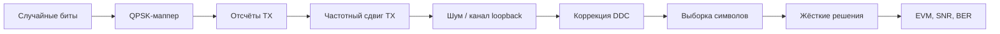

# Лабораторная 7.3 — Метрики TX/RX loopback

## Цель

Собрать компактную синтетическую QPSK-модель TX/RX loopback и рассчитать ключевые метрики качества: EVM, SNR и BER.

## Что выполняется

В работе студент:

1. генерирует случайные биты и QPSK-символы;
2. моделирует TX frequency offset и канал с шумом;
3. выполняет DDC-коррекцию;
4. принимает решения по символам;
5. строит constellation plots и рассчитывает EVM/BER.

## Результат

После выполнения работы должны быть получены:

- spectrum plot до/после DDC;
- TX и RX constellation plots;
- metrics JSON;
- численные значения EVM, SNR estimate и BER.

## Что приложить к отчёту

- параметры QPSK-модели;
- sample rate и samples per symbol;
- TX offset и DDC shift;
- constellation plots;
- таблицу EVM/SNR/BER;
- вывод о готовности к real RF captures.

## Подробная техническая часть

### Практический вопрос

> Как проверить полную цепочку TX/RX по графикам созвездий и числовым метрикам до перехода к RF-железу?

### Исполняемые файлы

| Среда | Файл | Результат |
|---|---|---|
| Python | `blocks/block_07_tx_rx_chains/python/lab_7_3_tx_rx_loopback_metrics.py` | спектры, графики созвездий и JSON с метриками в `docs/assets` |

Запуск из корня репозитория:

```bash
python blocks/block_07_tx_rx_chains/python/lab_7_3_tx_rx_loopback_metrics.py
```

Сгенерированные артефакты:

```text
docs/assets/lab73_tx_rx_loopback_spectrum.png
docs/assets/lab73_tx_constellation.png
docs/assets/lab73_rx_constellation_after_ddc.png
docs/assets/lab73_tx_rx_loopback_metrics.json
```

### Цепочка обработки



### Допущения модели

Работа намеренно компактна:

- символы QPSK используют детерминированный seed;
- в качестве учебной заглушки применяется прямоугольное формирование импульса;
- тайминг считается известным;
- сдвиг DDC точно компенсирует синтетический сдвиг TX;
- перед оценкой EVM и BER применяется скалярное выравнивание усиления/фазы;
- алгоритмы синхронизации вводятся позже, в Блоке 8.

### Метрики

| Метрика | Смысл |
|---|---|
| EVM | RMS-расстояние между выровненными символами RX и эталонными символами TX |
| EVM dB | `20*log10(EVM_rms)` |
| Оценка SNR | приблизительно `-EVM_dB` в этой упрощённой модели |
| BER | битовые ошибки, делённые на число сравнённых бит |
| оценка сдвига до/после DDC | оценка сдвига несущей до и после цифрового понижающего преобразования |
| остаточная частотная ошибка | оценка остаточного сдвига несущей после DDC |

### Ожидаемые графики

- спектр RX до и после DDC;
- эталонное созвездие TX;
- созвездие RX после DDC и скалярного выравнивания.

### Чего ожидать

С конфигурацией по умолчанию (4096 QPSK-символов, 4 отсчёта на символ, сдвиг TX 100 кГц) корректный запуск печатает:

```text
Symbols: 4096
Samples per symbol: 4
TX offset: 100000.000 Hz
DDC shift: -100000.000 Hz
Estimated offset before DDC: 99908.589 Hz
Estimated offset after DDC: 91.568 Hz
Residual frequency error: 91.568 Hz
EVM: 8.526 % (-21.39 dB)
SNR estimate: 21.39 dB
BER: 0.000000e+00 (0/8192)
```

Читайте эти числа вместе:

- **DDC убирает сдвиг.** Оценщик видит около 99,9 кГц до понижающего преобразования и около 92 Гц после него: остаток составляет менее 0,1 % исходного сдвига. Оставшиеся ~92 Гц — собственное смещение оценщика, а не эффект канала.
- **EVM 8,5 % соответствует SNR ≈ 21,4 дБ** через `SNR ≈ −EVM_dB` — приближение, которое использует эта упрощённая модель. Это оценка SNR по созвездию, а не независимое измерение.
- **BER = 0 на 8192 битах, но EVM не нулевой.** Это обычная картина для QPSK при ~21 дБ: решения пока верны, а облака созвездия уже заметно разбросаны. Один BER скрыл бы уровень шума, поэтому набор метрик всегда включает EVM (сравните с [Лабораторной 8.7](lab-8-7-snr-vs-ber-traps.md)).

### Зачем это нужно

Работа связывает несколько предыдущих блоков курса:

| Предыдущий блок | Что используется здесь |
|---|---|
| Блок 3, основы DSP | FFT, смеситель, чтение спектра |
| Блок 4, fixed-point-мышление | Q-формат и интерпретация EVM/ошибки |
| Блок 6, RF-фронтенд | частотный сдвиг и анализ в стиле захвата |
| Блок 7, цепочка TX/RX | сквозные метрики |

### Переход к реальным RF-захватам

Тот же конвейер метрик можно использовать с реальными IQ-данными:

```text
реальный capture.ci16 + JSON метаданных -> DDC -> символьный тайминг -> выравнивание -> EVM/SNR/BER
```

Синтетическая модель поначалу обходит самые трудные шаги реального мира:

- оценку сдвига несущей;
- восстановление тайминга;
- кадровую синхронизацию;
- дисбаланс IQ;
- смещение DC;
- дрейф усиления;
- фазовый шум.

Они вводятся в Блоке 8.

### Чек-лист отчёта (расширенный)

- [ ] Указаны тип модуляции и число символов.
- [ ] Указаны частота дискретизации и число отсчётов на символ.
- [ ] Указаны сдвиг TX и сдвиг DDC.
- [ ] Приложен спектр RX до/после DDC.
- [ ] Приложены графики созвездий TX и RX.
- [ ] Указаны EVM, оценка SNR и BER.
- [ ] Объяснено, почему синтетическая модель проще реального RF.
- [ ] Указано, каких шагов синхронизации пока не хватает.

### Шаблон инженерного вывода

```text
Синтетический QPSK-loopback использовал ____ символов и частотный сдвиг TX ____ Гц.
После DDC остаточная частотная ошибка составила ____ Гц. Измеренный EVM — ____ %,
оценка SNR — ____ дБ, BER — ____.
Цепочка готова / не готова к реальным RF-захватам, потому что ______.
```
