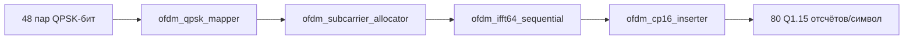
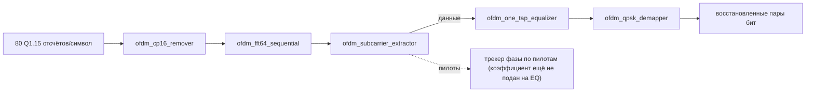

# Лабораторная 8.14 - OFDM RTL: от mapper до эквализированного loopback

## Цель

Провести OFDM мини-линию из [Лабораторной 8.5](lab-8-5-ofdm-mini-link.md) от модели с плавающей точкой на Python к синтезируемому, самопроверяемому fixed-point тракту: QPSK mapper, распределитель/экстрактор поднесущих, потоковый radix-2 64-точечный IFFT/FFT, вставка/удаление циклического префикса и одноотводный эквалайзер — каждый со своим тестбенчем на Icarus Verilog, собранные в полный цифровой loopback TX-RX и в эквализированный loopback через реальный канал.

Эта лабораторная — программно-RTL половина issue #48. Прочитайте [границу доказательности](#что-эта-лабораторная-доказывает-и-чего-не-доказывает) прежде чем считать любой результат здесь аппаратным измерением — это не так.

## Зачем нужна вторая, RTL-модель той же цепочки

[Лабораторная 8.5](lab-8-5-ofdm-mini-link.md) уже доказывает, что алгоритм OFDM работает в плавающей точке. Это не то же самое, что «это работает на кристалле FPGA». Каждый этап здесь существует дважды, намеренно:

- один раз как побитово точная Q1.15 fixed-point модель на Python (`tools/ofdm_ifft_fixed.py`, `tools/ofdm_fft_fixed.py`, `tools/ofdm_equalizer_fixed.py`), которая явно отслеживает каждое решение об округлении и насыщении;
- один раз как синтезируемый Verilog, который проверяется по *тем же самым* закоммиченным векторам, что и fixed-point модель, а не только по ожиданиям собственного тестбенча.

Именно вторая копия делает утверждение «RTL корректен» опровержимым, а не предположением. Файлы `verification/vectors/block08_ofdm_*.mem` — это общая точка истины: `tests/test_ofdm_ifft_fixed.py`, `tests/test_ofdm_fft_fixed.py` и `tests/test_ofdm_tx_fixed.py` сверяют Python-модель с ними, а `tb_ofdm_ifft64_sequential.sv`/`tb_ofdm_fft64_sequential.sv` сверяют RTL с теми же файлами — так что расхождение между Python и RTL не может остаться незамеченным.

## Цепочка TX



| Блок | Роль | Fixed-point / временной контракт |
|---|---|---|
| `ofdm_qpsk_mapper.v` | 2 бита -> один Q1.15 QPSK-символ, знаковое соглашение как в `qpsk_from_bits` из Lab 8.5 | амплитуда `round(32767/sqrt(2)) = 23170`; латентность 1 такт |
| `ofdm_subcarrier_allocator.v` | Размещает 48 символов данных в 64-бинный кадр IFFT (естественный порядок) и вставляет четыре пилотных значения (`pilot_ref = [+1,+1,+1,-1]`) на `k = -21,-7,+7,+21`, точно как частотное распределение в Lab 8.5 | собирает 48 символов, затем выдаёт бины 0..63; новый кадр не принимается до конца выдачи |
| `ofdm_ifft64_sequential.v` | Потоковый radix-2 DIT IFFT, один экземпляр `ofdm_ifft_butterfly`, переиспользуемый на все 6 стадий x 32 бабочки | каждая бабочка делит на 2 -> нормированный масштаб `1/64`; `total_saturation_count` накапливает насыщенные финальные компоненты по всем 192 бабочкам |
| `ofdm_cp16_inserter.v` | Добавляет отсчёты `[48..63]` в качестве циклического префикса | выдаёт 80 отсчётов/символ (`out_is_cp` высок для индексов 0..15); `frame_error`, если входной символ был неполным |

`ofdm_tx_mapper_ifft_path.v` собирает mapper -> allocator -> IFFT; `ofdm_tx_cp16_path.v` добавляет этап CP и является полным TX-базисом, используемым в loopback-тестах ниже.

## Цепочка RX



| Блок | Роль | Fixed-point / временной контракт |
|---|---|---|
| `ofdm_cp16_remover.v` | Отбрасывает 16-отсчётный префикс, передаёт отсчёты 16..79 без изменений | полностью backpressure на 64 полезных отсчётах |
| `ofdm_fft64_sequential.v` | Масштабированное прямое FFT, построено переиспользованием ядра IFFT через тождество `FFT(x)/N = conj(IFFT(conj(x)))` | редкие насыщения на границе Q1.15 при сопряжении `-32768` подсчитываются явно, а не скрываются |
| `ofdm_subcarrier_extractor.v` | Разделяет 64 бина на 48 данных, 4 пилота и 12 нулевых/защитных поднесущих — точная инверсия распределения allocator'а | приёмники данных и пилотов backpressure-независимы; застревание одного не может застопорить другой |
| `ofdm_pilot_phase_tracker.v` | Превращает четыре пилота каждого символа в фазовый корректирующий коэффициент Q2.14 (CORDIC векторизации + поворота) | эталоны пилотов учитываются только знаком, 14 итераций CORDIC, `pilot_ready` опущен на 31 такт на символ; побитово совпадает с `tools/ofdm_pilot_phase_tracker_fixed.py`; к эквалайзеру пока не подключён |
| `ofdm_one_tap_equalizer.v` | Умножает каждый символ данных на внешне заданный корректирующий коэффициент Q2.14 | Q1.15 x Q2.14 -> Q3.29, округление до Q15 (к ближайшему, half-LSB от нуля), затем насыщение; `saturation_count` накапливается с момента сброса |
| `ofdm_qpsk_demapper.v` | Демаппер с жёстким решением, обратный mapper'у | прозрачный ready/valid, ноль соответствует биту `0` — точно как в Python-эталоне |

## Fixed-point контракт одним взглядом

Каждый отсчёт в этой цепочке — знаковый Q1.15 (`±1` представляется как `±32767`/`-32768`, обычная асимметричная граница дополнительного кода). Единственное намеренное исключение — корректирующий коэффициент эквалайзера, Q2.14, чтобы можно было представить коэффициент коррекции почти до 2.0 без незаметного изменения масштаба сигнального тракта. Каждый арифметический этап, способный потерять точность или диапазон — бабочки IFFT/FFT, комплексное умножение эквалайзера — явно округляется (к ближайшему, half-LSB от нуля) и явно насыщается, и каждое насыщение *подсчитывается*, а не просто ограничивается: `total_saturation_count` на стороне TX/IFFT, `total_saturation_count` + `conjugation_saturation_count` на стороне FFT, `saturation_count` в эквалайзере. Это прямо удовлетворяет требованию issue #48 «явное масштабирование, насыщение и счётчики переполнения», и именно это делает критерий приёмки ниже проверяемым, а не предполагаемым:

> «Никакого недокументированного насыщения при выбранном back-off».

Каждый loopback-тест ниже утверждает, что каждый из этих счётчиков равен ровно нулю, и с шумом провалился бы, если бы какой-то этап тихо клипировал сигнал.

## Потоковый контракт

Каждый блок использует один тактовый домен, синхронный активный низким сброс и однорегистровое рукопожатие ready/valid: источник обязан удерживать `valid` и данные стабильными до момента, пока `ready` тоже не станет высоким, а `ready` потребителя может комбинационно зависеть от собственной занятости, но не создавать комбинационную петлю обратно через `valid`. Это намеренно та же дисциплина, что уже используется в цепочке QPSK-модема в других частях курса. Это **ещё не** упаковано как AXI4-Stream: имена сигналов — `valid`/`ready`/`re`/`im`/`index`/`last`, а не `tvalid`/`tready`/`tdata`/`tlast`, и нет блока управления/статуса AXI4-Lite, который выставлял бы счётчики насыщения или soft reset для PS. Комментарий в самом `ofdm_tx_mapper_ifft_path.v` говорит об этом прямо: CP и «AXI-Stream» упомянуты вместе как следующий шаг; CP с тех пор добавлен, упаковка AXI — нет. Считайте это открытым, чётко обозначенным пунктом, честно отражённым, а не тихим пробелом.

## Пилоты: что уже есть, а чего пока нет

Пара allocator/extractor выполняет настоящую **вставку и извлечение** пилотов: allocator записывает четыре фиксированных пилотных значения в их бины на TX, а extractor выдаёт *отдельный* поток пилотов на RX (`pilot_re`/`pilot_im`/`pilot_slot`/`pilot_ref_re`) параллельно с потоком данных, точно отражая `pilot_k`/`pilot_ref` из Lab 8.5.

`ofdm_pilot_phase_tracker.v` потребляет этот поток пилотов. Для каждого OFDM-символа он формирует `P = sum(sign(pilot_ref) * pilot)` (эталоны равны +-1, поэтому умножители не нужны), находит `angle(P)` векторизующим CORDIC на 14 итераций и превращает его поворотным CORDIC в корректирующий коэффициент `16384 * exp(-j * angle(P))` в Q2.14 — входной формат `ofdm_one_tap_equalizer`. Это форма с фиксированной точкой для `pilot_phase = angle(vdot(pilot_ref, y_eq[pilots]))` из Lab 8.5. На 31 такт вычисления `pilot_ready` опускается, а при нулевой сумме пилотов выдаётся единичный коэффициент с флагом `zero_energy`.

Проверка устроена так же, как для остальной цепочки: `tools/ofdm_pilot_phase_tracker_fixed.py` — побитово точная модель, `tools/generate_ofdm_pilot_tracker_vectors.py` записывает 49 тестовых символов (через каждые 15 градусов, границы +-90 и +-180 градусов, амплитуды от 300 до 32000, нулевая энергия и зашумлённые символы, у которых четыре пилота не совпадают), а `tb_ofdm_pilot_phase_tracker.sv` требует побитового совпадения, удерживая `pilot_valid` высоким все такты занятости:

```bash
python -m pytest tests/test_ofdm_pilot_phase_tracker_fixed.py
python -m tools.generate_ofdm_pilot_tracker_vectors   # пересоздать закоммиченные векторы
python tools/run_ofdm_rtl.py                          # все OFDM-стенды, включая трекер
```

```text
PASS: ofdm_pilot_phase_tracker matched the fixed-point model on 49 symbols (backpressure cycles 1490)
```

Относительно идеального `exp(-j * theta)` коэффициент отличается не более чем на 7 LSB от 16384 (0,04 %), а фаза — не более чем на 3 единицы pi/2^15 (около 3e-4 рад) на каждом целом градусе.

Чего в RTL по-прежнему **нет**: коэффициент относится к символу, по пилотам которого он получен, но данные этого символа уже прошли к моменту прихода последнего пилота (бин 57). Применение к тому же символу требует буфера данных на один символ; применение к следующему символу даёт слежение с запаздыванием на символ. Ни того, ни другого подключения пока нет, loopback-тесты ниже по-прежнему дают эквалайзеру фиксированный коэффициент, и нет оценки канала по поднесущим для частотно-селективного канала.

## Этап проверки 1: модель с плавающей точкой vs fixed-point модель vs RTL

```bash
python -m pytest tests/test_ofdm_ifft_fixed.py tests/test_ofdm_fft_fixed.py \
  tests/test_ofdm_equalizer_fixed.py tests/test_ofdm_tx_fixed.py -q
```

Эти тесты сверяют арифметику Q1.15 Python-модели (включая счётчики насыщения) с закоммиченными файлами `verification/vectors/block08_ofdm_*.mem`. Тестбенчи RTL ниже сверяются с *теми же* файлами, так что успех с обеих сторон — это побитовое совпадение в три стороны: замысел с плавающей точкой -> fixed-point эталон -> синтезируемый RTL.

## Этап проверки 2: самопроверяющий цифровой RTL loopback

У каждого блока свой тестбенч; запустите два сквозных напрямую через Icarus Verilog:

```bash
RTL=blocks/block_08_modulation_and_synchronization/rtl
TB=blocks/block_08_modulation_and_synchronization/tb

iverilog -g2012 -o /tmp/tb_ofdm_loop.vvp \
  $RTL/ofdm_qpsk_mapper.v $RTL/ofdm_subcarrier_allocator.v \
  $RTL/ofdm_ifft_butterfly.v $RTL/ofdm_ifft64_sequential.v \
  $RTL/ofdm_tx_mapper_ifft_path.v $RTL/ofdm_cp16_inserter.v \
  $RTL/ofdm_tx_cp16_path.v $RTL/ofdm_cp16_remover.v \
  $RTL/ofdm_fft64_sequential.v $RTL/ofdm_subcarrier_extractor.v \
  $RTL/ofdm_qpsk_demapper.v \
  $TB/tb_ofdm_tx_rx_digital_loopback.sv
vvp /tmp/tb_ofdm_loop.vvp
```

Loopback через канал с поворотом +90 градусов и одноотводный эквалайзер — отдельный testbench:

```bash
iverilog -g2012 -o /tmp/tb_ofdm_eq_loop.vvp \
  $RTL/ofdm_qpsk_mapper.v $RTL/ofdm_subcarrier_allocator.v \
  $RTL/ofdm_ifft_butterfly.v $RTL/ofdm_ifft64_sequential.v \
  $RTL/ofdm_tx_mapper_ifft_path.v $RTL/ofdm_cp16_inserter.v \
  $RTL/ofdm_tx_cp16_path.v $RTL/ofdm_cp16_remover.v \
  $RTL/ofdm_fft64_sequential.v $RTL/ofdm_subcarrier_extractor.v \
  $RTL/ofdm_one_tap_equalizer.v $RTL/ofdm_qpsk_demapper.v \
  $TB/tb_ofdm_tx_rx_equalized_loopback.sv
vvp /tmp/tb_ofdm_eq_loop.vvp
```

Измеренные результаты (воспроизводятся командами выше на текущем RTL этого репозитория):

```text
PASS: OFDM TX->RX digital loopback recovered 96/96 bits with zero errors
PASS: OFDM +90deg channel -> -90deg equalizer recovered 96/96 bits, BER=0
```

Второй результат — не тривиальный passthrough: тестбенч применяет настоящий поворот на +90 градусов ко всем переданным отсчётам во временной области (`channel_re = -im, channel_im = re`), а эквалайзер получает точный обратный коэффициент (`W = -j` в Q2.14), чтобы его снять. Каждый счётчик насыщения (`tx_saturation_count`, `fft_saturation_count`, `eq_saturation_count`) в этом же тесте проверяется на строгий ноль, так что «BER=0» не маскирует переполнение, которое случайно сократилось численно.

## Что эта лабораторная доказывает и чего не доказывает

Это закрывает, только в симуляции, «Initial RTL scope» issue #48 (mapper, распределитель/экстрактор поднесущих, потоковый 64-точечный IFFT/FFT, вставка/удаление CP, одноотводный эквалайзер, явное масштабирование/насыщение/счётчики переполнения) и этапы проверки 1-2 (плавающая точка vs fixed-point, самопроверяющий цифровой loopback) с реальным, воспроизводимым, измеренным доказательством: 96/96 бит при BER=0 как для чистого цифрового loopback, так и для loopback через настоящий поворот комплексного канала, который эквалайзер реально корректирует.

Это **не** заявляет:

- упаковку AXI4-Stream/AXI4-Lite (совместимый по семантике ready/valid есть; именования AXI, блока управления/статуса AXI4-Lite и интеграции в Vivado — нет);
- автоматическую коррекцию по пилотам в тракте данных RTL: `ofdm_pilot_phase_tracker.v` вычисляет фазовый коэффициент на символ (побитово совпадая со своей моделью), но пока не подключён к эквалайзеру, и оценки канала по поднесущим нет;
- этапы проверки 3-5 (PL/fabric loopback на Zynq, безопасный ослабленный кабельный loopback через AD9361/AD9363, независимый захват SDR) — для них нужны физическая плата и RF-тракт, которых не было при написании этой лабораторной;
- отчёты по ресурсам, латентности или timing по результатам реального синтеза — для них нужен Vivado, которого тоже не было. Комментарии в заголовках блоков действительно указывают латентность и число тактов явно (например, у IFFT — `384 такта вычислений после сбора входа»), это реальная информация о дизайне, но не замена отчёту после реализации.

## Упражнения

Каждое упражнение меняет коэффициент эквалайзера в строке `.coeff_re(16'sd0), .coeff_im(-16'sd16384)` файла `tb_ofdm_tx_rx_equalized_loopback.sv` (Q2.14, то есть 16384 = 1,0). Приведённые выводы получены на Icarus Verilog 12.0.

1. Возьмите неверный знак, `W = +j` (`.coeff_im(16'sd16384)`). Канал и эквалайзер теперь дают в сумме 180 градусов: `FAIL BER nonzero: 96/96 bit errors`. Инвертирован каждый бит.
2. Отключите эквалайзер, `W = 1` (`.coeff_re(16'sd16384), .coeff_im(16'sd0)`), или возьмите `W = -1`. Остаточный поворот +90 или -90 градусов: `48/96 bit errors` в обоих случаях. В QPSK с кодом Грея четверть оборота меняет ровно один из двух бит каждого символа.
3. Скомпенсируйте только половину поворота, `W = exp(-j pi/4)` (`.coeff_re(16'sd11585), .coeff_im(-16'sd11585)`). Остаток 45 градусов, и точки ложатся на оси (первое ошибочное значение — `EQ=(513,1)`): `22/96 bit errors`. Объясните, почему это худший случай для жёсткого решения и почему число ошибок не ровно 48.
4. В реальном приёмнике коэффициент не задаётся testbench. Какие OFDM-символы или поднесущие вы бы использовали для его оценки и как это делает Lab 8.5 на Python?

## Что включить в отчёт

- [x] Побитовое совпадение плавающей точки и fixed-point (общие закоммиченные векторы).
- [x] Самопроверяющий цифровой RTL loopback, BER=0, воспроизводимо.
- [x] Самопроверяющий эквализированный RTL loopback через реальный комплексный канал, BER=0, воспроизводимо.
- [x] Каждый счётчик насыщения/переполнения равен нулю при проверенном back-off.
- [ ] Упаковка AXI4-Stream/AXI4-Lite.
- [x] Трекер фазы по пилотам в RTL, побитово совпадающий со своей моделью с фиксированной точкой (49 символов).
- [ ] Подача коэффициента трекера на эквалайзер; оценка канала по поднесущим.
- [ ] PL/fabric loopback на Zynq.
- [ ] Безопасный ослабленный кабельный loopback AD9361/AD9363 с метаданными затухания/усиления.
- [ ] Отчёт по ресурсам, латентности и timing по результатам реального синтеза.
