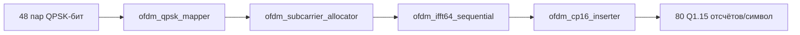
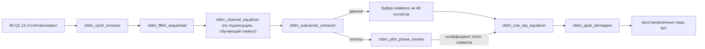

# Лабораторная 8.14 — OFDM RTL: от mapper до эквализированного loopback

## Цель

Провести OFDM мини-линию из [Лабораторной 8.5](lab-8-5-ofdm-mini-link.md) от модели с плавающей точкой на Python к синтезируемому, самопроверяемому fixed-point тракту: QPSK mapper, распределитель/экстрактор поднесущих, потоковый radix-2 64-точечный IFFT/FFT, вставка/удаление циклического префикса и одноотводный эквалайзер — каждый со своим тестбенчем на Icarus Verilog, собранные в полный цифровой loopback TX-RX и в эквализированный loopback через реальный канал.

Эта лабораторная — программно-RTL половина issue #48. Прочитайте [границу доказательности](#что-эта-лабораторная-доказывает-и-чего-не-доказывает) прежде чем считать любой результат здесь аппаратным измерением — это не так.

## Зачем нужна вторая, RTL-модель той же цепочки

[Лабораторная 8.5](lab-8-5-ofdm-mini-link.md) уже доказывает, что алгоритм OFDM работает в плавающей точке. Это не то же самое, что «это работает на кристалле FPGA». Каждый этап здесь существует дважды, намеренно:

- один раз как побитово точная Q1.15 fixed-point модель на Python (`tools/ofdm_ifft_fixed.py`, `tools/ofdm_fft_fixed.py`, `tools/ofdm_equalizer_fixed.py`), которая явно отслеживает каждое решение об округлении и насыщении;
- один раз как синтезируемый Verilog, который проверяется по *тем же самым* закоммиченным векторам, что и fixed-point модель, а не только по ожиданиям собственного тестбенча.

Именно вторая копия делает утверждение «RTL корректен» опровержимым, а не предположением. Файлы `verification/vectors/block08_ofdm_*.mem` — это общая точка истины: `tests/test_ofdm_ifft_fixed.py`, `tests/test_ofdm_fft_fixed.py` и `tests/test_ofdm_tx_fixed.py` сверяют Python-модель с ними, а `tb_ofdm_ifft64_sequential.sv`/`tb_ofdm_fft64_sequential.sv` сверяют RTL с теми же файлами — так что расхождение между Python и RTL не может остаться незамеченным.

## Цепочка TX


```mermaid
flowchart LR
    BITS["48 пар QPSK-бит"] --> MAP[ofdm_qpsk_mapper]
    MAP --> ALLOC[ofdm_subcarrier_allocator]
    ALLOC --> IFFT[ofdm_ifft64_sequential]
    IFFT --> CP[ofdm_cp16_inserter]
    CP --> OUT["80 Q1.15 отсчётов/символ"]
```

| Блок | Роль | Fixed-point / временной контракт |
|---|---|---|
| `ofdm_qpsk_mapper.v` | 2 бита -> один Q1.15 QPSK-символ, знаковое соглашение как в `qpsk_from_bits` из Lab 8.5 | амплитуда `round(32767/sqrt(2)) = 23170`; латентность 1 такт |
| `ofdm_subcarrier_allocator.v` | Размещает 48 символов данных в 64-бинный кадр IFFT (естественный порядок) и вставляет четыре пилотных значения (`pilot_ref = [+1,+1,+1,-1]`) на `k = -21,-7,+7,+21`, точно как частотное распределение в Lab 8.5 | собирает 48 символов, затем выдаёт бины 0..63; новый кадр не принимается до конца выдачи |
| `ofdm_ifft64_sequential.v` | Потоковый radix-2 DIT IFFT, один экземпляр `ofdm_ifft_butterfly`, переиспользуемый на все 6 стадий x 32 бабочки | каждая бабочка делит на 2 -> нормированный масштаб `1/64`; `total_saturation_count` накапливает насыщенные финальные компоненты по всем 192 бабочкам |
| `ofdm_cp16_inserter.v` | Добавляет отсчёты `[48..63]` в качестве циклического префикса | выдаёт 80 отсчётов/символ (`out_is_cp` высок для индексов 0..15); `frame_error`, если входной символ был неполным |

`ofdm_tx_mapper_ifft_path.v` собирает mapper -> allocator -> IFFT; `ofdm_tx_cp16_path.v` добавляет этап CP и является полным TX-базисом, используемым в loopback-тестах ниже.

## Цепочка RX


```mermaid
flowchart LR
    IN["80 Q1.15 отсчётов/символ"] --> CPR[ofdm_cp16_remover]
    CPR --> FFT[ofdm_fft64_sequential]
    FFT --> CEQ["ofdm_channel_equalizer (по поднесущим, обучающий символ)"]
    CEQ --> EXT[ofdm_subcarrier_extractor]
    EXT -->|данные| BUF["буфер символа на 48 отсчётов"]
    EXT -->|пилоты| PILOT[ofdm_pilot_phase_tracker]
    BUF --> EQ[ofdm_one_tap_equalizer]
    PILOT -->|"коэффициент этого символа"| EQ
    EQ --> DEMAP[ofdm_qpsk_demapper]
    DEMAP --> BITS["восстановленные пары бит"]
```

| Блок | Роль | Fixed-point / временной контракт |
|---|---|---|
| `ofdm_cp16_remover.v` | Отбрасывает 16-отсчётный префикс, передаёт отсчёты 16..79 без изменений | полностью backpressure на 64 полезных отсчётах |
| `ofdm_fft64_sequential.v` | Масштабированное прямое FFT, построено переиспользованием ядра IFFT через тождество `FFT(x)/N = conj(IFFT(conj(x)))` | редкие насыщения на границе Q1.15 при сопряжении `-32768` подсчитываются явно, а не скрываются |
| `ofdm_subcarrier_extractor.v` | Разделяет 64 бина на 48 данных, 4 пилота и 12 нулевых/защитных поднесущих — точная инверсия распределения allocator'а | приёмники данных и пилотов backpressure-независимы; застревание одного не может застопорить другой |
| `ofdm_pilot_phase_tracker.v` | Превращает четыре пилота каждого символа в фазовый корректирующий коэффициент Q2.14 (CORDIC векторизации + поворота) | эталоны пилотов учитываются только знаком, 14 итераций CORDIC, `pilot_ready` опущен на 31 такт на символ; побитово совпадает с `tools/ofdm_pilot_phase_tracker_fixed.py` |
| `ofdm_channel_equalizer.v` | Оценивает `H[k]` на каждой используемой несущей по обучающему символу и снимает её фазу в следующих символах | `G = Y*conj(sign X)` (только сложения); `NORMALIZE = 0`: `Z = Y*conj(G) >> 4`, амплитуда не нормируется, конвейер на 3 такта; `NORMALIZE = 1`: zero-forcing `2^14 * Y/G` с CORDIC `1/abs(G)^2` на каждый бин, конвейер на 7 тактов; побитово совпадает с `tools/ofdm_channel_equalizer_fixed.py` |
| `ofdm_pilot_phase_corrector.v` | Подключает трекер к эквалайзеру: буферизует данные одного символа и применяет коэффициент этого же символа | буфер на 48 отсчётов; пока буфер опустошается, `data_ready` и `pilot_ready` опущены, поэтому задержка — один символ плюс 31 такт трекера; арифметика трекера и эквалайзера не меняется |
| `ofdm_one_tap_equalizer.v` | Умножает каждый символ данных на внешне заданный корректирующий коэффициент Q2.14 | Q1.15 x Q2.14 -> Q3.29, округление до Q15 (к ближайшему, half-LSB от нуля), затем насыщение; `saturation_count` накапливается с момента сброса |
| `ofdm_cfo_corrector.v` | Коррекция CFO во временной области перед удалением CP (этап 2e) | корреляция префикса, накопленная по символам, векторный CORDIC на 20 итераций, 32-битный NCO, конвейерный CORDIC поворота на 16 итераций; побитово совпадает с `tools/ofdm_cfo_corrector_fixed.py` |
| `ofdm_qam16_demapper.v` | Решающее устройство 16-QAM с кодом Грея (этап 2e) | нужен эквалайзер zero-forcing; порог `2^14/3 = 5461` |
| `ofdm_qpsk_demapper.v` | Демаппер с жёстким решением, обратный mapper'у | прозрачный ready/valid, ноль соответствует биту `0` — точно как в Python-эталоне |

## Fixed-point контракт одним взглядом

Каждый отсчёт в этой цепочке — знаковый Q1.15 (`±1` представляется как `±32767`/`-32768`, обычная асимметричная граница дополнительного кода). Единственное намеренное исключение — корректирующий коэффициент эквалайзера, Q2.14, чтобы можно было представить коэффициент коррекции почти до 2.0 без незаметного изменения масштаба сигнального тракта. Каждый арифметический этап, способный потерять точность или диапазон — бабочки IFFT/FFT, комплексное умножение эквалайзера — явно округляется (к ближайшему, half-LSB от нуля) и явно насыщается, и каждое насыщение *подсчитывается*, а не просто ограничивается: `total_saturation_count` на стороне TX/IFFT, `total_saturation_count` + `conjugation_saturation_count` на стороне FFT, `saturation_count` в эквалайзере. Это прямо удовлетворяет требованию issue #48 «явное масштабирование, насыщение и счётчики переполнения», и именно это делает критерий приёмки ниже проверяемым, а не предполагаемым:

> «Никакого недокументированного насыщения при выбранном back-off».

Каждый loopback-тест ниже утверждает, что каждый из этих счётчиков равен ровно нулю, и с шумом провалился бы, если бы какой-то этап тихо клипировал сигнал.

## Потоковый контракт

Каждый блок использует один тактовый домен, синхронный активный низким сброс и однорегистровое рукопожатие ready/valid: источник обязан удерживать `valid` и данные стабильными до момента, пока `ready` тоже не станет высоким, а `ready` потребителя может комбинационно зависеть от собственной занятости, но не создавать комбинационную петлю обратно через `valid`. Это намеренно та же дисциплина, что уже используется в цепочке QPSK-модема в других частях курса. Внутри цепочки сигналы по-прежнему называются `valid`/`ready`/`re`/`im`/`index`/`last`; `ofdm_axi_modem.v` — упаковка AXI вокруг всей цепочки TX и RX:

| Интерфейс | Формат |
|---|---|
| `s_axis_tx` | `tdata[1:0]` — одна пара битов QPSK (при `MODULATION = 1` — `tdata[3:0]`, четыре бита); 48 на символ (`tlast` не используется, кадр задаётся счётом) |
| `m_axis_tx` | `tdata = {Q, I}`, Q1.15; 80 отсчётов на символ, сначала CP, `tlast` на 80-м |
| `s_axis_rx` | `tdata = {Q, I}`, Q1.15; 80 отсчётов на символ, `tlast` на 80-м (`tlast` не на своём месте выставляет флаг ошибки кадра RX) |
| `m_axis_rx` | QPSK: `tdata[7:0] = {data_index, bits}`; 16-QAM: `tdata[15:0] = {2'b00, data_index, 4'b0000, bits}`, чтобы индекс оставался выровненным по байту. 48 на символ в порядке бинов FFT (индексы данных 24..47, затем 0..23), `tlast` на 48-м |
| `s_axi` (AXI4-Lite) | `0x00` ID `"OFDM"`, `0x04` версия (`0x00030000`), `0x08` управление (бит 0 — сброс тракта, бит 1 — переобучение, бит 8 — сброс липких ошибок), `0x0C` статус (бит 6 — канал обучен), `0x10`-`0x18` счётчики насыщения TX/FFT/EQ, `0x1C`/`0x20` счётчики символов TX/RX, `0x24` фаза по пилотам, `0x28` корректирующий коэффициент, `0x2C` насыщения эквалайзера канала, `0x30` число пройденных обучающих символов, `0x34` оценка CFO `theta = -2^24 * 64 * CFO` (CFO в периодах на отсчёт, 24 бита со знаковым расширением), `0x38` конфигурация сборки (бит 0 `MODULATION`, 1 `CHANNEL_EQ`, 2 `NORMALIZE`, 3 `CFO_CORR`, 4 `BRAM_MEMORY`) |

RX-цепочка содержит корректор CFO во временной области из этапа 2e (`CFO_CORR = 1`) и эквалайзер по
поднесущим `ofdm_channel_equalizer.v` из этапа 2d (`CHANNEL_EQ = 1`, по умолчанию zero-forcing
`NORMALIZE = 1`). `MODULATION = 1` собирает вариант 16-QAM; ему нужен эквалайзер zero-forcing, потому
что только он ставит внутренний и внешний уровни на одну сетку. Первым символом после сброса и после
записи `CONTROL[1]` должен прийти обучающий символ: хост передаёт шаблон `train_bits()` эквалайзера
как 48 пар битов на `s_axis_tx` (для 16-QAM — те же знаки на внешних точках, `{b1, 0, b0, 0}`).
Переобучение заново запускает и оценку CFO. Этот символ не даёт выхода на `m_axis_rx`, а `STATUS[6]` поднимается, когда
коэффициенты готовы. `tb_ofdm_axi_modem.sv` передаёт обучающий символ и три символа данных из
`s_axis_tx` через канал с поворотом в `s_axis_rx` со случайными остановками на линии и на
`m_axis_rx_tready`, затем сбрасывает тракт и переобучает через `CONTROL[1]`, каждый раз с ещё одним
символом данных. Проверяются BER=0, карта регистров, то, что регистр фазы по пилотам после
выравнивания канала показывает около 0, то, что `CFO_THETA` совпадает с заданным смещением с
точностью 1 %, и липкий флаг ошибки кадра RX. С параметром `CFO_PPM` стенд вдобавок поворачивает
фазу канала на смещение на каждом отсчёте; CI проверяет QPSK при 120 и -150 градусах и 16-QAM при
120 градусах и 5000 ppm:

```text
PASS: ofdm_axi_modem (MODULATION=0, NORMALIZE=1, CFO 0 ppm) 120-degree channel recovered 480/480 bits in 5 symbols after a training symbol, BER=0; reset, retrain, registers and sticky errors checked
PASS: ofdm_axi_modem (MODULATION=1, NORMALIZE=1, CFO 5000 ppm) 120-degree channel recovered 960/960 bits in 5 symbols after a training symbol, BER=0; reset, retrain, registers and sticky errors checked
```

К PS, DMA или интерфейсу AD9361 в block design обёртка пока не подключена.

## Пилоты: что уже есть, а чего пока нет

Пара allocator/extractor выполняет настоящую **вставку и извлечение** пилотов: allocator записывает четыре фиксированных пилотных значения в их бины на TX, а extractor выдаёт *отдельный* поток пилотов на RX (`pilot_re`/`pilot_im`/`pilot_slot`/`pilot_ref_re`) параллельно с потоком данных, точно отражая `pilot_k`/`pilot_ref` из Lab 8.5.

`ofdm_pilot_phase_tracker.v` потребляет этот поток пилотов. Для каждого OFDM-символа он формирует `P = sum(sign(pilot_ref) * pilot)` (эталоны равны +-1, поэтому умножители не нужны), находит `angle(P)` векторизующим CORDIC на 14 итераций и превращает его поворотным CORDIC в корректирующий коэффициент `16384 * exp(-j * angle(P))` в Q2.14 — входной формат `ofdm_one_tap_equalizer`. Это форма с фиксированной точкой для `pilot_phase = angle(vdot(pilot_ref, y_eq[pilots]))` из Lab 8.5. На 31 такт вычисления `pilot_ready` опускается, а при нулевой сумме пилотов выдаётся единичный коэффициент с флагом `zero_energy`.

Проверка устроена так же, как для остальной цепочки: `tools/ofdm_pilot_phase_tracker_fixed.py` — побитово точная модель, `tools/generate_ofdm_pilot_tracker_vectors.py` записывает 49 тестовых символов (через каждые 15 градусов, границы +-90 и +-180 градусов, амплитуды от 300 до 32000, нулевая энергия и зашумлённые символы, у которых четыре пилота не совпадают), а `tb_ofdm_pilot_phase_tracker.sv` требует побитового совпадения, удерживая `pilot_valid` высоким все такты занятости:

```bash
python -m pytest tests/test_ofdm_pilot_phase_tracker_fixed.py
python -m tools.generate_ofdm_pilot_tracker_vectors   # пересоздать закоммиченные векторы
python tools/run_ofdm_rtl.py                          # все OFDM-стенды, включая трекер
```

```text
PASS: ofdm_pilot_phase_tracker matched the fixed-point model on 49 symbols (backpressure cycles 1490)
```

Относительно идеального `exp(-j * theta)` коэффициент отличается не более чем на 7 LSB от 16384 (0,04 %), а фаза — не более чем на 3 единицы pi/2^15 (около 3e-4 рад) на каждом целом градусе.

Коэффициент относится к символу, по пилотам которого он получен, но данные этого символа уже прошли к моменту прихода последнего пилота (бин 57). Поэтому `ofdm_pilot_phase_corrector.v` держит данные символа в буфере на 48 отсчётов и выпускает их через эквалайзер, когда коэффициент готов: коррекция того же символа, как в лабораторной 8.5, ценой задержки на один символ. Применение коэффициента к *следующему* символу обошлось бы без буфера, но давало бы слежение с запаздыванием на символ. Эта коррекция — одна общая фаза на символ; частотно-селективному каналу нужна ещё оценка по поднесущим из этапа 2d (`ofdm_channel_equalizer.v`).

## Этап проверки 1: модель с плавающей точкой vs fixed-point модель vs RTL

```bash
python -m pytest tests/test_ofdm_ifft_fixed.py tests/test_ofdm_fft_fixed.py \
  tests/test_ofdm_equalizer_fixed.py tests/test_ofdm_tx_fixed.py -q
```

Эти тесты сверяют арифметику Q1.15 Python-модели (включая счётчики насыщения) с закоммиченными файлами `verification/vectors/block08_ofdm_*.mem`. Тестбенчи RTL ниже сверяются с *теми же* файлами, так что успех с обеих сторон — это побитовое совпадение в три стороны: замысел с плавающей точкой -> fixed-point эталон -> синтезируемый RTL.

## Этап проверки 2: самопроверяющий цифровой RTL loopback

У каждого блока свой тестбенч; запустите два сквозных напрямую через Icarus Verilog:

```bash
RTL=blocks/block_08_modulation_and_synchronization/rtl
TB=blocks/block_08_modulation_and_synchronization/tb

iverilog -g2012 -o /tmp/tb_ofdm_loop.vvp \
  $RTL/ofdm_qpsk_mapper.v $RTL/ofdm_subcarrier_allocator.v \
  $RTL/ofdm_ifft_butterfly.v $RTL/ofdm_iq_bank_ram.v $RTL/ofdm_ifft64_sequential.v \
  $RTL/ofdm_tx_mapper_ifft_path.v $RTL/ofdm_cp16_inserter.v \
  $RTL/ofdm_tx_cp16_path.v $RTL/ofdm_cp16_remover.v \
  $RTL/ofdm_fft64_sequential.v $RTL/ofdm_subcarrier_extractor.v \
  $RTL/ofdm_qpsk_demapper.v \
  $TB/tb_ofdm_tx_rx_digital_loopback.sv
vvp /tmp/tb_ofdm_loop.vvp
```

Loopback через канал с поворотом +90 градусов и одноотводный эквалайзер — отдельный testbench:

```bash
iverilog -g2012 -o /tmp/tb_ofdm_eq_loop.vvp \
  $RTL/ofdm_qpsk_mapper.v $RTL/ofdm_subcarrier_allocator.v \
  $RTL/ofdm_ifft_butterfly.v $RTL/ofdm_iq_bank_ram.v $RTL/ofdm_ifft64_sequential.v \
  $RTL/ofdm_tx_mapper_ifft_path.v $RTL/ofdm_cp16_inserter.v \
  $RTL/ofdm_tx_cp16_path.v $RTL/ofdm_cp16_remover.v \
  $RTL/ofdm_fft64_sequential.v $RTL/ofdm_subcarrier_extractor.v \
  $RTL/ofdm_one_tap_equalizer.v $RTL/ofdm_qpsk_demapper.v \
  $TB/tb_ofdm_tx_rx_equalized_loopback.sv
vvp /tmp/tb_ofdm_eq_loop.vvp
```

Или запустите все OFDM-стенды (их 23) так же, как CI; `--fabric` и `--baseline` выбирают другие
сборки IFFT/FFT:

```bash
python tools/run_ofdm_rtl.py
```

Измеренные результаты (воспроизводятся командами выше на текущем RTL этого репозитория):

```text
PASS: OFDM TX->RX digital loopback recovered 96/96 bits with zero errors
PASS: OFDM +90deg channel -> -90deg equalizer recovered 96/96 bits, BER=0
```

Второй результат — не тривиальный passthrough: тестбенч применяет настоящий поворот на +90 градусов ко всем переданным отсчётам во временной области (`channel_re = -im, channel_im = re`), а эквалайзер получает точный обратный коэффициент (`W = -j` в Q2.14), чтобы его снять. Каждый счётчик насыщения (`tx_saturation_count`, `fft_saturation_count`, `eq_saturation_count`) в этом же тесте проверяется на строгий ноль, так что «BER=0» не маскирует переполнение, которое случайно сократилось численно.

## Этап проверки 2b: loopback с коррекцией по пилотам

Здесь коэффициент эквалайзеру никто не задаёт. `ofdm_pilot_phase_corrector.v` буферизует 48 отсчётов данных символа, даёт трекеру измерить четыре пилота этого символа и затем пропускает буферизованные данные через эквалайзер с коэффициентом того же символа. Тестбенч поворачивает канал на `ANGLE_DEG` (по умолчанию 120 градусов, далеко за пределами ±45 градусов, которые выдерживает решающее устройство QPSK) и передаёт два символа подряд:

```bash
for angle in 120 -150; do
  iverilog -g2012 -s tb_ofdm_tx_rx_pilot_corrected_loopback \
    -Ptb_ofdm_tx_rx_pilot_corrected_loopback.ANGLE_DEG=$angle \
    -o /tmp/tb_ofdm_pc_loop.vvp $RTL/ofdm_*.v $TB/tb_ofdm_tx_rx_pilot_corrected_loopback.sv
  vvp /tmp/tb_ofdm_pc_loop.vvp
done
```

```text
PASS: OFDM 120-degree channel -> pilot-corrected RX recovered 192/192 bits in 2 symbols, BER=0 (phase 21851, coeff=(-8201,-14183))
PASS: OFDM -150-degree channel -> pilot-corrected RX recovered 192/192 bits in 2 symbols, BER=0 (phase -27301, coeff=(-14186,8200))
```

Измеренная фаза — угол канала в единицах pi/2^15 (120 градусов = 21845), коэффициент равен `16384 * exp(-j * phase)` в Q2.14. Если заставить корректор применять единичный коэффициент, тот же тест падает с 96/192 битовыми ошибками.

## Этап проверки 2c: смещение несущей частоты

Статический поворот — простой случай: каждому символу нужен один и тот же коэффициент. Смещение
несущей частоты (CFO) заставляет фазу расти от символа к символу и внутри символа. Тот же тестбенч
принимает `CFO_PPM` (смещение в 1e-6 циклов на отсчёт) и `SYMBOLS` и печатает строку `RESULT` перед
PASS/FAIL; `tools/run_ofdm_cfo_sweep.py` прогоняет его по списку смещений:

```bash
python tools/run_ofdm_cfo_sweep.py --angle-deg 30 --symbols 8
```

Измерено в Icarus Verilog 12.0 (768 бит на точку):

| CFO, ppm | CFO / расстояние между поднесущими | Набег фазы за символ | Битовых ошибок | Фаза RTL (последний символ) | Фаза float-модели |
|---:|---:|---:|---:|---:|---:|
| 0 | 0,000 | 0 град | 0 | 5467 | 5461,3 |
| 1000 | 0,064 | 28,8 град | 0 | -19767 | -19764,1 |
| 2000 | 0,128 | 57,6 град | 0 | 20491 | 20487,2 |
| 4000 | 0,256 | 115,2 град | 0 | -30221 | -30220,4 |
| 5000 | 0,320 | 144,0 град | 0 | 9907 | 9904,7 |
| 6000 | 0,384 | 172,8 град | 13 | -15547 | -15540,8 |
| 7000 | 0,448 | 201,6 град | 71 | 24527 | 24514,3 |
| 8000 | 0,512 | 230,4 град | 104 | -997 | -1006,0 |

Из таблицы видно три вещи:

- **Коррекция того же символа отслеживает большие набеги фазы.** До 144 градусов за символ корректор
  по-прежнему даёт BER = 0, потому что каждый символ корректируется фазой, измеренной по его
  собственным пилотам. Приёмник, применяющий коэффициент предыдущего символа, ошибался бы на весь
  набег, а решающее устройство QPSK выдерживает только 45 градусов.
- **Ломается модель общей фазы, а не слежение.** Внутри одного символа фаза всё равно уходит на
  `2*pi*CFO*64`, и поднесущие перестают быть ортогональными: энергия каждой несущей просачивается в
  соседние (межканальная интерференция, ICI). Примерно с 0,38 расстояния между поднесущими одна только
  ICI переворачивает биты. Один коэффициент на символ этого не исправит; нужна оценка и коррекция CFO
  во временной области, до FFT.
- **Оценка по пилотам смещена, и это смещение — не шум.** Фаза трекера отличается от средней фазы
  канала на символе на величину, растущую с CFO. Float-модель `tools/ofdm_cfo_pilot_bias.py` строит те
  же символы и воспроизводит фазу RTL с точностью примерно 13 единиц (0,07 градуса); если поднесущие
  данных оставить пустыми, разница равна нулю. Смещение — это ICI от поднесущих данных, просочившаяся
  в четыре бина пилотов, и оно зависит от данных:

```bash
python tools/ofdm_cfo_pilot_bias.py --angle-deg 30 --symbols 8 --ppm 0 500 2000 4000
```

```text
   CFO ppm   mean phase   pilot estimate   bias (units, deg)   bias with pilots only
         0       5461.3           5461.3       0.0    0.00                   0.0
       500      25367.9          25624.8     256.9    1.41                  -0.0
      2000      19551.6          20487.2     935.6    5.14                  -0.0
      4000     -31894.2         -30220.4    1673.8    9.19                  -0.0
```

Поэтому при CFO тестбенч проверяет BER, а фазу только сообщает. В CI прогоняется случай 2000 ppm,
8 символов.

## Этап проверки 2d: частотно-селективный канал

Одного коэффициента на символ достаточно, пока все поднесущие видят один и тот же канал. Многолучевой
канал — нет: его частотная характеристика `H[k]` имеет своё усиление и свою фазу на каждой несущей.
`ofdm_channel_equalizer.v` стоит между FFT и экстрактором и оценивает `H[k]` по **обучающему символу** —
первому символу после сброса, на 48 поднесущих данных которого известная фиксированная
последовательность битов (`train_bits()`), а пилоты обычные:

- обучение: `G[k] = Y[k] * conj(sign(X[k]))`, только сложения, потому что знаки эталона — ±1;
- каждый следующий символ: `Z[k] = Y[k] * conj(G[k]) >> 4` с округлением и насыщением.

`Z[k]` — это переданный символ, умноженный на `|H[k]|^2`: фаза канала снята на каждой несущей, поэтому
жёсткие решения QPSK верны **без деления**. Амплитуда не нормируется (несущие в замирании выходят
маленькими) — для QPSK это нормально, для 16-QAM и для измерения EVM — нет. Пилоты тоже выравниваются,
поэтому `ofdm_pilot_phase_corrector.v` дальше по тракту измеряет только то, что изменилось после
обучающего символа, например остаточный CFO. Лабораторная 8.5 использует другую преамбулу (известные
значения на чётных несущих, интерполяция между ними, деление на `H`); обучающий символ здесь ближе к
длинному обучающему полю 802.11.

Блок побитово совпадает с `tools/ofdm_channel_equalizer_fixed.py` на 6 кадрах (единичный канал,
многолучевость лабораторной 8.5, сильная многолучевость с шумом, глубокое замирание, насыщение
эквалайзера, бины у полной шкалы):

```bash
python -m pytest tests/test_ofdm_channel_equalizer_fixed.py
python -m tools.generate_ofdm_channel_eq_vectors      # перегенерировать закоммиченные векторы
```

```text
PASS: ofdm_channel_equalizer matched the fixed-point model on 6 frames, 768 equalized bins, saturation counts included
```

Сквозной стенд `tb_ofdm_tx_rx_multipath_loopback.sv` передаёт обучающий символ, а затем данные через
`h = 0.5 + 0.25 e^{j1.2} z^-3 + 0.15 e^{-j2.0} z^-7` (в пределах циклического префикса):

```bash
iverilog -g2012 -s tb_ofdm_tx_rx_multipath_loopback -o /tmp/tb_mp.vvp \
  $RTL/ofdm_*.v $TB/tb_ofdm_tx_rx_multipath_loopback.sv
vvp /tmp/tb_mp.vvp
```

```text
PASS: OFDM 3-path channel -> per-subcarrier equalizer recovered 384/384 data bits in 4 symbols after 1 training symbol, BER=0 (equalizer saturations 0)
```

С `-Ptb_ofdm_tx_rx_multipath_loopback.USE_CHANNEL_EQ=0` эквалайзер по поднесущим обходится, и
корректируется только общая фаза по пилотам: `FAIL BER nonzero: 24/384 bit errors`. Добавление CFO
(`CFO_PPM`, 8 символов данных) показывает обе коррекции вместе: 0 ошибок при 500, 1000 и 2000 ppm,
2 из 768 бит при 3000 ppm, где несущие в самой глубокой части замирания встречаются с межканальной
интерференцией этапа 2c.

### Zero-forcing: одна сетка амплитуд для 16-QAM

QPSK нужны только знаки, поэтому `Z = Y*conj(G)` достаточно; решающему устройству 16-QAM нужно ещё,
чтобы все несущие лежали на одной сетке амплитуд. С `NORMALIZE = 1` эквалайзер делит на `|G|^2` без
делителя: после обучающего символа он останавливает вход, пока последовательный CORDIC в линейном
режиме вычисляет `1/|G[k]|^2` для каждого бина (`|G|^2` сдвигается так, чтобы старший бит стал битом 35,
затем 17 итераций `y -/+= x >> i, z +/-= 2^(16-i)`), и бины данных выходят как `2^14 * Y/G`: около ±8192
на компоненту на каждой несущей данных и около ±16384 на пилотах. Fixed-point модель и RTL совпадают
побитово в обоих режимах (7 кадров, в одном из которых канал после обучения меняется, чтобы пройти
путь насыщения):

```text
PASS: ofdm_channel_equalizer (NORMALIZE=1) matched the fixed-point model on 7 frames, 896 equalized bins, saturation counts included
```

Многолучевой стенд сообщает, насколько решённые компоненты отстоят от одной сетки:
`rms(c - sign*A)/A`, где `A` — их средний модуль (`-Ptb_ofdm_tx_rx_multipath_loopback.NORMALIZE=1`,
8 символов данных):

| Эквалайзер | Битовых ошибок | Средняя амплитуда `A` | Разброс относительно сетки |
|---|---:|---:|---:|
| нет (только общая фаза по пилотам) | 48/768 | 189 | 57,6 % |
| `NORMALIZE = 0` (только фаза, `abs(H)^2` остаётся) | 0/768 | 5790 | 61,7 % |
| `NORMALIZE = 1` (zero-forcing) | 0/768 | 8192 | 0,4 % |
| `NORMALIZE = 1`, CFO 500 / 1000 / 2000 ppm | 0/768 | 8159 / 8113 / 7983 | 8,9 / 17,5 / 35,8 % |

Zero-forcing кладёт все несущие на одну сетку. CFO снова её размывает: внутри символа фаза всё равно
уходит на `2*pi*CFO*64`, и один коэффициент на символ этого не снимет. QPSK это безразлично (BER
остаётся 0), а решающему устройству 16-QAM — нет, поэтому приёмнику QAM нужна коррекция CFO до FFT.

## Этап проверки 2e: 16-QAM и коррекция CFO во временной области

Два новых блока превращают цепочку в приёмник 16-QAM:

- `ofdm_qam16_mapper.v` / `ofdm_qam16_demapper.v`: 16-QAM с кодом Грея, четыре бита на несущую. На
  каждой оси первый бит — знак, второй выбирает внутренний уровень `1/sqrt(10)` (10362) или внешний
  `3/sqrt(10)` (31086). `ofdm_tx_cp16_path` выбирает маппер параметром `MODULATION = 1`. Обучающий
  символ использует внешние точки со знаками обучающего символа QPSK, поэтому эквалайзер zero-forcing
  кладёт внешний уровень на `2^14/2 = 8192`, а внутренний — на треть от него: порог решающего устройства
  посередине — `2^14/3 = 5461`, он выведен, а не подобран.
- `ofdm_cfo_corrector.v` перед удалением CP: буферизует каждый символ из 80 отсчётов и считает
  корреляцию циклического префикса `P = sum x[n] * conj(x[n+64])` по 16 отсчётам префикса (префикс —
  копия хвоста символа, поэтому `angle(P) = -2*pi*64*CFO`), накопленную с момента сброса. Векторный
  CORDIC на 20 итераций даёт угол, 32-битный NCO сдвигается на `угол/64` за отсчёт, а конвейерный CORDIC
  поворота на 16 итераций поворачивает тот же символ обратно, включая обучающий. Побитово совпадает с
  `tools/ofdm_cfo_corrector_fixed.py` (6 потоков, 1280 отсчётов):

```bash
python -m pytest tests/test_ofdm_qam16_cfo_fixed.py
python -m tools.generate_ofdm_cfo_vectors      # перегенерировать закоммиченные векторы
```

```text
PASS: ofdm_cfo_corrector matched the fixed-point model on 6 streams, 1280 samples; misplaced in_last flagged
PASS: 16-QAM mapper and slicer match the model (16 codes, thresholds)
```

`tb_ofdm_tx_rx_qam16_loopback.sv` прогоняет 16-QAM через всю цепочку (`CHANNEL = 1`: многолучёвость
лабораторной 8.5, 6 символов данных, 1152 бита на точку) и сообщает EVM относительно идеальной сетки
после эквалайзера:

| CFO, ppm (доля шага поднесущих) | Без корректора CFO | С корректором CFO |
|---:|---:|---:|
| 0 | 0 ошибок, EVM 0,44 % | 0 ошибок, EVM 0,44 % |
| 500 (0,032) | 0 ошибок, EVM 8,4 % | 0 ошибок, EVM 0,44 % |
| 2000 (0,128) | 88 ошибок, EVM 34 % | 0 ошибок, EVM 0,45 % |
| 4000 (0,256) | 281 ошибка, EVM 74 % | 0 ошибок, EVM 0,54 % |
| 7000 (0,448) | 495 ошибок, EVM 162 % | 0 ошибок, EVM 0,50 % |
| 7700 (0,493) | | 0 ошибок, EVM 0,49 % |
| 8200 (0,525) | | 550 ошибок, EVM 146 % |

```bash
iverilog -g2012 -s tb_ofdm_tx_rx_qam16_loopback -Ptb_ofdm_tx_rx_qam16_loopback.CFO_PPM=6000 \
  -o /tmp/tb_qam16.vvp $RTL/ofdm_*.v $TB/tb_ofdm_tx_rx_qam16_loopback.sv
vvp /tmp/tb_qam16.vvp
```

Что из этого следует:

- **16-QAM нужна коррекция CFO до FFT.** QPSK выдерживал 0,32 шага поднесущих с фазой на символ
  (этап 2c); 16-QAM теряет биты уже на 0,128, потому что межканальная интерференция размывает решение
  «внутренний/внешний» задолго до того, как перевернёт знак.
- **У корреляции префикса есть диапазон.** Её угол однозначен, пока `64 * CFO` не выходит за пол-оборота,
  то есть `abs(CFO) < 1/128` цикла на отсчёт (7812,5 ppm, половина шага поднесущих). На 8200 ppm угол
  заворачивается (`theta` меняет знак), и коррекция толкает не в ту сторону.
- **Многолучёвость немного её смещает.** Совсем без сдвига корректор всё равно видит небольшой (до
  примерно 26 ppm на сильном канале): первые отсчёты префикса несут эхо предыдущего символа, так что
  префикс — не точная копия. Остаток снимает трекер по пилотам; пропуск первых отсчётов префикса в
  корреляции убрал бы смещение ценой меньшего числа отсчётов.
- На сильной многолучёвости (`CHANNEL = 2`) EVM 1,7 % при 0, 6000 и -4000 ppm: остаётся вклад
  эквалайзера, а не сдвига.

## Этап проверки 2f: шум и цена одного обучающего символа

`tb_ofdm_tx_rx_qam16_loopback.sv` умеет добавлять после канала белый гауссов шум (`ESN0_DB10` —
Es/N0 на используемую поднесущую в десятых долях дБ; `MODULATION = 0` пропускает через ту же цепочку
QPSK). Стенд выводит уровень шума из масштабирования цепочки: бин равен `X/64`, поэтому шум с
дисперсией `2*sigma^2` на отсчёт превращается в `2*sigma^2/64` на бин и
`sigma = sqrt(abs(X)^2 / (128 * Es/N0))`. `tools/run_ofdm_ber_sweep.py` перебирает Es/N0 и печатает
измеренный BER рядом с кривой AWGN:

```bash
python tools/run_ofdm_ber_sweep.py --modulation qpsk --esn0 6 8 10 12 --seeds 4
python tools/run_ofdm_ber_sweep.py --modulation qam16 --esn0 14 16 18 20 22 --seeds 4
```

Плоский канал без CFO, 100 символов данных на прогон, четыре зерна шума на точку (вся цепочка:
корректор CFO, FFT, эквалайзер zero-forcing, обученный по одному зашумлённому символу, фаза по
пилотам, решающее устройство):

| Модуляция | Es/N0, дБ | Ошибки / биты | BER | EVM | Теория AWGN | Теория на 3 дБ позже |
|---|---:|---:|---:|---:|---:|---:|
| QPSK | 6 | 3613 / 38400 | 9,4e-2 | 88,6 % | 2,3e-2 | 7,9e-2 |
| QPSK | 8 | 1793 / 38400 | 4,7e-2 | 68,6 % | 6,0e-3 | 3,8e-2 |
| QPSK | 10 | 669 / 38400 | 1,7e-2 | 52,7 % | 7,8e-4 | 1,3e-2 |
| QPSK | 12 | 152 / 38400 | 4,0e-3 | 40,6 % | 3,4e-5 | 2,4e-3 |
| 16-QAM | 14 | 2552 / 76800 | 3,3e-2 | 27,5 % | 9,4e-3 | 4,2e-2 |
| 16-QAM | 16 | 971 / 76800 | 1,3e-2 | 21,6 % | 1,8e-3 | 1,7e-2 |
| 16-QAM | 18 | 236 / 76800 | 3,1e-3 | 17,1 % | 1,4e-4 | 4,5e-3 |
| 16-QAM | 20 | 31 / 76800 | 4,0e-4 | 13,5 % | 2,9e-6 | 5,8e-4 |
| 16-QAM | 22 | 3 / 76800 | 3,9e-5 | 10,7 % | 6,8e-9 | 2,5e-5 |

Только симуляция, с фиксированными зёрнами; теоретические столбцы — `1/2 erfc(sqrt(Es/N0 / 2))` для
QPSK с кодом Грея и приближение ближайших соседей `3/8 erfc(sqrt(Es/N0 / 10))` для 16-QAM с кодом
Грея. Что из этого следует:

- **Основная часть разрыва — обучающий символ, а не RTL.** Эквалайзер делит на `G`, оценённый по
  одному символу с тем же шумом. В первом порядке шум оценки складывается с шумом данных: вдвое
  большая дисперсия, потеря 3 дБ, если обучающие точки имеют среднюю энергию символа (QPSK).
  Обучающий символ 16-QAM использует внешние точки с энергией в 1,8 раза выше средней, поэтому его
  оценка чище: `1 + 1/1,8`, около 1,9 дБ. Поэтому 16-QAM ложится между двумя теоретическими кривыми,
  а QPSK — за второй.
- **При малом Es/N0 рассуждение первого порядка слишком оптимистично.** `1/G` от зашумлённого `G`
  имеет тяжёлый хвост: поднесущая, чья оценка случайно вышла малой, усиливает всё, что на ней, на все
  100 символов. Идеальная модель с плавающей точкой ровно этого (идеальный тайминг, без пилотов,
  `Z = Y / G_est`) даёт для QPSK EVM 131 % при 6 дБ и 49,7 % при 10 дБ против 70,7 % и 44,7 % по
  правилу «вдвое большей дисперсии».
- **Корректор CFO здесь ничего не стоит.** В обход него (`--no-cfo-corr`) получается 1848 и 707
  ошибок при 8 и 10 дБ — то же, что с ним, в пределах разброса зёрен. Оставшийся разрыв до идеальной
  модели, около 0,5–1 дБ, согласуется с фазой символа по четырём зашумлённым пилотам (в идеальной
  модели трекера пилотов нет) и с фиксированной точкой.
- **Зёрна важны.** Все символы данных одного прогона делят одну оценку канала, поэтому прогон
  измеряет одну реализацию обучения; удачная или неудачная оценка сдвигает точку в два раза.
  Усредняйте по зёрнам (`--seeds`), прежде чем сравнивать с кривой.

Лекарство обычное: усреднить оценку по нескольким обучающим символам или сгладить её по соседним
поднесущим. Каждое уменьшение шума оценки вдвое возвращает часть потери.

## Что эта лабораторная доказывает и чего не доказывает

Это закрывает, только в симуляции, «Initial RTL scope» issue #48 (mapper, распределитель/экстрактор поднесущих, потоковый 64-точечный IFFT/FFT, вставка/удаление CP, одноотводный эквалайзер, явное масштабирование/насыщение/счётчики переполнения) и этапы проверки 1-2 (плавающая точка vs fixed-point, самопроверяющий цифровой loopback) с реальным, воспроизводимым, измеренным доказательством: 96/96 бит при BER=0 как для чистого цифрового loopback, так и для loopback через настоящий поворот комплексного канала, который эквалайзер реально корректирует.

Это **не** заявляет:

- интеграцию в систему Zynq: у `ofdm_axi_modem.v` есть интерфейсы AXI4-Stream/AXI4-Lite, он проверен в симуляции и в OOC-реализации, но block design, соединяющего его с PS, DMA или интерфейсом AD9361, нет;
- законченный приёмник 16-QAM: AXI-модем передаёт 16-QAM с корректором CFO (`MODULATION = 1`), есть прогоны с шумом (этап 2f), но канал оценивается по одному обучающему символу и не отслеживается, что стоит около 2–3 дБ относительно теории, и все прогоны — симуляция;
- этапы проверки 3-5 (PL/fabric loopback на Zynq, безопасный ослабленный кабельный loopback через AD9361/AD9363, независимый захват SDR) — для них нужны физическая плата и RF-тракт, которых не было при написании этой лабораторной;
- план тактирования на уровне платы. Out-of-context реализация в Vivado 2021.1 на `xc7z020clg400-2` ([отчёт](https://github.com/Lay007/zynq-sdr-course/blob/main/reports/fpga/block8-ofdm-vivado-evidence_ru.md)) разводит каждый OFDM-блок, корректор по пилотам и AXI-модем без ошибок DRC, причём пути от портов тоже проверяются (задержка входа/выхода 0 нс). Все тактируемые блоки, кроме однотактного эквалайзера, укладываются в 100 МГц: TX-путь и FFT64 с WNS +1,65 / +1,49 нс (около 120 / 117 МГц), корректор +0,57 нс, эквалайзер канала zero-forcing +2,68 нс и полный AXI-модем с ним и корректором CFO +0,85 нс (5895 LUT, 3178 FF, 32 DSP48E1, 3,5 BRAM; сборка 16-QAM +0,58 нс, 5966 LUT). Для этого понадобилось конвейерное расписание IFFT/FFT, которое теперь используется по умолчанию (`PIPELINED = 1`): бабочка занимает четыре такта вместо одного, но принимает по бабочке за такт, поэтому преобразование вычисляется за 222 такта вместо 384. Однотактный учебный вариант (`PIPELINED = 0` или `+define+OFDM_IFFT_PIPELINED=0`) не укладывался в 100 МГц примерно на 10 нс (28 уровней логики за один такт). Однотактный эквалайзер (`PIPELINED = 0`, режим автономного блока по умолчанию) не укладывается на 1,08 нс, когда проверяются пути от его входных портов; корректор и модем используют трёхтактную форму `PIPELINED = 1`. Рабочая память преобразований по умолчанию в блочной RAM (`BRAM_MEMORY = 1`: два банка по 32 слова, выбираемые по чётности адреса, так что две точки бабочки никогда не делят банк): 886 / 833 LUT вместо 8151 / 7307 с памятью в логике, при 229 тактах вычисления вместо 222. `--fabric` и `+define+OFDM_IFFT_BRAM=0` выбирают память в логике, а однотактный базовый вариант всегда использует её.

## Упражнения

Каждое упражнение меняет коэффициент эквалайзера в строке `.coeff_re(16'sd0), .coeff_im(-16'sd16384)` файла `tb_ofdm_tx_rx_equalized_loopback.sv` (Q2.14, то есть 16384 = 1,0). Приведённые выводы получены на Icarus Verilog 12.0.

1. Возьмите неверный знак, `W = +j` (`.coeff_im(16'sd16384)`). Канал и эквалайзер теперь дают в сумме 180 градусов: `FAIL BER nonzero: 96/96 bit errors`. Инвертирован каждый бит.
2. Отключите эквалайзер, `W = 1` (`.coeff_re(16'sd16384), .coeff_im(16'sd0)`), или возьмите `W = -1`. Остаточный поворот +90 или -90 градусов: `48/96 bit errors` в обоих случаях. В QPSK с кодом Грея четверть оборота меняет ровно один из двух бит каждого символа.
3. Скомпенсируйте только половину поворота, `W = exp(-j pi/4)` (`.coeff_re(16'sd11585), .coeff_im(-16'sd11585)`). Остаток 45 градусов, и точки ложатся на оси (например, индекс данных 22 даёт `EQ=(513,1)`): `22/96 bit errors`. Объясните, почему это худший случай для жёсткого решения и почему число ошибок не ровно 48.
4. В реальном приёмнике коэффициент не задаётся testbench. Какие OFDM-символы или поднесущие вы бы использовали для его оценки и как это делает Lab 8.5 на Python?
5. При CFO 2000 ppm на сколько градусов ошибался бы на каждом символе приёмник, применяющий коэффициент предыдущего символа? Сравните с запасом 45 градусов решающего устройства QPSK и с набегом 57,6 градуса из таблицы. При каком смещении такой приёмник начал бы ошибаться?
6. Запустите `python tools/ofdm_cfo_pilot_bias.py --ppm 4000` и сравните смещение с поднесущими данных и без них. Почему известная детерминированная последовательность данных даёт смещение, а не случайный шум, и уменьшило бы его большее число пилотов?

## Что включить в отчёт

- [x] Побитовое совпадение плавающей точки и fixed-point (общие закоммиченные векторы).
- [x] Самопроверяющий цифровой RTL loopback, BER=0, воспроизводимо.
- [x] Самопроверяющий эквализированный RTL loopback через реальный комплексный канал, BER=0, воспроизводимо.
- [x] Каждый счётчик насыщения/переполнения равен нулю при проверенном back-off.
- [x] Упаковка AXI4-Stream/AXI4-Lite (`ofdm_axi_modem.v`, BER=0 при случайном backpressure, карта регистров проверена).
- [ ] Block design с PS, DMA и интерфейсом AD9361.
- [x] Трекер фазы по пилотам в RTL, побитово совпадающий со своей моделью с фиксированной точкой (49 символов).
- [x] Коэффициент трекера подан на эквалайзер (коррекция того же символа, BER=0 через каналы 120 и -150 градусов).
- [x] Оценка канала по поднесущим по обучающему символу (побитово; BER=0 через трёхлучевой канал, в том числе с CFO 2000 ppm).
- [ ] PL/fabric loopback на Zynq.
- [ ] Безопасный ослабленный кабельный loopback AD9361/AD9363 с метаданными затухания/усиления.
- [x] Отчёт по ресурсам и таймингу по OOC-реализации в Vivado с учётом путей от портов (все блоки разведены; все тактируемые блоки, кроме однотактного эквалайзера, укладываются в 100 МГц).
- [x] Конвейерная бабочка и расписание: TX/FFT укладываются в 100 МГц, 222 такта вычисления; оба расписания проходят все OFDM-стенды.
- [x] Рабочая память преобразований в блочной RAM (два банка по чётности; примерно девятая часть LUT, больший запас по таймингу; все стенды проходят в обоих режимах памяти).
- [x] Эквалайзер канала zero-forcing с CORDIC `1/abs(G)^2` (побитово; разброс относительно сетки 0,4 % через трёхлучевой канал; укладывается в 100 МГц) и эквалайзер канала в AXI-модеме.
- [x] 16-QAM и коррекция CFO во временной области сквозным образом и в AXI-модеме (BER=0 до 7700 ppm; укладывается в 100 МГц).
- [x] BER от Es/N0 с AWGN в сравнении с теорией (симуляция; около 2–3 дБ теряется на единственном обучающем символе).
- [ ] Оценка канала, усреднённая по нескольким обучающим символам или сглаженная по поднесущим.
