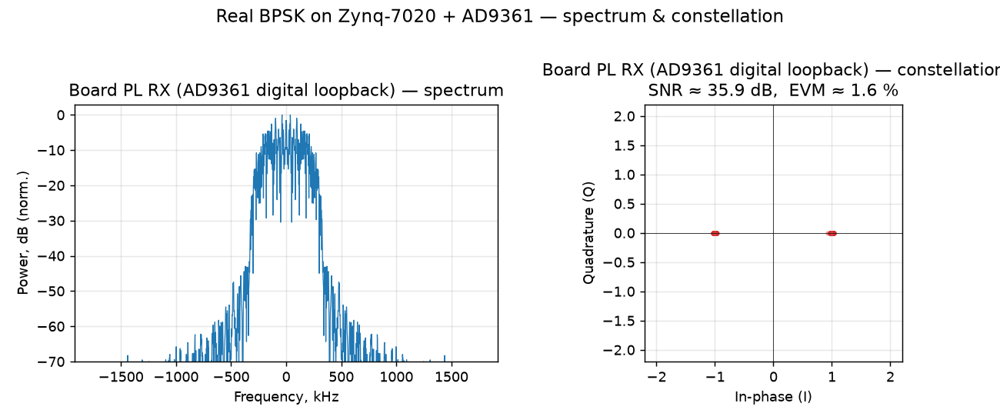
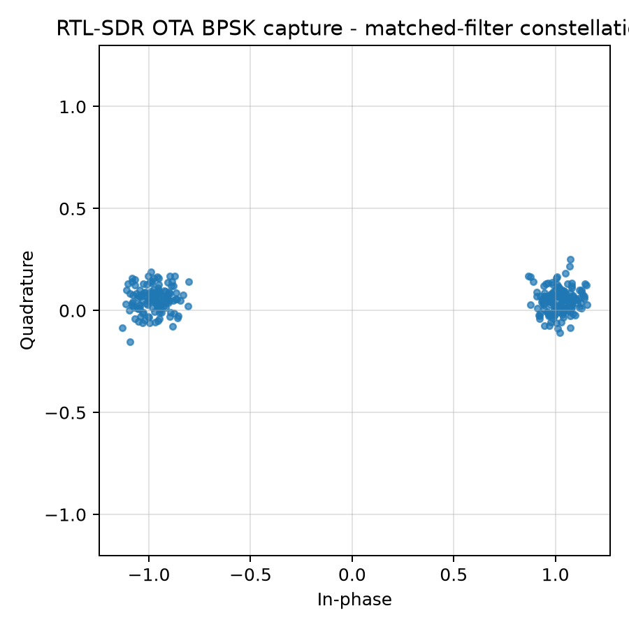
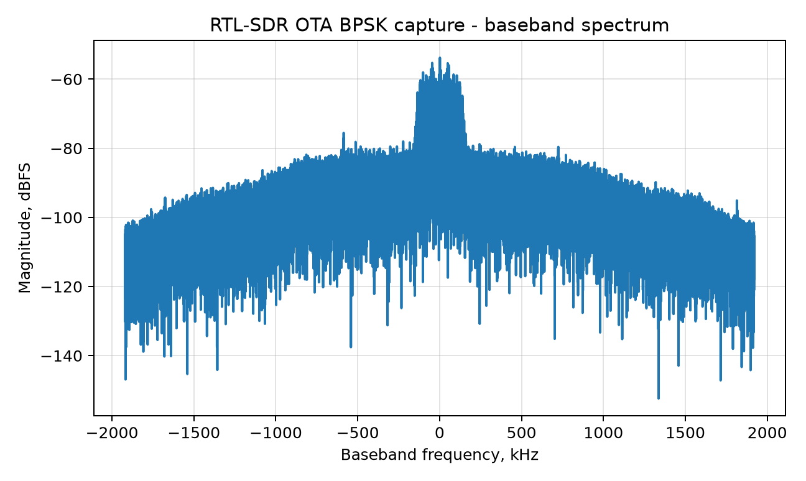

# Лабораторная 8.15 — BPSK на реальном железе: спектр, созвездие и SNR/EVM

## Цель

Связать синтетическую теорию модуляции и синхронизации этого блока с **реальными измеренными сигналами** учебной платы (Zynq-7020 + AD9361). Мы смотрим на те же три величины, которые вы считаете «на бумаге», — **спектр мощности**, **созвездие** и **SNR / EVM**, — но снятые с работающей платы, и сравниваем две точки наблюдения за *одним и тем же передатчиком*:

- **Board PL RX** — что реально отсчитывает встроенный FPGA-приёмник в **цифровом loopback** AD9361 (те самые отсчёты `capture_in`, считанные из отладочного отвода PL BPSK-модема Блока 11).
- **RTL-SDR** — что видит **независимый приёмник по воздуху** в BPSK-передаче платы (демодулируется читателем из Lab 11.20, который ищет сдвиг несущей, передискретизирует и применяет согласованный фильтр).

Это учебное сравнение: оно делает абстрактное «созвездие на реальном канале шумит и вращается» конкретным — с числами.

## Что видит плата — цифровой loopback AD9361



- **Спектр (слева).** Классическая форма BPSK с корневым приподнятым косинусом (RRC): плоский главный лепесток шириной примерно ±300 кГц (символьная скорость 480 кСимв/с при SPS = 8, частота дискретизации 3,84 МГц), спад roll-off на плечах и малая внеполосная энергия.
- **Созвездие (справа).** Два плотных кластера при I = ±1, **Q ≈ 0** — ровно BPSK: один бит на символ по синфазной оси. Q равно нулю, потому что цифровой loopback идёт **без несущей**, и вращения фазы нет.
- **Измеренное качество:** **SNR ≈ 36 дБ, EVM ≈ 1,6 %.** Это «идеальный» внутренний взгляд приёмника — без RF-канала и без ухода генератора, — и именно он служит эталоном для сравнения с OTA-случаем. (BER = 0.)

## Что видит независимый RTL-SDR — по воздуху





Тот же тип BPSK, переданный платой и принятый по воздуху RTL-SDR на расстоянии ~10 см, затем демодулированный офлайн. Спектр RRC по-прежнему отчётливо виден, но созвездие рассказывает историю канала:

- Два кластера **заметно шире** (тепловой шум + многолучёвость): **EVM ≈ 10,6 %**, то есть **SNR ≈ 19,5 дБ** (`SNR ≈ −20·log₁₀(EVM)`), примерно на 16 дБ хуже внутреннего loopback.
- Кластеры сидят слегка **выше оси I (небольшой +Q)** — остаточная **фаза несущей** от **сдвига частоты +2,7 кГц** между гетеродином TX AD9361 и тюнером RTL-SDR, которую читатель оценивает и убирает до принятия решений (это ровно тот CFO из [Лабораторной 8.1](lab-8-1-cfo-estimation-correction.md) и фаза из [Лабораторной 8.2](lab-8-2-phase-offset-correction.md), увиденные на реальном железе).
- Несмотря на всё это, на 10 см канал по-прежнему декодируется с **BER = 0** — настоящая, пусть и короткодистанционная, радиолиния. EVM 10,6 % и BER получены оценкой с опорой на эталон (усиление/фаза подгоняются по известному кадру). Оценка приёмника (преамбула + петля отслеживания фазы, только нагрузка) даёт тот же вывод: **0 / 256 битовых ошибок нагрузки, EVM 9,97 %** (см. [Лабораторную 11.20](lab-11-20-read-rtl-wav-ota-bpsk-ber.md)).

## Бок о бок

| Метрика | Board PL RX (цифровой loopback AD9361) | RTL-SDR (по воздуху, ~10 см) |
|---|---|---|
| Созвездие | 2 плотные точки на I, Q ≈ 0 | 2 более широких кластера, небольшой +Q |
| EVM | ≈ 1,6 % | ≈ 10,6 % |
| SNR (из EVM) | ≈ 36 дБ | ≈ 19,5 дБ |
| Сдвиг несущей | 0 (цифровой, без несущей) | ≈ +2,7 кГц |
| BER | 0 | 0 |

**Как читать:** внутренний loopback изолирует *модем* (чисто, без канала), а RTL-SDR показывает *радиолинию* — созвездие расплывается от шума и вращается от сдвига несущей, но остаётся достаточно открытым для декодирования. Разница между двумя созвездиями — это, визуально, и есть RF-канал.

## Зачем это нужно

Всё раньше в блоке считалось на синтетике. Единственное, чего симуляция показать не может, — как *мало* от идеальной картины переживает встречу с железом: реальный генератор никогда не стоит точно на частоте, реальный канал добавляет шум и многолучёвость, у реального приёмника своя квантизация и усиление. Эта работа показывает те же три величины, которые вы считали, — спектр, созвездие, SNR/EVM, — но измеренными, чтобы вы знали, как выглядит «хорошо» на настоящей плате и из чего состоит зазор до идеала.

## Как считаются числа

- **EVM** (величина вектора ошибки): после согласованного фильтра берётся по одному отсчёту на SPS в центре глаза; идеальная точка BPSK — `±A` по I. `EVM_rms = rms(символ − идеал) / A`.
- **SNR** из EVM: `SNR_dB ≈ −20·log₁₀(EVM_rms)`.
- **Спектр:** модуль FFT с окном для отсчётов основной полосы, нормированный на пик.

## Воспроизведение

- Рисунок платы (из закоммиченного захвата 4,8 кБ реальных отсчётов PL RX):

  ```bash
  python blocks/block_08_modulation_and_synchronization/python/hardware_bpsk_spectrum_constellation.py \
      --board datasets/lab11_hardware_bpsk_capture/board_pl_rx_loopback_capture.npz
  ```

- Рисунки и метрики RTL-SDR OTA (из записанного WAV, см. manifest):

  ```bash
  python blocks/block_11_integrated_sdr_project/python/lab_11_20_read_rtl_wav_ota_bpsk_ber.py \
      --manifest datasets/lab11_20_rtl_sdr_ota_bpsk/manifest_live_20260624_stock_10cm_ref.yaml
  ```

## Упражнения

1. По двум созвездиям оцените на глаз отношение разбросов кластеров, затем сверьте с EVM (1,6 % и 10,6 %). Сколько это в дБ и совпадает ли с разницей SNR в таблице (~16,5 дБ)?
2. В OTA-захвате в обоих кластерах виден небольшой +Q. Переведите сдвиг +2,7 кГц в поворот фазы за символ при 240 кСимв/с кадра OTA (16 отсчётов на символ при 3,84 MS/s). Почему читатель всё равно принимает решения верно?
3. BER = 0 в обоих столбцах. Сколько бит сравнено в каждом случае (кадр платы — 281 символ; для OTA-случая смотрите вывод отчёта Lab 11.20)? Какова 95-процентная верхняя граница BER, если ошибок не увидели на таком числе бит? Почему «BER = 0» сама по себе слабее, чем кажется (сравните с [Лабораторной 8.7](lab-8-7-snr-vs-ber-traps.md))?

## Чек-лист отчёта

- [ ] Оба рисунка воспроизведены командами выше.
- [ ] Для каждой точки наблюдения указаны ширина спектра, EVM, SNR и CFO.
- [ ] Короткий абзац о том, из чего состоит разница между двумя созвездиями.
- [ ] Рядом с каждым BER указано число сравнённых бит.

## Примечания

- Захват платы — это PL BPSK-модем в loopback; OTA-захват — эталонный BPSK стокового shell (Lab 11.14) по воздуху. Оба — реальный BPSK, переданный платой; выбраны потому, что RF-безопасная мощность передачи PL намеренно очень мала, поэтому чистое OTA-созвездие проще всего получить на близком расстоянии. Полную историю железа Блока 11 (on-chip PL BPSK, BER = 0) см. в [Лабораторной 11.26](lab-11-26-runtime-dds-bypass-bpsk-ota.md).
- Продолжение (в этой работе пока не сделано): повторить те же три графика для **QPSK** (четыре точки созвездия, два бита на символ); синтетическую и HDL-часть QPSK см. в [Лабораторной 8.8](lab-8-8-qpsk-modem-impairments.md).
