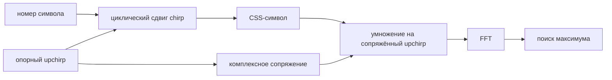

# Лабораторная 8.20 — CSS: chirp-сигнал и кодирование символа

## Цель

Построить базовый сигнальный тракт chirp spread spectrum (CSS):

- сформировать комплексный базовый upchirp;
- закодировать целочисленный символ циклическим сдвигом chirp;
- исследовать мгновенную частоту и частотно-временное представление;
- выполнить dechirp умножением на комплексно-сопряжённый опорный chirp;
- убедиться, что после dechirp энергия символа концентрируется в одном отсчёте FFT.

Лабораторная реализует **учебный CSS-сигнал**. Это ещё не полный LoRa-совместимый пакетный PHY: преамбула, заголовок, whitening, перемежение, помехоустойчивое кодирование и CRC здесь не реализуются.

## Основные соотношения

Для spreading factor `SF` и полосы `BW`:

```text
N  = 2^SF
Ts = 2^SF / BW
```

При `SF=7` и `BW=125 кГц` символ содержит 128 chips и длится 1,024 мс.

## Цепочка обработки



## Запуск

```bash
python blocks/block_08_modulation_and_synchronization/python/lab_8_20_css_waveform.py
```

## Генерируемые артефакты

```text
docs/assets/lab820_css_upchirp_frequency.png
docs/assets/lab820_css_symbol_spectrogram.png
docs/assets/lab820_css_dechirped_fft.png
docs/assets/lab820_css_metrics.json
```

## Что проверить

- комплексная огибающая остаётся постоянной с точностью вычислений;
- мгновенная частота upchirp проходит заданную полосу;
- циклический сдвиг меняет передаваемый символ, но не мощность огибающей;
- после dechirp сигнал превращается в комплексный тон;
- максимум FFT в идеальном случае соответствует заданному номеру символа.

## Инженерные вопросы

1. Почему постоянная огибающая удобна для нелинейного или ограниченного по мощности передатчика?
2. Что изменится, если частота дискретизации выше полосы CSS-сигнала?
3. Почему умножение chirp на сопряжённый опорный chirp превращает его в тон?
4. Какие блоки естественно переносить в FPGA: chirp NCO, комплексный умножитель, FFT или поиск максимума?

## Что включить в отчёт

- [ ] Значения `SF`, `BW`, частоты дискретизации и длительности символа.
- [ ] График мгновенной частоты.
- [ ] Частотно-временную диаграмму символа.
- [ ] FFT после dechirp и найденный bin.
- [ ] Явное указание, что реализован учебный CSS-тракт, а не полный LoRa PHY.
