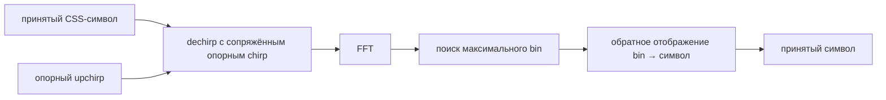

# Лабораторная 8.21 — CSS: dechirp и FFT-детектор

## Цель

Превратить CSS-сигнал из Lab 8.20 в воспроизводимый детектор символов и количественно оценить его ограничения:

- построить полный набор символов для выбранного spreading factor;
- определить идеальное соответствие между символом и FFT-bin;
- принимать случайные символы после dechirp;
- измерить вероятность ошибки символа SER в зависимости от SNR;
- исследовать чувствительность к смещению несущей CFO;
- использовать отношение первого FFT-пика ко второму как дополнительную меру уверенности детектора.

## Структура детектора



## Запуск

```bash
python blocks/block_08_modulation_and_synchronization/python/lab_8_21_css_dechirp_fft.py
```

## Генерируемые артефакты

```text
docs/assets/lab821_css_ser_vs_snr.png
docs/assets/lab821_css_ser_vs_cfo.png
docs/assets/lab821_css_example_fft.png
docs/assets/lab821_css_detector_metrics.json
```

## Параметры эксперимента по умолчанию

- `SF=7`;
- полоса 125 кГц;
- 800 случайных символов на точку;
- sweep SNR от −18 до 0 дБ;
- нормированное CFO от −0,45 до +0,45 шага FFT-bin.

Нормированная ось CFO удобна тем, что один шаг FFT-bin равен `BW / 2^SF`. Поэтому результат можно переносить на другие значения полосы и spreading factor.

## Критерии приёмки

Модель и её JSON-отчёт позволяют проверить, что:

- идеальное отображение «символ → FFT-bin» является взаимно однозначным;
- тестовый символ принимается правильно;
- при 0 дБ для фиксированного seed SER равен нулю;
- в самой шумной точке SER становится явно ненулевым;
- дробное CFO ухудшает решение ещё до перехода максимума в соседний bin.

## Почему нужен SER, а не только SNR

Хороший спектр или достаточно высокий SNR не доказывают работоспособность цифровой линии. Поэтому лабораторная считает реальные ошибки решений. В пакетной версии этот принцип должен быть расширен до BER, PER, вероятности пропуска пакета и вероятности ложной тревоги.

## Следующий этап

Пакетная CSS/LoRa-like лабораторная должна добавить:

- преамбулу из повторяющихся chirp;
- обнаружение начала пакета;
- грубую и точную оценку CFO;
- ошибку частоты дискретизации;
- sync word и downchirp;
- BER/PER, пропуски и ложные обнаружения.

## Что включить в отчёт

- [ ] График SER от SNR.
- [ ] График чувствительности к нормированному CFO.
- [ ] Пример FFT после dechirp.
- [ ] Количество реально проверенных символов в каждой точке.
- [ ] Объяснение, почему peak-to-second-peak полезен, но не заменяет SER/PER.
