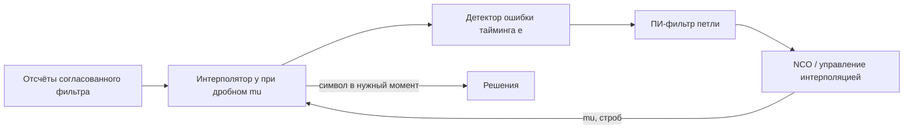

# Лабораторная 8.3 — Восстановление символьной синхронизации

## Цель

Понять, как выбор неправильной фазы дискретизации увеличивает EVM/BER, и научиться выбирать лучшую sampling phase для QPSK-сигнала.

## Что выполняется

В работе студент:

1. генерирует oversampled QPSK-сигнал;
2. вносит timing offset;
3. перебирает возможные sampling phases;
4. выбирает фазу с минимальной EVM;
5. сравнивает constellation, EVM и BER до/после timing recovery.

## Результат

После выполнения работы должны быть получены:

- constellation plot при неправильной фазе;
- constellation plot после восстановления timing;
- график EVM versus sampling phase;
- educational eye preview;
- metrics JSON.

## Что приложить к отчёту

- samples per symbol;
- injected timing offset;
- estimated best phase;
- EVM/BER до и после;
- eye preview;
- вывод о роли timing recovery.

## Подробная техническая часть

### Практический вопрос

> Даже когда частота и фаза несущей скорректированы, как выбрать правильный момент выборки для решений по символам?

### Исполняемые файлы

| Среда | Файл | Результат |
|---|---|---|
| Python | `blocks/block_08_modulation_and_synchronization/python/lab_8_3_timing_recovery.py` | графики созвездий, предпросмотр глазковой диаграммы, поиск тайминга и JSON с метриками в `docs/assets` |

Запуск из корня репозитория:

```bash
python blocks/block_08_modulation_and_synchronization/python/lab_8_3_timing_recovery.py
```

Сгенерированные артефакты:

```text
docs/assets/lab83_timing_constellation_wrong_phase.png
docs/assets/lab83_timing_constellation_recovered.png
docs/assets/lab83_timing_phase_search.png
docs/assets/lab83_timing_eye_preview.png
docs/assets/lab83_timing_metrics.json
```

### Цепочка обработки


### Модель тайминга

Для сигнала с передискретизацией при `samples_per_symbol = SPS` приёмник должен выбрать одну фазу выборки:

```text
phase = 0, 1, 2, ..., SPS-1
```

Неверная фаза попадает в переходную область между символами и увеличивает EVM/BER. Хорошая фаза попадает около устойчивого центра символа.

### Учебный метод восстановления тайминга

Работа использует простой перебор фазы:

1. перебрать все фазы выборки от `0` до `SPS-1`;
2. выбрать отсчёты принятого сигнала;
3. выровнять скалярное усиление/фазу по известным эталонным символам;
4. вычислить EVM для каждой фазы;
5. выбрать фазу с минимальным EVM.

Это намеренно метод с опорой на эталон. Реальные приёмники используют детекторы ошибки тайминга и петли слежения, например методы Гарднера или Мюллера и Мюллера, описанные ниже.

### Петли слежения без эталона (Гарднер)

Перебор фазы выше требует эталонных символов и выбирает одну фиксированную фазу. В реальном канале во время payload эталона нет, а момент выборки *дрейфует*, если тактовые частоты передачи и приёма различаются хотя бы на долю процента. Стандартное решение — замкнутый **символьный синхронизатор**: оценивать ошибку тайминга на каждом символе и управлять интерполятором, выдающим отсчёт в нужный момент.



**Детектор ошибки тайминга Гарднера (TED).** Работая на двух отсчётах на символ — отсчёте в нужный момент `y_on[k]` и срединном отсчёте `y_mid[k]` на полпути к предыдущему символу, — ошибка равна

```text
e[k] = Re{ y_mid[k] · ( y_on[k] − y_on[k−1] )* }
```

Она нулевая, когда `y_on` попадает на пики символов (срединный отсчёт тогда лежит на пересечении нуля), и меняет знак вместе с направлением ошибки тайминга. Существенно, что детектору **не** нужна скорректированная фаза несущей, поэтому петли тайминга и несущей могут работать независимо. Для двоичной сигнализации форма **sign-Gardner** `e[k] = sgn(y_mid[k])·sgn(y_on[k]−y_on[k−1])`, не зависящая от амплитуды, сохраняет коэффициент усиления петли постоянным независимо от AGC и уровня сигнала — это удобно для fixed-point и FPGA.

**Интерполятор.** Поскольку нужный момент редко попадает на входной отсчёт, интерполятор вычисляет поток при дробном смещении `mu ∈ [0,1)`. При высокой передискретизации достаточно линейного интерполятора `y = x[n−1] + mu·(x[n] − x[n−1])`; при низкой используют полиномиальные интерполяторы (Фэрроу).

**Управление интерполяцией (NCO) и фильтр петли.** Убывающий счётчик по модулю 1 на каждом входном отсчёте уменьшается на `w ≈ 1/(отсчётов на строб)`; недозаполнение отмечает строб и даёт дробное `mu`. Пропорционально-интегральный (ПИ) фильтр петли превращает выход TED в поправку к `w`:

```text
integ += k2 · e[k]          (интегральный путь: отслеживает постоянное смещение скорости)
w       = w_nominal + k1 · e[k] + integ   (пропорциональный путь: демпфирование)
```

Интегральный путь поглощает постоянную ошибку числа отсчётов на символ (рассогласование тактовых частот), а пропорциональный обеспечивает устойчивость. Детектор **Мюллера и Мюллера** — решающе-ориентированная альтернатива, которой нужен лишь один отсчёт на символ, но она чувствительнее к остаточной фазе несущей.

Это ровно та петля, что реализована (и проверена побитово между float Python, fixed-point Python, MATLAB, Simulink и синтезируемым Verilog) в Блоке 5 — см. `blocks/block_05_fpga_hdl_flow/lab_5_8_bpsk_rx_bit_recovery.md` (раздел *Расширение восстановления тайминга*) и `rtl/bpsk_symbol_timing_recovery.v`. Там один лишь перебор фиксированной фазы из этой работы оставляет пол BER ~40 % на пакете AD9361 с дрейфом, а петля Гарднера восстанавливает его с BER 0.

### Чего ожидать

С параметрами по умолчанию (4096 QPSK-символов, 8 отсчётов на символ, прямоугольные импульсы, задержка тайминга 3 отсчёта, шум 0,045 rms) корректный запуск печатает:

```text
True timing offset: 3 samples
Estimated best phase: 7 samples
EVM before: 6856.845 % (36.72 dB)
EVM after: 6.308 % (-24.00 dB)
BER before: 4.932861e-01 (4041/8192)
BER after: 0.000000e+00 (0/8192)
```

Самый поучительный результат — вся кривая EVM от фазы (`lab83_timing_phase_search.png`), а не только её минимум:

| Фаза выборки | EVM |
|---:|---:|
| 0 | 6856,85 % |
| 1 | 6521,08 % |
| 2 | 6533,21 % |
| 3 | 6,40 % |
| 4 | 6,34 % |
| 5 | 6,39 % |
| 6 | 6,48 % |
| 7 | 6,31 % |

Читайте внимательно:

- **Фазы 0, 1 и 2 катастрофичны (EVM около 6500–6900 %, BER около 0,49).** Сигнал задержан на 3 отсчёта, поэтому первые три отсчёта каждого символьного слота ещё принадлежат *предыдущему* символу. Выборка там читает не тот символ: выравнивать не по чему, скалярное выравнивание раздувает «усиление», и EVM выходит за осмысленный диапазон 0–100 %. **EVM намного выше 100 % означает «не тот символ», а не «немного шумно».**
- **Фазы 3–7 все хороши и почти равны (около 6,3–6,5 %).** При прямоугольных импульсах символ плоский на протяжении 8 отсчётов, поэтому любая фаза внутри плато читает верное значение. Число плохих фаз (3) равно введённой задержке.
- **Поэтому «лучшая фаза 7 при истинном сдвиге 3» — не ошибка.** Перебор возвращает argmin среди пяти фаз, различающихся лишь шумом; фазы 3, 4, 5, 6 или 7 дали бы BER 0. С настоящим корневым приподнятым косинусом хорошая область сужается до раскрыва глаза вокруг одного острого оптимума, а разница между лучшей и плохой фазой становится плавной, а не обрывом; вот где петля слежения (Гарднер, выше) оправдывает себя.
- **Остаточный EVM 6,3 % — это уровень шума** (`noise_rms = 0,045` на символах единичной амплитуды), а не остаток от ошибки тайминга.

### Метрики

| Метрика | Смысл |
|---|---|
| истинный сдвиг тайминга | введённая задержка тайминга в отсчётах |
| оценённая лучшая фаза | фаза, выбранная перебором по минимуму EVM |
| EVM до | ошибка при намеренно неверной фазе выборки |
| EVM после | ошибка при восстановленной фазе выборки |
| BER до | решения при неверной фазе тайминга |
| BER после | решения при восстановленной фазе тайминга |

### Ожидаемые графики

- созвездие при неверной фазе выборки;
- созвездие после восстановления тайминга;
- EVM от фазы выборки;
- учебный предпросмотр глазковой диаграммы.

### Типичные ошибки

| Ошибка | Симптом | Исправление |
|---|---|---|
| выборка на фазе 0 по привычке | высокий EVM даже на чистом сигнале | искать или отслеживать фазу тайминга |
| нет передискретизации | восстановление тайминга нельзя продемонстрировать | использовать SPS > 1 |
| CFO ещё присутствует | оценка тайминга становится неустойчивой | сначала скорректировать CFO |
| сдвиг фазы ещё присутствует | решения смещены | скорректировать фазу до расчёта BER |
| неверное выравнивание эталона | кривая EVM вводит в заблуждение | компенсировать задержку и скалярное усиление |

### Чек-лист отчёта (расширенный)

- [ ] Указано число отсчётов на символ.
- [ ] Указан введённый сдвиг тайминга.
- [ ] Объяснён перебор фазы выборки.
- [ ] Построен график EVM от фазы выборки.
- [ ] Приложено созвездие до восстановления тайминга.
- [ ] Приложено созвездие после восстановления тайминга.
- [ ] Приложен предпросмотр глазковой диаграммы.
- [ ] Указаны EVM и BER до/после.
- [ ] Объяснено, как реальные приёмники отслеживают тайминг без эталонных символов.

### Шаблон инженерного вывода

```text
Сигнал QPSK с передискретизацией имел SPS = ____ и сдвиг тайминга ____ отсчётов.
Оценённая лучшая фаза выборки — ____ отсчётов. EVM улучшился с ____ % до ____ %,
а BER изменился с ____ до ____. Результат подтверждает / не подтверждает, что
выбор тайминга был доминирующим искажением, потому что ______.
```
