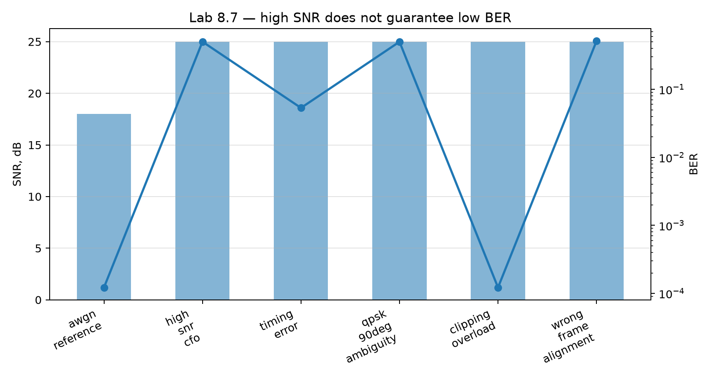
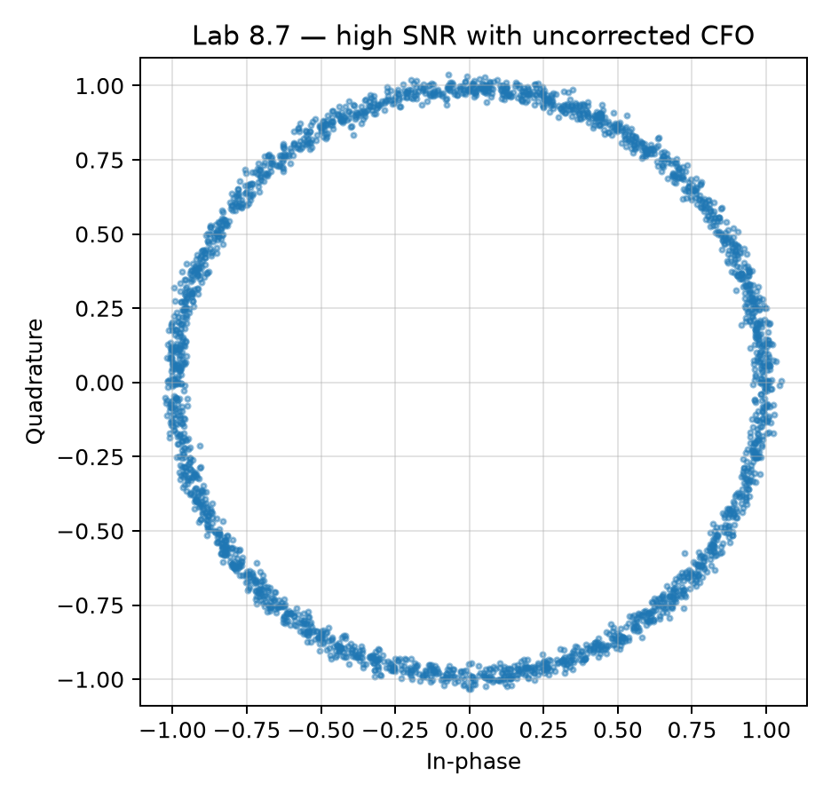
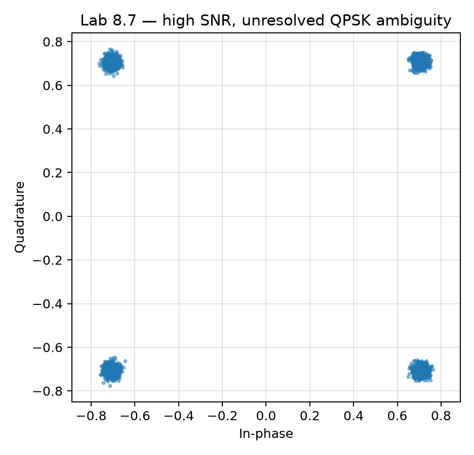

# Лабораторная 8.7 — SNR недостаточно: ловушки BER и EVM

## Цель

Показать, почему цифровой SDR-канал нельзя принимать только по SNR. Приёмник может показывать сильный сигнал и большой запас над шумом, а восстановленный поток битов при этом остаётся неверным — из-за частотного сдвига несущей, ошибки тайминга, фазовой неоднозначности, ограничения сигнала (clipping) или сдвига кадра.

Лабораторная строит детерминированную синтетическую QPSK-развёртку по искажениям и фиксирует минимум доказательств качества канала, который потребуется во всех последующих RF-работах: SNR, EVM, BER, число сравнённых бит, допущение о кадровой синхронизации и инженерный вывод.

## Зачем это нужно

На стенде первое число, которое читает каждый, — это SNR: на анализаторе спектра или водопаде виден мощный пик высоко над шумовой полкой, и естественный вывод — «канал работает». Эта работа — противоядие. SNR характеризует *аналоговый* сигнал: сколько мощности в полезном сигнале по сравнению с шумом. Цифровому каналу этого мало: приёмник должен принять верное решение в верный момент, в верном повороте и на верном кадре. Каждый из этих пунктов может сломаться, пока SNR остаётся идеальным.

Поэтому каждая следующая RF-работа курса заканчивается BER (или FER) и числом сравнённых бит. Здесь на шести контролируемых экспериментах показано, от чего защищает это правило.

## Ключевая мысль

```text
SNR отвечает: «Виден ли сигнал над шумом?»
BER отвечает: «Восстановил ли цифровой канал правильные биты?»
```

Для лабораторных по BPSK/QPSK/OFDM высокий SNR — лишь необходимое условие. Он не доказывает, что цифровой канал работает. Результат, принимаемый к рассмотрению, должен содержать BER или FER и число реально сравнённых бит или кадров.

## Файлы

| Путь | Назначение |
|---|---|
| `blocks/block_08_modulation_and_synchronization/python/lab_8_7_snr_vs_ber_traps.py` | детерминированная QPSK-развёртка по искажениям с метриками SNR/EVM/BER |

## Запуск

```bash
python blocks/block_08_modulation_and_synchronization/python/lab_8_7_snr_vs_ber_traps.py
```

Запуск детерминирован (seed `8701`, 4096 QPSK-символов, 8 отсчётов на символ, RRC roll-off 0,35), поэтому ваши числа должны совпасть с таблицей ниже.

## Сценарии

| Сценарий | Что остаётся высоким | Что ломается | Урок |
|---|---|---|---|
| AWGN reference | SNR | ничего существенного | Базовый случай, где SNR разумно согласуется с BER. |
| High-SNR CFO | SNR | BER/EVM | Частотный сдвиг вращает созвездие; SNR не видит «уход» фазы. |
| Timing error | SNR | BER/EVM | Выборка вдали от центра символа даёт неверные решения. |
| Неоднозначность QPSK на 90° | SNR и выровненный EVM | BER | Созвездие после поворота выглядит чистым, но биты сопоставлены не тому квадранту. |
| Clipping / перегрузка | кажущийся SNR | запас по EVM/BER | Перегрузка АЦП или разрядной сетки — не гауссов шум. |
| Wrong frame alignment | SNR | BER | Мощный пакет бесполезен, если приёмник сравнивает не те биты. |

## Чего ожидать

С конфигурацией по умолчанию запуск печатает (и сохраняет в `lab87_snr_vs_ber_metrics.json`):

| Сценарий | SNR | EVM | BER (ошибок / сравнено бит) |
|---|---:|---:|---:|
| `awgn_reference` | 18 дБ | 4,7 % | 0 (0 / 8192) |
| `high_snr_cfo` | 25 дБ | ≫ 100 % | 0,501 (4105 / 8192) |
| `timing_error` | 25 дБ | 66,8 % | 0,053 (437 / 8192) |
| `qpsk_90deg_ambiguity` | 25 дБ | 2,6 % | 0,500 (4096 / 8192) |
| `clipping_overload` | 25 дБ | 8,1 % | 0 (0 / 8192) |
| `wrong_frame_alignment` | 25 дБ | ≫ 100 % | 0,512 (4194 / 8190) |

Обратите внимание: у эталона AWGN намеренно *самый низкий* SNR (18 дБ) и *лучший* BER. У каждого искажённого случая SNR на 7 дБ выше, и он всё равно хуже по BER или EVM — большинство катастрофически. Разберём строки по очереди:



- **High-SNR CFO — BER 0,5, «подбрасывание монеты».** Сдвиг несущей 25 кГц при 480 кСимв/с — это `25e3 / 480e3 ≈ 0,052` цикла на символ, то есть созвездие поворачивается примерно на **19° за каждый символ** и размазывается в кольцо. Через несколько символов фаза побывала во всех квадрантах, и каждое решение становится почти случайным: BER ≈ 0,5, как при угадывании. SNR вращением не меняется — кольцо *тонкое*, — поэтому SNR проблему не видит. EVM при этом бессмыслен (десятки тысяч процентов), и это само по себе сигнал: если EVM выше 100 %, приёмник вообще не смотрит на переданное созвездие.

  

- **Timing error — BER 0,053.** Приёмник берёт отсчёт на 3 отсчёта (из 8 на символ) в стороне от пика согласованного фильтра, то есть на 0,375 символа. Глаз частично закрыт межсимвольной интерференцией, кластеры созвездия расплываются навстречу друг другу, и примерно один бит из двадцати неверен, хотя шум пренебрежимо мал. Лечится петлёй восстановления тайминга — см. [Лабораторную 8.3](lab-8-3-timing-recovery.md).
- **Неоднозначность QPSK на 90° — самый коварный случай.** Созвездие — четыре чётких плотных кластера, а EVM после наилучшего выравнивания приёмника составляет 2,6 % — лучше эталона. И всё же BER ровно 0,5. Петля восстановления несущей не отличает «этот квадрант — `00`» от «этот квадрант — `00`, повёрнутый на 90°», потому что созвездие симметрично относительно поворота на 90°. Биты каждый раз сопоставляются не тому квадранту. Решается известной преамбулой или дифференциальным кодированием (см. [Лабораторную 8.9](lab-8-9-qpsk-carrier-recovery.md)).

  

- **Clipping — урок в обратную сторону.** При пороге ограничения 0,18 форма сигнала сплющивается, а EVM вырастает с 2,5 % (без ограничения, тот же SNR) до 8 %, но BER по-прежнему нулевой. QPSK принимает решения только по *знаку* I и Q, а ограничение знаки сохраняет — оно искажает амплитуды, но не квадранты. Поэтому для QPSK ущерб виден в EVM задолго до того, как появится в BER: **BER = 0 не означает, что у канала есть запас.** Для 16-QAM или OFDM, где информацию несёт амплитуда, то же ограничение гораздо опаснее (см. [Лабораторную 8.10](lab-8-10-ofdm-papr-clipping.md)). Перегрузка — нелинейное искажение, а не гауссов шум; см. развёртку по усилению в Блоке 6.
- **Wrong frame alignment — BER 0,512 на 8190 битах, а не 8192.** Приёмник сдвинут на один символ относительно передатчика, поэтому сравнивает не те биты (и теряет два в конце записи — уже по числу сравнённых бит видно, что что-то не так). Это чистый «кадровый» отказ: идеальный сигнал, бесполезный пакет. В реальных системах его ловят по преамбуле/слову синхронизации и CRC.

## Ожидаемые артефакты

| Файл | Содержимое |
|---|---|
| `docs/assets/lab87_snr_vs_ber_summary.png` | сводный график SNR и BER |
| `docs/assets/lab87_constellation_cfo.png` | созвездие с частотным сдвигом несущей |
| `docs/assets/lab87_constellation_timing_error.png` | созвездие с ошибкой тайминга |
| `docs/assets/lab87_constellation_qpsk_phase_ambiguity.png` | созвездие с неразрешённой квадрантной неоднозначностью QPSK |
| `docs/assets/lab87_snr_vs_ber_metrics.json` | машиночитаемые метрики сценариев и выводы |

## Правило приёмки для следующих работ по цифровому каналу

Результат BPSK/QPSK/OFDM не считается подтверждённым цифровым каналом, пока в отчёте не указаны:

- SNR или оценка шума;
- EVM или другая метрика качества созвездия;
- BER или FER;
- число сравнённых бит или кадров;
- статус кадровой синхронизации;
- замечания о частотном/временном сдвиге, если они значимы.

Если BER/FER отсутствует, вывод нужно ограничить качеством спектра или формы сигнала, а не корректностью цифрового канала.

## Упражнения

1. В скрипте поставьте в сценарии CFO `cfo_hz=50.0`, затем 100 и 200. Посчитайте поворот за символ (`cfo / symbol_rate * 360°`) и фазу, накопленную за запись из 4096 символов. Уже 50 Гц даёт здесь BER ≈ 0,42 — почему такой крошечный сдвиг фатален для приёмника без слежения за фазой?
2. Пройдите `timing_offset_samples` от 0 до 4 при SNR 25 дБ. Найдите наибольший сдвиг, при котором BER всё ещё равен 0, и отметьте EVM при нём. Что это говорит об EVM и BER как критериях приёмки? (Ожидается BER = 0 до 2 отсчётов при EVM уже около 38 %.)
3. Снижайте порог ограничения с 0,5 до 0,05. EVM растёт и насыщается, но BER не покидает нуля. Объясните почему, исходя из того, по чему QPSK принимает решения, и предскажите, что произойдёт с каналом 16-QAM ([Лабораторная 8.11](lab-8-11-16qam-tradeoffs.md)).
4. В сценарии неоднозначности попробуйте фазы 45°, 90° и 180°. BER должен быть около 0,25, 0,5 и 1,0, а выровненный EVM — около 2,5 % во всех трёх случаях. Почему BER может быть ровно 1,0 — *идеально* инвертированный канал — и почему EVM этого не замечает?
5. Напишите инженерный вывод (шаблон ниже) для строки timing error.

## Шаблон инженерного вывода

```text
Сигнал имел SNR = ____ дБ и EVM = ____ %, но BER = ____ на ____ битах.
Следовательно, эксперимент подтверждает / не подтверждает работоспособный цифровой канал.
Ограничивающий фактор, скорее всего, ____, потому что ____.
```

## Чек-лист отчёта

- [ ] Приложены JSON с метриками и сводный график.
- [ ] Перечислены все шесть сценариев с SNR, EVM, BER и числом сравнённых бит.
- [ ] По абзацу на каждый сломанный сценарий: что ломается и почему SNR этого не показал.
- [ ] Правило приёмки процитировано и применено к одной из ваших прежних работ.
