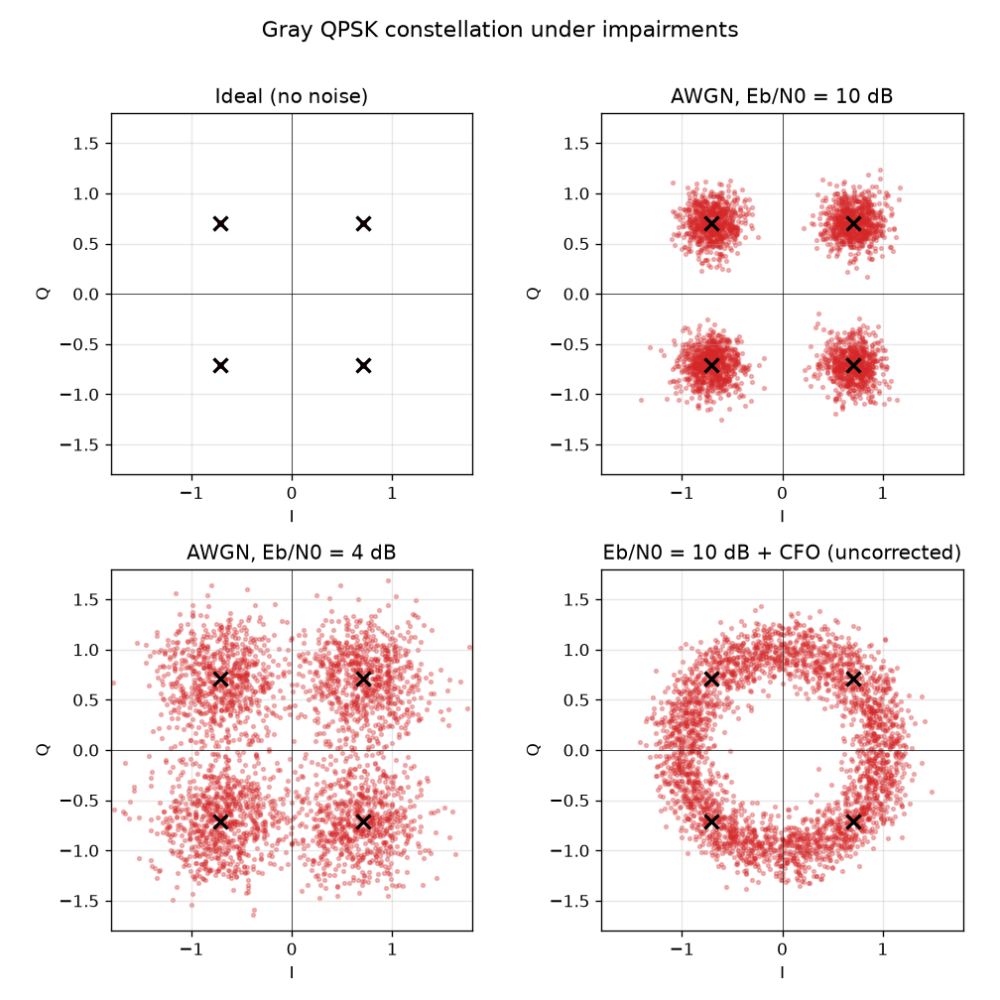
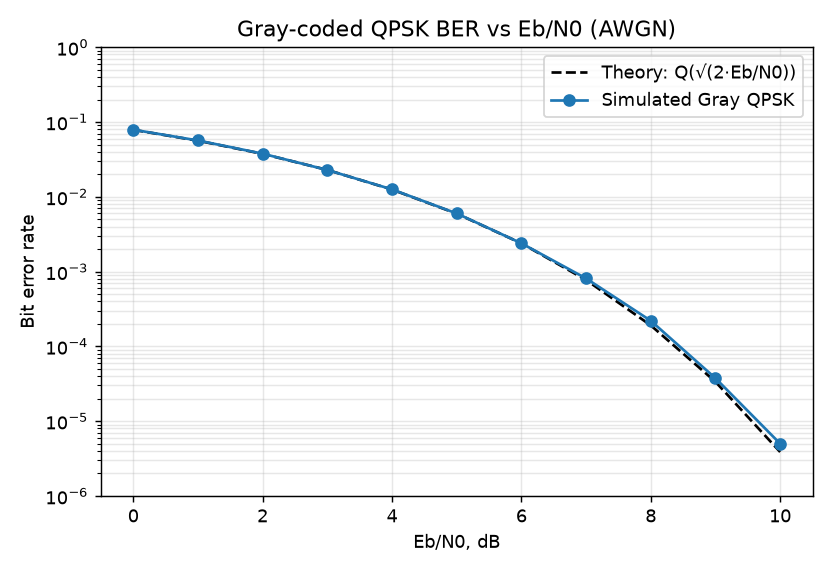

# Лабораторная 8.8 — QPSK-модем, искажения и BER

## Цель

Расширить тракт BPSK до **QPSK** (два бита на символ, четыре точки созвездия) и изучить, как два классических искажения этого блока — **шум** и **сдвиг частоты несущей (CFO)** — влияют на созвездие и вероятность битовой ошибки. Два уровня:

1. синтезируемый **QPSK-модем**, восстанавливающий полный кадр при **BER = 0** в идеальном HDL-loopback (тот RTL, который вы поставили бы в FPGA);
2. **симуляция канала/искажений**, добавляющая AWGN и CFO и строящая кривую BER от Eb/N0 против теории.

## QPSK-модем (HDL, идеальный loopback)

QPSK — это просто **две независимые оси BPSK**: младший бит задаёт I, старший — Q (код Грея, поэтому переворот одного бита переводит в соседний угол). Поэтому модем без изменений использует общие комплексные I/Q-блоки цепочки BPSK — `bpsk_upsampler_8x`, `bpsk_rrc_tx_fir`, `bpsk_rrc_rx_fir`, `bpsk_symbol_timing_sampler` — а QPSK-специфичны только маппер, решение и кадрирование:

```
источник дибит -> qpsk_symbol_mapper -> upsampler -> RRC TX  ── loopback ──►
    RRC RX (согласованный фильтр) -> сэмплер с фиксированной фазой -> qpsk_hard_decision -> qpsk_ber_counter
```

`tb_qpsk_zynq_ber_top` замыкает I/Q передатчика прямо на приёмник и перебирает фазу выборки: он восстанавливает все **140 символов QPSK (280 бит) при BER = 0** (start_offset = 62). Запустите это через HDL-проверку Блока 5 (`python tools/run_block5_hdl_smoke.py`, цель `tb_qpsk_zynq_ber_top`). QPSK несёт 2 бита на символ, поэтому при той же символьной скорости и полосе, что и BPSK, он удваивает битовую скорость — в этом весь смысл QPSK.

## Искажения: что шум и CFO делают с созвездием



- **Идеал** — четыре чистые точки в (±1, ±1)/√2.
- **AWGN 10 дБ** — четыре плотных облака; решения по-прежнему тривиально верны.
- **AWGN 4 дБ** — облака расплываются и начинают пересекать оси I/Q → появляются битовые ошибки.
- **CFO (без коррекции)** — сдвиг частоты поворачивает каждый символ на растущую фазу, поэтому четыре точки размазываются в **кольцо**: без восстановления несущей QPSK не декодируется. Это проблема фазы/частоты из [Лабораторной 8.1](lab-8-1-cfo-estimation-correction.md) и [Лабораторной 8.2](lab-8-2-phase-offset-correction.md), а развернуть это кольцо обратно — именно то, что делает петля восстановления несущей (Костас / 4-я степень) перед жёстким решением.

## BER от Eb/N0



Поскольку QPSK с кодом Грея — это две ортогональные оси BPSK, его BER на бит равен кривой BPSK, `BER = Q(sqrt(2*Eb/N0))`, и симуляция ложится на эту теоретическую линию на всём участке 0–10 дБ. Так что QPSK даёт **вдвое большую битовую скорость при том же Eb/N0 и BER**, что и BPSK: платой служит более плотное созвездие (меньший запас по шуму при данном Es/N0), а не энергия на бит.

Запуск по умолчанию печатает смоделированный BER при каждом целом Eb/N0 от 0 до 10 дБ:

| Eb/N0 | 0 дБ | 2 дБ | 4 дБ | 6 дБ | 8 дБ | 10 дБ |
|---|---:|---:|---:|---:|---:|---:|
| смоделированный BER | 7,89e-2 | 3,77e-2 | 1,26e-2 | 2,39e-3 | 2,2e-4 | 0 |
| теория `Q(sqrt(2*Eb/N0))` | 7,86e-2 | 3,75e-2 | 1,25e-2 | 2,39e-3 | 1,91e-4 | 3,9e-6 |

Две строки совпадают в пределах шума Монте-Карло. **Ноль при 10 дБ — это предел разрешения, а не канал без ошибок:** прогон сравнивает 400 000 бит, а теория при 3,9e-6 предсказывает около 1,6 ошибки, поэтому отсутствие ошибок не удивляет, и кривая разрешает BER лишь примерно до 2,5e-6 (то же правило «BER = 0 требует указанного числа бит», что и в [Лабораторной 8.7](lab-8-7-snr-vs-ber-traps.md)).

## Воспроизведение

```bash
# Loopback HDL-модема (BER = 0) — часть проверки Блока 5:
python tools/run_block5_hdl_smoke.py      # -> PASS: qpsk_zynq_ber_top loopback ... BER=0

# Графики искажений (кривая BER + созвездия):
python blocks/block_08_modulation_and_synchronization/python/qpsk_impairments_ber.py
```

## Следующие шаги

- **Восстановление несущей** — петля Костаса, управляемая решениями, разворачивает кольцо CFO обратно в четыре точки (и разрешает остаточную неоднозначность 90° с помощью преамбулы): сделано в **[Лабораторной 8.9 — восстановление несущей QPSK](lab-8-9-qpsk-carrier-recovery.md)**.
- **Железо**: модем QPSK теперь работает в runtime-мосте AD9361 и декодирует при BER = 0 в цифровом loopback ([Lab 11.27](lab-11-27-runtime-qpsk-digital-loopback.md), использующая ту же плоскость DAC-mux / ADC-tap / gpreg, что и мост BPSK в [Lab 11.26](lab-11-26-runtime-dds-bypass-bpsk-ota.md)) и по воздуху на двухплатном канале ([Lab 11.4](lab-11-4-final-measurement-report.md)). Созвездие реального железа из [Лабораторной 8.15](lab-8-15-real-hardware-bpsk-metrics.md) с четырьмя точками вместо двух для QPSK ещё предстоит повторить.
