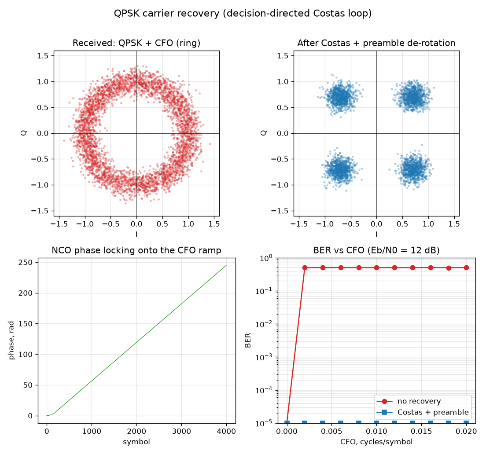

# Лабораторная 8.9 — Восстановление несущей QPSK (петля Костаса, управляемая решениями)

## Цель

[Лабораторная 8.8](lab-8-8-qpsk-modem-impairments.md) закончилась открытой проблемой: некорректированный **сдвиг частоты несущей (CFO)** поворачивает каждый символ QPSK на растущую фазу, размазывая четыре точки созвездия в **кольцо**, которое жёсткое решение не может прочитать (BER ≈ 0,5). Эта работа закрывает проблему **петлёй восстановления несущей**, которая разворачивает кольцо обратно в четыре точки, и показывает единственную особенность, которой нет у BPSK, — остаточную **неоднозначность фазы 90°**.

## Петля

Восстановление — это **петля Костаса, управляемая решениями**: потоковая петля с обратной связью ровно той структуры, которую вы поставили бы в FPGA (аккумулятор фазы NCO + пропорционально-интегральный фильтр петли + детектор фазовой ошибки), частотный двойник петли тайминга Гарднера.

Для каждого символа `s`:

```
y = s · e^(−jθ)                      # развернуть на текущую фазу NCO
e = sign(Re y)·Im y − sign(Im y)·Re y   # фазовая ошибка QPSK по решениям
freq += ki·e                         # интегральный член отслеживает CFO
θ    += freq + kp·e                  # пропорциональный член отслеживает фазу
```

Детектор фазовой ошибки `e` равен нулю, когда `y` лежит на точке QPSK, а иначе подталкивает `θ` к ближайшей, поэтому петля загоняет кольцо на сетку созвездия. Интегральный член `freq` накапливается в постоянный наклон, который **совпадает с рампой CFO** — на левой нижней панели ниже видно, как фаза NCO растёт ровно вдоль этой рампы.



- **Принятый сигнал (кольцо)** — QPSK + CFO, BER ≈ 0,5, не декодируется.
- **После Костаса + разворота по преамбуле** — четыре чистых облака; CFO убран.
- **Фаза NCO** — захватывает рампу CFO примерно за сотню символов при показанном смещении 0,01 цикла/символ (большие смещения требуют больше времени, см. ниже).
- **BER от CFO** — без восстановления BER стоит на уровне случайного угадывания при любом ненулевом CFO; с петлёй он остаётся равным 0 на всём участке развёртки.

## Неоднозначность 90°

Детектор ошибки петли Костаса для QPSK «доволен» в любой из четырёх точек созвездия, поэтому он захватывает один из четырёх поворотов `k·90°` — и какой именно, произвольно. Кольцо превращается в четыре чистые точки, но абсолютная разметка I/Q может оказаться повёрнутой, перемешивая биты (BER 0,25–0,5), хотя *созвездие* выглядит идеально. Поэтому сырая кривая BER от CFO для Костаса «прыгает».

Исправление — та же **известная преамбула / уникальное слово**, которую уже использует модем BPSK для кадровой синхронизации (8-битное слово захвата из [Лабораторной 8.8](lab-8-8-qpsk-modem-impairments.md) и [Блока 11](../blocks/11-integrated-sdr-project.md)): перебрать четыре поворота и оставить тот, что совпадает с преамбулой. Именно это превращает шумную кривую в ровную линию **BER = 0** выше. Скрипт использует 32 известных символа как такую преамбулу и оценивает BER только на символах после неё. (Альтернатива — дифференциальное кодирование QPSK: оно убирает неоднозначность без преамбулы ценой ~2-кратного штрафа по BER.)

## Воспроизведение

```bash
python blocks/block_08_modulation_and_synchronization/python/qpsk_carrier_recovery.py
# -> по строке на каждую точку CFO (см. «Чего ожидать»), затем
# -> raw BER @ CFO=0.01: 0.5005 | recovered: 0.0
```

## Чего ожидать

Развёртка BER от CFO посылает 20 000 символов на точку при Eb/N0 = 12 дБ, пропускает первые 1000 символов, использует следующие 32 известных символа как преамбулу, выбирающую поворот на 90 градусов, и оценивает оставшиеся 37 936 бит. Также печатается время захвата: индекс символа после последней ошибки символа, измеренный по известным данным.

| CFO, циклов/символ | 0 - 0,004 | 0,006 | 0,008 | 0,010 | 0,012 | 0,014 | 0,016 | 0,018 | 0,020 |
|---|---:|---:|---:|---:|---:|---:|---:|---:|---:|
| захват, символов | 0 | 21 | 68 | 95 | 315 | 268 | 477 | 384 | 650 |
| сырой BER | 0 при CFO 0, иначе около 0,50 | 0,50 | 0,50 | 0,50 | 0,50 | 0,50 | 0,50 | 0,50 | 0,50 |
| BER после восстановления | 0 | 0 | 0 | 0 | 0 | 0 | 0 | 0 | 0 |

- **BER после восстановления равен 0 во всех точках** при 37 936 битах на точку, поэтому утверждение — «ниже примерно 1e-4 на точку», а не «без ошибок».
- **Время захвата резко растёт со смещением**, причём не плавно: около 100 символов при показанном на графике 0,01 цикла/символ и 650 при 0,02. За пределами полосы захвата петля входит в синхронизм через проскальзывания циклов, пока интегратор не догонит, и число проскальзываний зависит от шума.
- **Пропуск 1000 символов не бесплатен.** Именно он держит преамбулу вне фазы захвата. Упражнения показывают, что будет, если его укоротить.

## Упражнения

1. В `ber_vs_cfo()` измените пропуск с 1000 на 100 символов. До 0,010 цикла/символ ничего не меняется, но начиная с 0,012 BER после восстановления становится 0,996, 0,997, 0,501, 6,95e-3 и 0,987. Преамбула теперь попадает в фазу захвата: выбранный ею поворот верен для того момента и неверен для уже захваченной полезной нагрузки (BER около 1 — ошибка на 180 градусов, около 0,5 — на 90). Реальный приёмник должен ставить преамбулу после захвата петли или сначала прогонять петлю на достаточно длинной обучающей последовательности.
2. Удвойте коэффициенты петли (`kp=0.04, ki=0.004`): время захвата падает до 0 вплоть до 0,012 цикла/символ и до 211 символов при 0,02. Уменьшите их вдвое (`kp=0.01, ki=0.001`): захват доходит до 546 символов при 0,01 и 5643 при 0,02, а начиная с 0,012 даже пропуска 1000 символов не хватает (BER после восстановления 0,997, 2,5e-2, 0,500, 0,950, 0,120). Чем вы платите за более широкую петлю? Измерьте EVM после восстановления при CFO = 0 для обоих наборов коэффициентов.
3. Измените `resolve_90deg_ambiguity()` так, чтобы поворот выбирался по наименьшему BER на всём кадре, как в прежней версии этого скрипта. Объясните, почему результат развёртки здесь не меняется и почему такой выбор всё равно неверен для приёмника: он использует полезную нагрузку как собственный эталон.
4. Дифференциальный QPSK снимает неоднозначность без преамбулы. Объясните, откуда берётся его примерно двукратный штраф по BER.

## Следующие шаги

- **RTL**: эта петля перенесена в `blocks/block_05_fpga_hdl_flow/rtl/qpsk_costas.v` (NCO + ПИ + тот же детектор по решениям, комплексный разворот на символьной частоте), расположена между символьным сэмплером и жёстким решением. Она разворачивает четырёхточечное созвездие на кристалле и проверяется testbench `tb_qpsk_rx_costas` и `tb_qpsk_costas_stress`, повторяя путь переноса петли тайминга Гарднера.
- **Железо**: петля входит в приёмник в fabric, проверенный по воздуху в [Lab 11.4](lab-11-4-final-measurement-report.md), где дифференциальный QPSK с преамбулой снимает неоднозначность `90°` ([Lab 11.45](lab-11-45-differential-long-preamble.md)). Сырое созвездие по воздуху, наблюдаемое независимым приёмником, сравните с [Lab 8.15](lab-8-15-real-hardware-bpsk-metrics.md).
