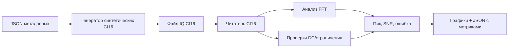

# Лабораторная 9.2 — Чтение CI16 IQ и анализ спектра

## Цель

Научиться читать бинарный CI16 IQ-файл по metadata JSON, строить спектр и выполнять базовые проверки качества записи.

## Что выполняется

В работе студент:

1. генерирует синтетический CI16 IQ-файл;
2. читает его как interleaved signed int16 I/Q;
3. переводит отсчёты в normalized complex samples;
4. строит FFT и time preview;
5. оценивает peak frequency, SNR, DC offset и clipping fraction.

## Результат

После выполнения работы должны быть получены:

- CI16 IQ-файл;
- spectrum plot;
- time-domain preview;
- metrics JSON;
- quality_pass вывод.

## Что приложить к отчёту

- metadata JSON;
- FFT-график;
- measured peak и frequency error;
- SNR estimate;
- DC/clipping checks;
- вывод о пригодности записи к синхронизации и демодуляции.

## Подробная техническая часть
### Исполняемые файлы

| Среда | Файл | Результат |
|---|---|---|
| Python | `blocks/block_09_recording_and_analysis_tools/python/lab_9_2_read_ci16_iq_and_analyze.py` | синтетический файл CI16, графики и JSON с метриками |
| JSON | `blocks/block_09_recording_and_analysis_tools/assets/example_ci16_capture_metadata.json` | метаданные захвата |

Запуск из корня репозитория:

```bash
python blocks/block_09_recording_and_analysis_tools/python/lab_9_2_read_ci16_iq_and_analyze.py
```

Или проанализируйте манифест реального набора данных CI16:

```bash
python blocks/block_09_recording_and_analysis_tools/python/lab_9_2_read_ci16_iq_and_analyze.py \
  --manifest datasets/lab6_6_zynq_rx_observation/manifest_fm_103119454.yaml
```

Сгенерированные артефакты:

```text
docs/assets/lab92_ci16_iq_spectrum.png
docs/assets/lab92_ci16_iq_time_preview.png
docs/assets/lab92_ci16_iq_metrics.json
blocks/block_09_recording_and_analysis_tools/assets/lab92_synthetic_ci16_tone.ci16
```

### Цепочка обработки



### Метрики

| Метрика | Смысл |
|---|---|
| `sample_count_read` | число комплексных отсчётов, прочитанных из файла |
| `measured_peak_hz` | сильнейший пик FFT |
| `frequency_error_hz` | измеренный пик минус ожидаемое смещение |
| `snr_db` | уровень пика минус оценка медианного уровня шума |
| `dc_offset_magnitude` | модуль среднего комплексного отсчёта |
| `clipping_fraction` | доля отсчётов, близких к полной шкале |
| `quality_pass` | быстрая проверка «прошёл/не прошёл» по порогам из метаданных |

### Переход к реальным захватам

Замените синтетический файл `.ci16` реальной записью и сохраните те же поля метаданных:

```text
real_capture.ci16 + real_capture.metadata.json -> читатель -> FFT -> проверки качества -> отчёт
```

Режим по манифесту принимает либо:

- исходный формат JSON метаданных Lab 9.2; либо
- YAML-манифест в стиле набора данных с полями `file_name`, `sample_rate_hz`, `center_frequency_hz`, `endianness` и `i_first`.

### Чек-лист отчёта (расширенный)

- [ ] Приложен JSON метаданных.
- [ ] Подтверждены размер файла CI16 и число отсчётов.
- [ ] Указаны частота дискретизации и центральная частота.
- [ ] Приложен график спектра.
- [ ] Приложено превью во временной области.
- [ ] Указаны частота пика и частотная ошибка.
- [ ] Указаны SNR, смещение DC и доля ограничения.
- [ ] Сделан вывод, пригоден ли захват для синхронизации и демодуляции.

### Шаблон инженерного вывода

```text
Запись CI16 содержит ____ комплексных отсчётов при ____ МС/с. Ожидаемое смещение сигнала — ____ кГц,
а измеренный пик — ____ кГц. Оценённый SNR — ____ дБ, доля ограничения — ____,
а quality_pass — ____. Запись готова / не готова к дальнейшей обработке, потому что ______.
```
