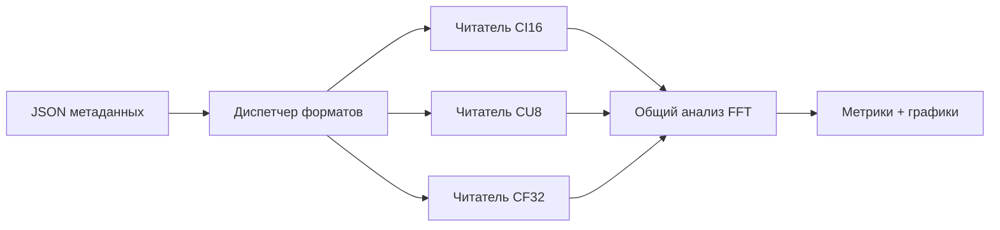

# Лабораторная 9.3 — Мультиформатный IQ reader

## Цель

Научиться читать IQ-записи разных форматов (`ci16`, `cu8`, `cf32`) через единый metadata-driven pipeline.

## Что выполняется

В работе студент:

1. генерирует синтетические IQ-записи в трёх форматах;
2. создаёт metadata для каждого файла;
3. читает данные через общий dispatcher;
4. строит FFT-графики для каждого формата;
5. сравнивает peak frequency, SNR, DC offset и clipping fraction.

## Результат

После выполнения работы должны быть получены:

- три synthetic IQ capture files;
- metadata для каждого формата;
- FFT-графики `ci16`, `cu8`, `cf32`;
- общий metrics JSON;
- вывод о применимости форматов для дальнейшей обработки.

## Что приложить к отчёту

- список проверенных IQ-форматов;
- metadata examples;
- spectrum plots;
- таблицу peak/SNR/DC/clipping;
- инженерный вывод о предпочтительном формате.

## Подробная техническая часть
### Инженерный вопрос

> Как одним скриптом анализа читать IQ-записи из разных инструментов, не переписывая конвейер обработки?

### Поддерживаемые форматы

| Формат | Двоичная раскладка | Типичный источник |
|---|---|---|
| `ci16` | знаковые int16, чередующиеся I/Q | AD9363, самодельный SDR |
| `cu8` | беззнаковые uint8, чередующиеся I/Q | сырые захваты RTL-SDR |
| `cf32` | float32, чередующиеся I/Q | GNU Radio, экспорт из MATLAB/Python |

### Исполняемый файл

```bash
python blocks/block_09_recording_and_analysis_tools/python/lab_9_3_multi_format_iq_reader.py
```

Сгенерированные артефакты:

```text
docs/assets/lab93_multiformat_iq_metrics.json
docs/assets/lab93_multiformat_iq_spectrum_ci16.png
docs/assets/lab93_multiformat_iq_spectrum_cu8.png
docs/assets/lab93_multiformat_iq_spectrum_cf32.png
```

### Цепочка обработки



### Почему это важно

Реальные эксперименты SDR часто смешивают инструменты. Захват курса может начаться с HDSDR/RTL-SDR, затем перейти на AD9363, затем быть экспортирован через GNU Radio или MATLAB. Этап анализа должен управляться метаданными, а не быть жёстко привязан к одной двоичной раскладке.

### Чего ожидать

```text
ci16: peak=124987.793 Hz, SNR=73.22 dB
cu8: peak=124987.793 Hz, SNR=73.14 dB
cf32: peak=124987.793 Hz, SNR=73.23 dB
```

- Все три формата дают один и тот же пик. 8-битный файл CU8 теряет здесь лишь 0,1 дБ «SNR». Это **не** значит, что 8 бит так же хороши, как 16: измеряемое число — пик над медианным бином FFT, оно включает выигрыш обработки FFT на длинной записи, а собственный шум синтетического тона намного выше шума квантования 8 бит, распределённого по такому числу бинов.

### Упражнения

1. Уберите синтетический шум и перезапустите. Какой формат теперь показывает более низкую полку и примерно на сколько (подсказка: около 6 дБ на бит)?
2. Добавьте второй тон на 50 дБ слабее первого. В каком формате он исчезает первым?

### Чек-лист отчёта (расширенный)

- [ ] Перечислены все проверенные форматы IQ.
- [ ] Показаны метаданные для каждого формата.
- [ ] Подтверждены число отсчётов и масштабирование.
- [ ] Сравнены измеренные частоты пиков.
- [ ] Сравнены показатели SNR/DC/ограничения.
- [ ] Объяснено, какой формат лучше для следующего шага обработки.

### Шаблон инженерного вывода

```text
Один и тот же конвейер анализа успешно прочитал форматы ____ и дал согласованные оценки частоты пика.
Наибольшая частотная ошибка — ____ Гц. Предпочтительный формат для дальнейшей обработки — ____, потому что ______.
```
