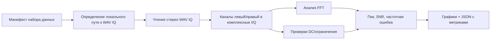

# Лабораторная 9.4 — Чтение WAV IQ и офлайн-анализ

## Цель

Научиться читать `WAV IQ` запись через manifest, восстанавливать комплексные отсчёты, строить FFT и получать воспроизводимые метрики для реальных захватов.

## Что выполняется

В работе студент:

1. берёт manifest с checksum и локальным path hint;
2. читает двухканальный `WAV IQ` файл;
3. интерпретирует каналы как `I/Q`;
4. считает spectrum, peak, SNR, DC offset и clipping fraction;
5. сохраняет графики и metrics JSON.

## Подробная техническая часть

### Зачем это нужно

Большинство «реальных» SDR-данных, которые вам встретятся, — это не красивые файлы `.ci16` из курса, а WAV-записи из SDR-приложений: HDSDR, SDR#, GQRX и т. п. пишут IQ как стереофайл, где левый канал — I, а правый — Q. Прежде чем что-либо анализировать, нужно убедиться, что вы верно прочитали такой файл: не перепутан порядок каналов, верна разрядность, известны частота дискретизации и центральная частота. Ошибка на этом шаге (перепутанные I и Q зеркально отражают спектр) незаметна на графиках и молча портит всё дальнейшее. Поэтому чтение идёт через **манифест**, а не через догадки по имени файла, а результат — это метрики, которые можно воспроизвести.

### Исполняемые файлы

| Среда | Файл | Результат |
|---|---|---|
| Python | `blocks/block_09_recording_and_analysis_tools/python/lab_9_4_read_wav_iq_and_analyze.py` | график спектра, превью во времени, JSON с метриками |
| YAML / JSON | манифест набора данных | подсказка пути к файлу, частота дискретизации, центральная частота, ожидаемое смещение сигнала |

Запуск из корня репозитория:

```bash
python blocks/block_09_recording_and_analysis_tools/python/lab_9_4_read_wav_iq_and_analyze.py \
  --manifest datasets/lab1_0_rtl_sdr_observation/manifest_narrowband_220860000.yaml
```

Для записи в FM-диапазоне:

```bash
python blocks/block_09_recording_and_analysis_tools/python/lab_9_4_read_wav_iq_and_analyze.py \
  --manifest datasets/lab1_0_rtl_sdr_observation/manifest_fm_103119454.yaml
```

Сгенерированные артефакты:

```text
docs/assets/lab94_<dataset_id>_spectrum.png
docs/assets/lab94_<dataset_id>_time_preview.png
docs/assets/<dataset_id>_metrics.json
```

### Цепочка обработки



### Поддерживаемые допущения о WAV IQ

- стерео WAV-контейнер;
- канал 1 = `I`, канал 2 = `Q` по умолчанию;
- данные PCM в формате little-endian;
- целочисленный PCM `8-bit`, `16-bit` или `32-bit`;
- `sample_rate_hz` и `center_frequency_hz` берутся из манифеста.

Если запись использует другой порядок каналов, задайте в манифесте `i_first: false`.

### Метрики

| Метрика | Смысл |
|---|---|
| `sample_count_read` | число комплексных отсчётов, восстановленных из WAV-файла |
| `measured_peak_hz` | сильнейший пик FFT относительно основной полосы |
| `frequency_error_hz` | измеренный пик минус ожидаемое смещение |
| `snr_db` | уровень пика минус оценка медианного уровня шума |
| `dc_offset_magnitude` | модуль среднего комплексного отсчёта |
| `clipping_fraction` | доля отсчётов, близких к полной шкале |
| `quality_pass` | быстрая проверка «прошёл/не прошёл» по необязательным порогам из манифеста |

### Переход к реальным захватам

Предполагаемый путь:

```text
приватный WAV IQ + manifest.yaml -> читатель -> FFT + QC -> графики + метрики -> отчёт
```

Так исходный файл остаётся вне Git, а анализ при этом воспроизводим.

В репозитории лежат две демонстрационные записи RTL-SDR (по ~50 МБ, хранятся через Git LFS в `datasets/lab1_0_rtl_sdr_observation/raw/`, контрольные суммы — в манифестах), поэтому команды выше воспроизводятся «из коробки». Для собственных больших записей используйте тот же манифест, но держите файл вне Git.

### Чего ожидать

Для узкополосной записи на 220,86 МГц (реальный захват RTL-SDR, а не синтетика) запуск печатает:

```text
Samples read: 12741632
Sample rate: 2400000 Hz
Center frequency: 220860000 Hz
Expected offset: 0.000 Hz
Measured peak: 0.000 Hz
Frequency error: 0.000 Hz
SNR estimate: 39.58 dB
DC offset magnitude: 0.004375
Clipping fraction: 0.000000e+00
Quality pass: True
```

Как читать:

- **12 741 632 отсчёта при 2,4 МС/с — это примерно 5,3 с записи.**
- **Пик ровно на 0 Гц и «SNR 39,6 дБ».** Манифест ожидает сигнал в центре полосы (`expected_signal_offset_hz: 0`). По одному спектру нельзя отличить настоящую узкополосную несущую от собственного DC-пика приёмника (см. [Лабораторную 6.5](lab-6-5-rf-impairment-calibration.md)); честный приём — повторить запись со смещённой центральной частотой: сигнал сместится, артефакт DC останется на нуле. И помните, что `snr_db` здесь — это пик над медианной шумовой полкой, а не качество канала связи.
- **DC 0,0044 и ноль ограничений** — запись не перегружена; по этим двум числам её можно считать пригодной для дальнейшего анализа.

### Чек-лист отчёта (расширенный)

- [ ] Приложены путь к манифесту и SHA256.
- [ ] Указаны частота дискретизации и центральная частота.
- [ ] Подтверждены число каналов WAV и разрядность отсчёта.
- [ ] Приложен график спектра.
- [ ] Приложено превью во временной области.
- [ ] Указаны частота пика, SNR, смещение DC и доля ограничения.
- [ ] Указано, где хранится исходный файл и почему его нет в Git.

### Шаблон инженерного вывода

```text
Запись WAV IQ ____ содержит ____ комплексных отсчётов при ____ МС/с.
Измеренный пик находится на ____ кГц относительно основной полосы, оценка SNR ____ дБ,
модуль смещения DC ____, доля ограничения ____.
Файл пригоден / не пригоден для дальнейшего воспроизведения или демодуляции, потому что ______.
```
