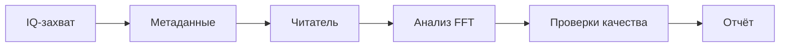

# Проект 12.2 — Итоговый проект: анализ RF-захвата

## Цель

Проанализировать реальный или синтетический IQ-захват с полными метаданными и подготовить отчёт инженерного уровня.

Смысл проекта — не красивый спектр. Нужно показать, что другой инженер, имея только ваши файлы, получит те же числа и тот же вывод, — и показать, что вы знаете, каким из этих чисел можно доверять, а каким нельзя.

## Зачем это нужно

Каждое утверждение в отчёте по SDR в конечном счёте опирается на запись: «сигнал на +3 кГц», «SNR 30 дБ», «фронтенд не перегружен». Запись без метаданных — это список чисел без единиц; спектр без указанной частоты дискретизации не имеет частотной оси; SNR без определения несопоставим. Этот проект тренирует неброскую дисциплину, отличающую измерение от скриншота: сначала метаданные, проверки качества до выводов и явное указание, для чего захват пригоден, а для чего нет.

## Необходимая цепочка



## Минимальные результаты

- запись в реестре наборов данных;
- JSON с метаданными;
- команда чтения IQ;
- график FFT;
- оценка SNR;
- проверка смещения DC и ограничения;
- итоговый отчёт.

## Критерии успеха

| Критерий | Цель |
|---|---:|
| Полнота метаданных | обязательно |
| Частотная ошибка | определяет студент |
| SNR | определяет студент |
| Доля ограничения | ниже порога |

Цели фиксируются в плане анализа **до** финального прогона. Захват, не прошедший собственные ворота качества, остаётся допустимой работой, если отчёт говорит об этом и объясняет причину; захват, объявленный «хорошим» без проверок, — нет.

## Выберите входные данные

| Вход | Откуда | Чему учит |
|---|---|---|
| Синтетическое воспроизведение | `datasets/demo_qpsk_capture` (детерминированный, 64 КиБ, SHA256 в манифесте) | полному процессу с известной истиной, поэтому ошибки видны |
| Готовый реальный захват | `datasets/lab1_0_rtl_sdr_observation` (WAV RTL-SDR), `datasets/lab6_6_zynq_rx_observation` или `datasets/lab6_8_zynq_ota_tone_observation` (CI16 Zynq AD9361) | реальным искажениям, истина неизвестна |
| Собственный захват | ваш приёмник, ваши метаданные | всему пути от железа до отчёта; требует записи RF-безопасных настроек |

Не заявляйте доказательств более высокой ступени, чем использовали: синтетический захват должен быть помечен как синтетический и в отчёте, и в манифесте.

## Заморозьте план анализа

До просмотра результатов напишите полстраницы:

| Поле | Необходимое содержание |
|---|---|
| вопрос | одно опровержимое предложение, например «тон в пределах 200 Гц от ожидаемого смещения, а захват не ограничен» |
| факты о захвате | формат, частота дискретизации, центральная частота, порядок каналов, настройки усиления, длительность |
| ожидаемый сигнал | где вы его ожидаете (смещение от центра) и как его узнаете |
| метрики | частота пика, частотная ошибка, SNR (с определением), смещение DC, доля ограничения |
| пороги | числовые пределы каждой проверки качества |
| правило остановки | когда анализ завершён |

## Ворота верификации

1. **G0 — метаданные:** манифест проходит `python tools/check_dataset_manifests.py` и содержит формат, частоту дискретизации, центральную частоту, порядок каналов, происхождение и контрольную сумму.
2. **G1 — чтение обратно:** читатель восстанавливает задокументированное число отсчётов, контрольная сумма совпадает; первые отсчёты выглядят так, как их описывает формат.
3. **G2 — здравый смысл:** пик спектра находится там, где его ожидают метаданные, либо разница объяснена (перепутанные I/Q зеркалят спектр; неверная частота дискретизации масштабирует ось).
4. **G3 — качество:** смещение DC, доля ограничения и SNR вычислены с заявленными определениями и сравнены с замороженными порогами.
5. **G4 — воспроизведение:** чистый checkout заново создаёт графики и JSON с метриками одной командой.

## Ловушки анализа, которые нужно проверить явно

| Ловушка | Симптом | Как исключить |
|---|---|---|
| перепутанные I/Q | зеркальный спектр, сигнал на −f вместо +f | повторить с изменённым `i_first`; настоящий тон перейдёт на зеркальную частоту |
| пик DC принят за сигнал | сильный пик ровно на 0 Гц | перестроить приёмник на известный шаг: настоящий сигнал сместится, пик DC — нет |
| неверная частота дискретизации | спектр выглядит верно, но с ошибочной шкалой частот | сравнить с известным эталоном (тон на известном смещении, вещательная несущая) |
| ограничение (clipping) | широкополосные «брызги», поднятая шумовая полка, сплюснутая форма | указать долю отсчётов около полной шкалы; посмотреть превью во времени |
| неопределённый SNR | числа, которые нельзя сравнить | указать, чем является SNR: пиком над медианным шумом, отношением мощности в полосе или оценкой по EVM |
| утечка / «пикет-забор» FFT | амплитуда пика зависит от положения тона | использовать окно и назвать его; не сравнивать высоты пиков в разных бинах без этого |

## Пакет доказательств

```text
project_12_2/
├── plan.md
├── manifest.yaml
├── run.py            # или команда читателя из Lab 9.2–9.4
├── metrics.json
├── figures/
│   ├── spectrum.png
│   └── time_preview.png
└── report.md
```

`metrics.json` должен содержать сырые значения (число отсчётов, бин пика, оценка шумовой полки) наряду с производными, чтобы рецензент мог пересчитать заявленный SNR.

## Отправная точка, безопасная для CI

Из корня репозитория:

```bash
python tools/check_dataset_manifests.py
python blocks/block_09_recording_and_analysis_tools/python/lab_9_4_read_wav_iq_and_analyze.py \
  --manifest datasets/lab1_0_rtl_sdr_observation/manifest_narrowband_220860000.yaml
```

Вторая команда — это [Lab 9.4](lab-9-4-read-wav-iq-and-analyze.md), разобранный пример цепочки этого проекта; её вывод показывает именно тот набор метрик (пик, частотная ошибка, SNR, смещение DC, доля ограничения, pass/fail), который ожидается в вашем отчёте.

## Итоговый чек-лист приёмки

- [ ] Манифест полон, контрольная сумма подтверждается.
- [ ] План анализа и пороги предшествуют финальному прогону.
- [ ] Указана синтетическая или реальная природа захвата.
- [ ] Три наиболее вероятных неверных прочтения (перестановка I/Q, пик DC, неверная частота дискретизации) проверены явно.
- [ ] У SNR есть письменное определение.
- [ ] Каждое приведённое отношение можно пересчитать из сохранённых сырых значений.
- [ ] Вывод говорит, пригоден захват для дальнейшей обработки или **нет**, и почему.
- [ ] Команда на чистом checkout воспроизводит графики и метрики.

Оцените работу по [рубрике оценки итоговых проектов](../../final-project-grading-rubric.md) и напишите отчёт по [шаблону отчёта Блока 12](https://github.com/Lay007/zynq-sdr-course/blob/main/blocks/block_12_final_projects/reports/report_template_ru.md).

## Шаблон вывода отчёта

```text
RF-захват содержит ____ отсчётов в формате ____. Измеренный пик находится на ____ Гц,
SNR составляет ____ дБ, доля ограничения — ____. Захват пригоден / не пригоден для дальнейшей обработки, потому что ______.
```
