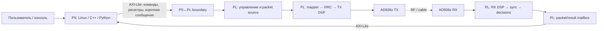
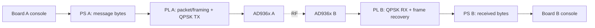

# Zynq: где заканчивается PS и начинается PL

Zynq объединяет в одном кристалле две разные вычислительные среды:

- **PS (Processing System)** — ARM-процессоры, память, Linux/no-OS, драйверы и пользовательское ПО;
- **PL (Programmable Logic)** — FPGA-логика, где удобно строить детерминированные потоковые DSP-тракты.

Для SDR важно не просто уметь написать Verilog-блок. Нужно понимать, **какая часть системы должна жить в PS, какая — в PL и каким интерфейсом их соединить**.



## Простое правило разделения

| Задача | Обычно PS | Обычно PL | Почему |
|---|---:|---:|---|
| CLI, строки, файлы, логирование | ✓ | | удобно программировать и менять |
| Настройка частоты, gain, режима | ✓ | | низкая скорость, сложная логика управления |
| Регистры start/status/counters | ✓ | ✓ | PS пишет/читает, PL исполняет |
| Модуляция, FIR, NCO, синхронизация | | ✓ | поток отсчётов и жёсткие временные требования |
| BER/EVM counters в реальном времени | | ✓ | удобно считать рядом с datapath |
| Формирование отчёта и графиков | ✓ | | нет смысла тратить FPGA-ресурсы |
| Большой поток IQ | ✓ | ✓ | обычно AXI4-Stream + DMA |

Граница не абсолютна. Например CRC можно считать и в PS, и в PL. В учебной работе важнее сначала **обосновать выбор**, а затем измерить последствия.

## Три AXI-интерфейса, которые нужно различать

### AXI4-Lite — управление

Подходит для:

- `start`;
- `status`;
- частоты/режима;
- counters;
- небольшого mailbox.

AXI-Lite легко изучать: программное обеспечение видит обычные 32-битные memory-mapped registers.

### AXI4-Stream — поток

Подходит для непрерывных данных:

```text
IQ sample 0 → IQ sample 1 → IQ sample 2 → ...
```

Здесь важны `valid/ready`, latency, backpressure и границы кадров.

### DMA — мост между памятью PS и AXI4-Stream

DMA нужен, когда данных уже слишком много для покомандной записи регистров. Он не должен быть первым знакомством студента с PS/PL: иначе легко научиться повторять Vivado Block Design, не понимая, что именно передаётся через границу.

## Почему первая лаборатория использует mailbox

Первая цель намеренно маленькая:

```text
PS пишет "Hello PL"
        ↓
64-byte AXI-Lite mailbox
        ↓
PL принимает команду
        ↓
PL формирует ответ
        ↓
PS читает "Hello PL" обратно
```

Это ещё **не радиолиния**. Здесь студент должен увидеть только системную границу:

1. где находится ARM-код;
2. где находится Verilog;
3. что такое physical base address;
4. как байты раскладываются по 32-битным регистрам;
5. почему `start`, `busy`, `valid` и `ack` нужны даже для очень простой операции.

После локального PS↔PL обмена тот же mailbox станет программной границей настоящего двухплатного QPSK demo.

## Целевой двухплатный эксперимент



Ожидаемая демонстрация:

```text
board-a$ sudo python3 tools/zynq_message_console.py --base <addr> send \
  "Hello from board A" --sequence 17
TX sequence=17 bytes=18 payload="Hello from board A"

board-b$ sudo python3 tools/zynq_message_console.py --base <addr> receive --wait 10
RX sequence=17 bytes=18 crc=OK payload="Hello from board A"
```

Физический адрес здесь специально не зашит в курс: студент должен взять его из **Vivado Address Editor / hardware design** конкретной сборки.

## Что останется в PS в первом radio demo

- ввод текста;
- sequence number и длина;
- запуск передачи;
- ожидание принятого пакета;
- проверка/печать метаданных;
- вывод сообщения в консоль.

## Что останется в PL

- сериализация packet payload в modem stream;
- mapper и pulse shaping;
- sample-rate DSP;
- frame synchronization;
- symbol/bit recovery;
- сохранение принятого пакета в RX mailbox.

Так студент видит смысл FPGA не как «ускорителя всего подряд», а как **детерминированного потокового сопроцессора рядом с обычным процессором**.

## Следующий шаг

Перейдите к **Lab 5.12 — PS↔PL message mailbox**. После неё в Block 11 тот же программный интерфейс будет использован для двухплатной передачи сообщения поверх существующего QPSK PHY.
