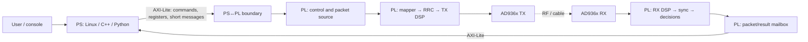
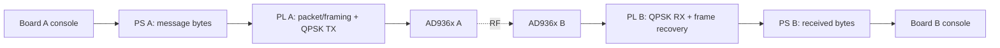

# Zynq: where PS ends and PL begins

A Zynq device combines two different computing environments on one chip:

- **PS (Processing System)** — ARM processors, memory, Linux/no-OS, drivers and application software;
- **PL (Programmable Logic)** — FPGA fabric for deterministic streaming datapaths.

For SDR work it is not enough to write an HDL block. A student should understand **which functions belong in PS, which belong in PL, and which interface should cross the boundary**.



## A practical partition rule

| Task | Usually PS | Usually PL | Reason |
|---|---:|---:|---|
| CLI, strings, files, logging | yes | | easy to program and change |
| Frequency/gain/mode configuration | yes | | low-rate control with complex policy |
| start/status/counter registers | yes | yes | PS accesses, PL executes |
| modulation, FIR, NCO, synchronization | | yes | streaming samples and deterministic timing |
| real-time BER/EVM counters | | yes | close to the datapath |
| reports and plots | yes | | no reason to spend FPGA resources |
| bulk IQ transport | yes | yes | typically AXI4-Stream plus DMA |

The boundary is not absolute. CRC, framing, or buffering can live on either side. The educational requirement is to **justify the choice** and understand the consequences.

## Three interfaces students should not confuse

### AXI4-Lite — control plane

Good for `start`, `status`, configuration words, counters, and a small mailbox. Software sees ordinary 32-bit memory-mapped registers.

### AXI4-Stream — datapath

Good for continuous data such as IQ samples. The key concepts are `valid/ready`, latency, backpressure and frame boundaries.

### DMA — memory-to-stream bridge

DMA becomes useful when the data volume is too large for register-by-register access. It should not be the student's first PS/PL experiment because it can hide the simpler architectural ideas behind a large Vivado block design.

## Why the first lab uses a mailbox

The first goal is intentionally small:

```text
PS writes "Hello PL"
        ↓
64-byte AXI-Lite mailbox
        ↓
PL accepts the command
        ↓
PL produces a response
        ↓
PS reads "Hello PL" back
```

This is **not an RF link yet**. The student should first see:

1. where ARM software runs;
2. where HDL runs;
3. what the physical base address means;
4. how bytes map into 32-bit registers;
5. why `start`, `busy`, `valid`, and `ack` are needed even for a tiny transaction.

The same mailbox then becomes the software boundary for the two-board QPSK message demo.

## Target two-board experiment



Target interaction:

```text
board-a$ sudo python3 tools/zynq_message_console.py --base <addr> send \
  "Hello from board A" --sequence 17
TX sequence=17 bytes=18 payload="Hello from board A"

board-b$ sudo python3 tools/zynq_message_console.py --base <addr> receive --wait 10
RX sequence=17 bytes=18 crc=OK payload="Hello from board A"
```

The physical address is deliberately not hard-coded. It must come from the Vivado Address Editor / hardware design for the actual build.

## Initial radio-demo partition

**PS:** text input, sequence and length, launch, receive polling, metadata checking and console output.

**PL:** payload serialization, modulation/pulse shaping, sample-rate DSP, frame synchronization, symbol/bit recovery and storage of the recovered packet in the RX mailbox.

The important lesson is that FPGA fabric is not “where all code should go”. It is a **deterministic streaming coprocessor next to a general-purpose processor**.

## Next step

Continue with **Lab 5.12 — PS↔PL message mailbox**. In Block 11 the same software interface will be reused for a two-board message over the existing QPSK PHY.
