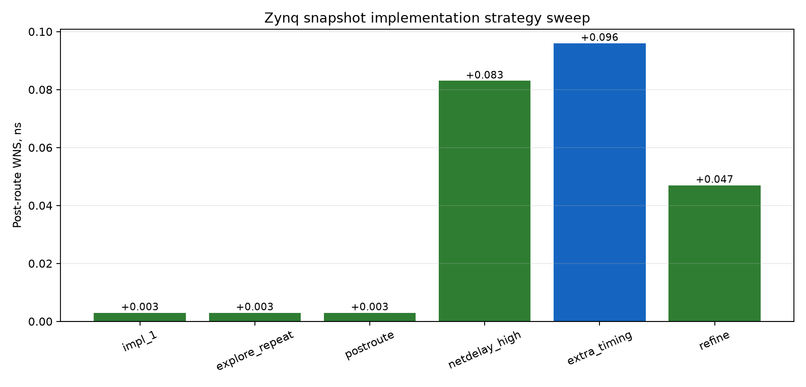

# Integrated Zynq snapshot implementation sweep

All runs use the same synthesized `bridge_txrx_mux` snapshot and overlay timing constraints. Only the implementation strategy changes.

| Run | Strategy | Status | WNS, ns | TNS, ns | Timing | Routed | Selected |
|---|---|---|---:|---:|---|---|---|
| impl_1 | `Performance_Explore` | complete | 0.003 | 0.000 | PASS | yes |  |
| impl_perf_explore_repeat | `Performance_Explore` | complete | 0.003 | 0.000 | PASS | yes |  |
| impl_perf_postroute | `Performance_ExplorePostRoutePhysOpt` | complete | 0.003 | 0.000 | PASS | yes |  |
| impl_perf_netdelay_high | `Performance_NetDelay_high` | complete | 0.083 | 0.000 | PASS | yes |  |
| impl_perf_extra_timing | `Performance_ExtraTimingOpt` | complete | 0.096 | 0.000 | PASS | yes | yes |
| impl_perf_refine | `Performance_RefinePlacement` | complete | 0.047 | 0.000 | PASS | yes |  |

Selected implementation: `impl_perf_extra_timing` with WNS `0.096 ns`.

Timing-clean runs: `6/6` completed runs.

Selection by timing does not replace board qualification. The selected payload must still pass the runtime QPSK fabric and RF checks.

