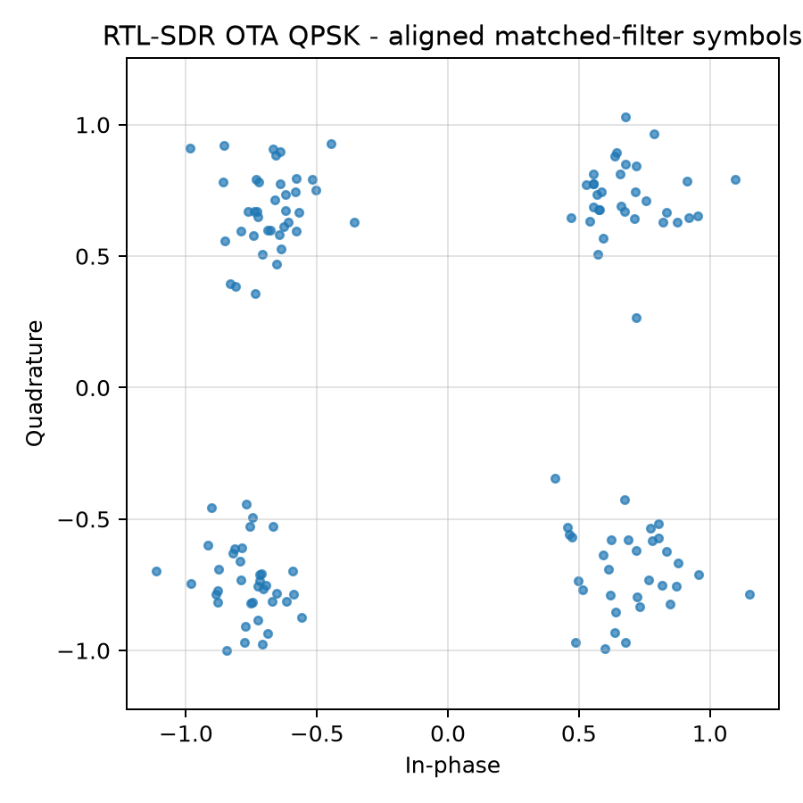
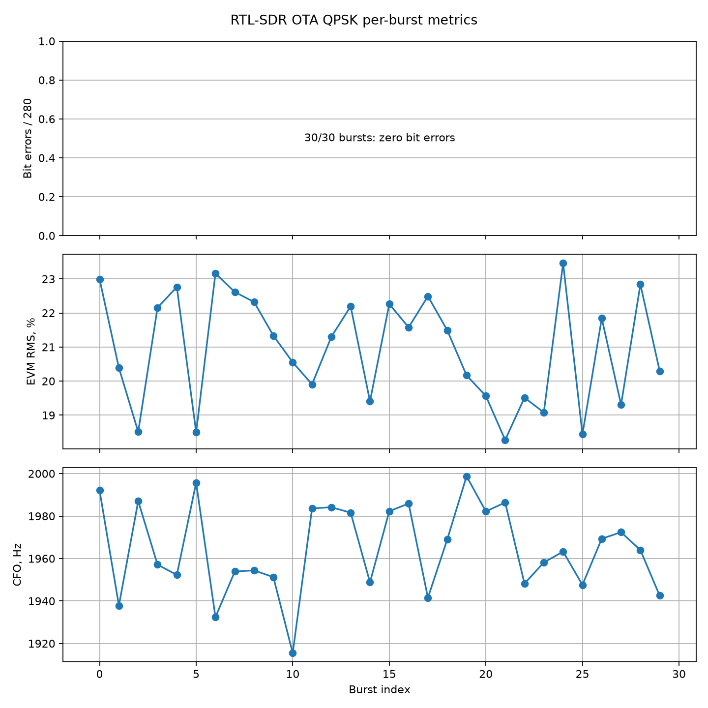
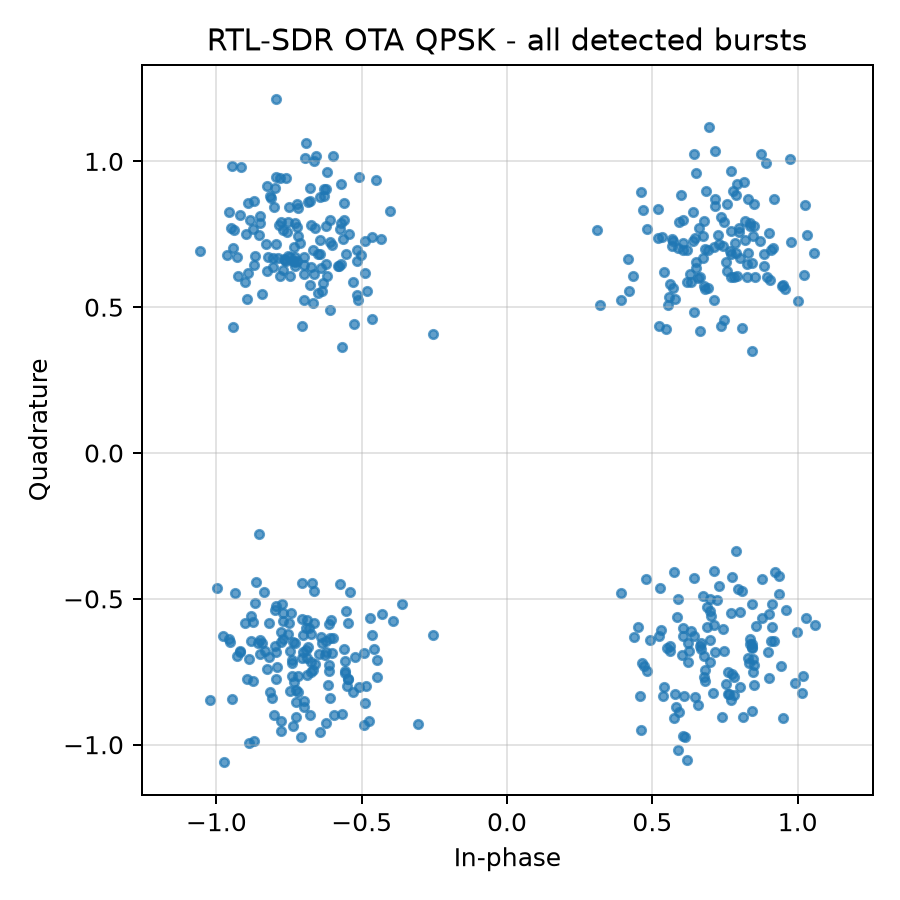
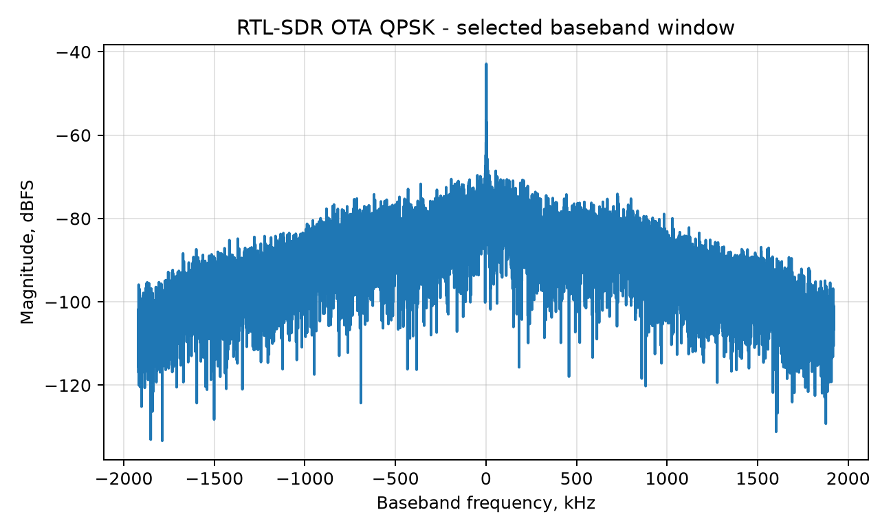
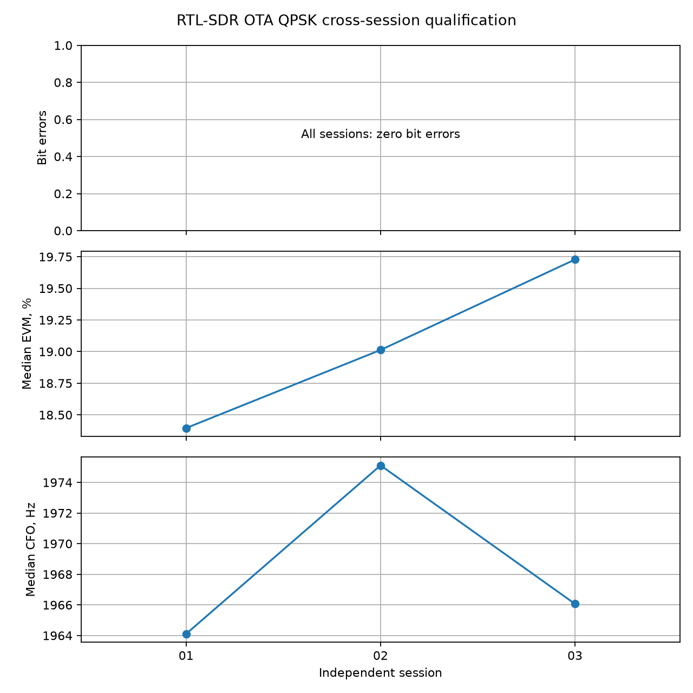

# QPSK Zynq-to-RTL-SDR OTA qualification — 2026-07-07

## Result

The timing-clean dual-modem payload transmitted its deterministic 140-symbol QPSK ROM frame through the Zynq TX1/AD9361 RF path. An independent RTL-SDR received the over-the-air signal through a separate antenna. Multi-burst analysis found every commanded burst in both recordings. The promoted `-50 dB` run recovered all 30 bursts and all 8,400 compared bits without error.

| Metric | -55 dB run | Promoted -50 dB run |
|---|---:|---:|
| TX hardware gain | -55 dB | -50 dB |
| RTL-SDR tuner gain | 30 dB | 30 dB |
| Commanded / energy-detected / correlated bursts | 40 / 40 / 40 | 30 / 30 / 30 |
| Zero-error bursts | 23 / 40 | 30 / 30 |
| Frame error rate | 42.5% | 0% |
| Compared bits | 11,200 | 8,400 |
| Bit errors | 18 | 0 |
| Aggregate BER | 1.607143e-3 | 0 |
| Median EVM RMS | 35.684% | 21.317% |
| Median SNR estimated from EVM | 8.95 dB | 13.43 dB |
| Median residual frequency offset | +1963.9 Hz | +1963.6 Hz |
| Median normalized correlation | 0.940 | 0.975 |
| Clipping fraction | 0 | 0 |

Both runs used a 2.4 MS/s RTL-SDR capture centered at 868.3 MHz. The Zynq sample rate was 3.84 MS/s, the QPSK symbol rate was 480 ksymbol/s, and the RRC rolloff was 0.35. The promoted capture SHA256 is `ebea5717237f4c8a1df830370f124cc77ced9af32e741419f6e340ae9d669ffa`.









## Evidence chain

- Capture manifest: `datasets/lab11_22_runtime_pl_rtl_monitor/manifest_live_20260707_qpsk_ota_cdcfix_02.yaml`
- Capture/session report: `docs/assets/lab1122_runtime_pl_rtl_monitor_live_20260707_qpsk_ota_cdcfix_02.json`
- Offline metrics: `docs/assets/lab1128_lab11_22_runtime_pl_rtl_monitor_live_20260707_qpsk_ota_cdcfix_02_metrics.json`
- Cross-session aggregate: `docs/assets/lab1128_qpsk_ota_crosssession_qualification_20260707.json`
- Cross-session run artifacts: matching `qpsk_ota_crosssession_01`, `_02` and `_03` manifests, capture reports and metrics
- Lower-power comparison: matching `_01` manifest, capture report and metrics files
- Transmitted payload MD5: `414eca88fe628de06c9bef09cf73e30e`
- Transmitted payload SHA256: `48a17b8cbabec9c7d9c5236cb665397d154813e6537c24067765f601d73ead28`

The analyzer reads the exact `bpsk_frame_bits.mem` ROM shared by the QPSK RTL source, pairs consecutive bits onto I and Q, applies the RRC matched filter, estimates residual CFO and phase, and compares the recovered axes against all 280 transmitted bits in every detected burst. Energy detection uses 256-sample blocks and robust median/MAD thresholds. A candidate becomes a frame only when normalized reference correlation is at least `0.8`; all hardware frames measured `0.898…0.983`.

## Metric definitions

The complete equations and assumptions are in `docs/digital-link-metrics.md`. The key definitions used here are:

- `BER = total wrong bits / total compared bits` over all correlated bursts;
- `FER = bursts containing at least one wrong bit / correlated bursts`;
- `EVM_RMS = sqrt(sum(|aligned_rx-reference|^2) / sum(|reference|^2))`;
- `SNR_from_EVM = -20 log10(EVM_RMS)`, valid as an SNR estimate only under noise-dominant assumptions;
- CFO is the fitted phase slope of `rx * conj(reference)`, converted from radians/symbol to hertz;
- clipping fraction is the fraction of raw IQ samples where either normalized axis exceeds `0.999` full scale.

For the promoted run, 30/30 zero-error bursts give a Wilson 95% success-rate interval of `88.65%…100%`. Zero errors in 8,400 bits give the rule-of-three bound `BER < 3.571429e-4` at approximately 95% confidence. Neither statement proves a physical BER floor.

## Independent-session series

Three new clean sessions repeated the promoted `-50 dB` configuration without changing the payload or monitor settings.

| Session | Bursts detected | Zero-error bursts | Errors / bits | Median EVM | Median SNR from EVM | Median CFO | Stock restore |
|---|---:|---:|---:|---:|---:|---:|---:|
| 01 | 30 / 30 | 30 / 30 | 0 / 8,400 | 18.396% | 14.71 dB | +1964.1 Hz | pass |
| 02 | 30 / 30 | 30 / 30 | 0 / 8,400 | 19.013% | 14.42 dB | +1975.1 Hz | pass |
| 03 | 30 / 30 | 30 / 30 | 0 / 8,400 | 19.728% | 14.10 dB | +1966.1 Hz | pass |
| Combined | 90 / 90 | 90 / 90 | 0 / 25,200 | 19.038% | 14.41 dB | +1968.7 Hz | 3 / 3 |



The aggregate is `docs/assets/lab1128_qpsk_ota_crosssession_qualification_20260707.json`. It validates a common bitstream MD5 and RF/modem configuration before combining sessions. The combined burst success Wilson 95% interval is `95.91%…100%`; the session success interval is `43.85%…100%`, reflecting the small session count. With zero errors in 25,200 compared bits, the rule-of-three bound is `BER < 1.190476e-4`.

## Reproduction

Capture:

```powershell
python blocks/block_11_integrated_sdr_project/python/lab_11_22_capture_runtime_pl_rtl_monitor_wav.py `
  --modulation qpsk `
  --bit-bin-path tmp/bridge_txrx_mux.qpsk.cdcfix_20260707.wordswap.bit.bin `
  --center-frequency-hz 868300000 `
  --tx-attenuation-db -50 `
  --rtl-tuner-gain-db10 300 `
  --start-offset 62 `
  --qpsk-symbol-count 140 `
  --runtime-repeat-count 30 `
  --runtime-repeat-gap-ms 40 `
  --rebind-runtime-dds-driver `
  --rebind-runtime-adc-driver `
  --runtime-dds-ratecntrl 3
```

Analyze:

```powershell
python blocks/block_11_integrated_sdr_project/python/lab_11_28_read_rtl_wav_ota_qpsk.py `
  --manifest datasets/lab11_22_runtime_pl_rtl_monitor/manifest_live_20260707_qpsk_ota_cdcfix_02.yaml
```

Aggregate independent sessions:

```powershell
python tools/aggregate_lab11_28_sessions.py `
  "docs/assets/lab1128_lab11_22_runtime_pl_rtl_monitor_live_20260707_qpsk_ota_crosssession_*_metrics.json" `
  --json-out docs/assets/lab1128_qpsk_ota_crosssession_qualification_20260707.json `
  --plot-out docs/assets/lab1128_qpsk_ota_crosssession_summary_20260707.png
```

## Limits

- The cross-session result covers three sessions and 25,200 bits; it is still not a long-duration BER floor.
- SNR is inferred from EVM after scalar/CFO alignment, not measured independently from calibrated RF power.
- Wilson BER bounds treat bit errors as independent Bernoulli trials; RF burst errors may be correlated, so the interval is descriptive.
- The RF path was antenna-to-antenna, so geometry and ambient interference are not controlled like a cabled attenuator experiment.
- The raw WAV remains local-only; its SHA256, manifest, plots, capture report and derived metrics are committed.
- Every capture session rebooted the board to stock; the final state had TX gain `-89.75 dB` and the TX LO powered down.
